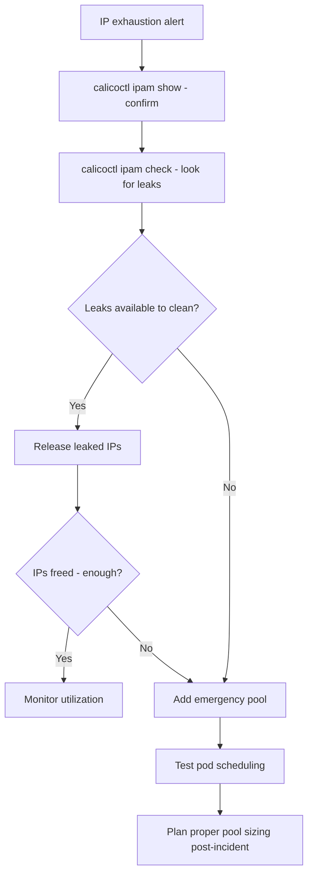

# Runbook: IP Pool Exhaustion in Calico

Author: [nawazdhandala](https://github.com/nawazdhandala)

Tags: Calico, Kubernetes, Networking, Troubleshooting

Description: On-call runbook for resolving Calico IP pool exhaustion with immediate capacity restoration and root cause remediation.

---

## Introduction

IP pool exhaustion causes all new pod scheduling to fail with IP allocation errors. This runbook provides the fastest path to restoring IP capacity, which typically means either cleaning up leaks or adding a second IP pool.

## Symptoms

- Alert: `CalicoIPPoolCritical` or `CalicoIPPoolHighUtilization`
- Pods failing with `failed to allocate IP address`
- `calicoctl ipam show` shows 0 or very few free IPs

## Root Causes

- IPAM leaks from orphaned allocations
- IP pool genuinely undersized for current workload

## Diagnosis Steps

```bash
calicoctl ipam show
calicoctl ipam check 2>/dev/null | head -30
```

## Solution

**Immediate: Check for and clean leaks**

```bash
# Run IPAM check
calicoctl ipam check 2>/dev/null

# If leaks found, release them
# (specify IP addresses from the check output)
# calicoctl ipam release --ip=<leaked-ip>
```

**If genuinely exhausted: Add a second IP pool immediately**

```bash
cat <<EOF | calicoctl apply -f -
apiVersion: projectcalico.org/v3
kind: IPPool
metadata:
  name: emergency-expansion-pool
spec:
  cidr: 192.168.0.0/16
  ipipMode: Always
  natOutgoing: true
  disabled: false
EOF

# Verify new pool is active
calicoctl ipam show
```

**Test pod scheduling after expansion**

```bash
kubectl run ip-emergency-test --image=busybox --restart=Never -- sleep 10
kubectl wait pod/ip-emergency-test --for=condition=Ready --timeout=60s
kubectl get pod ip-emergency-test -o wide
kubectl delete pod ip-emergency-test
```

**Post-incident: Rename emergency pool and plan proper pool management**

```bash
# Update cluster docs with actual IP pool capacity
# Plan migration to properly named and sized IP pools
```



## Prevention

- Deploy IP utilization monitoring during cluster setup
- Alert at 70% to allow proactive expansion
- Run weekly IPAM check to prevent leak accumulation

## Conclusion

IP pool exhaustion is resolved by either cleaning leaked IPAM allocations (if leaks are the cause) or adding an emergency IP pool for immediate capacity. After the incident, establish proper IP pool monitoring and sizing to prevent recurrence.
