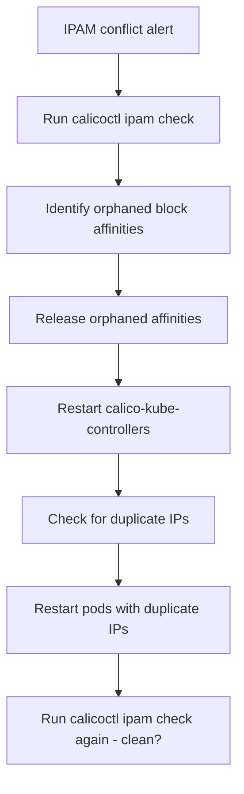

# Runbook: IPAM Block Conflicts in Calico

Author: [nawazdhandala](https://github.com/nawazdhandala)

Tags: Calico, Kubernetes, Networking, Troubleshooting

Description: On-call runbook for resolving Calico IPAM block conflicts with block affinity cleanup and duplicate IP resolution procedures.

---

## Introduction

This runbook guides engineers through resolving IPAM block conflicts in Calico. IPAM conflicts can cause IP allocation failures on specific nodes or duplicate pod IP assignments. The triage focuses on identifying which blocks or affinities are conflicted and releasing them.

## Symptoms

- Alert: IPAM check CronJob failing
- Pods failing IP allocation on specific nodes
- Duplicate pod IPs detected

## Root Causes

- Orphaned block affinities from removed nodes
- Race conditions during cluster operations

## Diagnosis Steps

**Step 1: Run IPAM check**

```bash
calicoctl ipam check 2>/dev/null | tail -30
```

**Step 2: Identify orphaned affinities**

```bash
CURRENT_NODES=$(kubectl get nodes -o jsonpath='{.items[*].metadata.name}')
calicoctl get blockaffinity -o yaml 2>/dev/null \
  | grep "node:" | awk '{print $2}' | sort -u | while read NODE; do
  echo "$CURRENT_NODES" | grep -qw "$NODE" || echo "ORPHANED: $NODE"
done
```

**Step 3: Check for duplicate IPs**

```bash
kubectl get pods --all-namespaces -o wide \
  | awk '{print $7}' | grep -v "IP\|<none>" | sort | uniq -d
```

## Solution

**Remove orphaned block affinities**

```bash
CURRENT_NODES=$(kubectl get nodes -o jsonpath='{.items[*].metadata.name}')
for BA in $(calicoctl get blockaffinity -o jsonpath='{.items[*].metadata.name}' 2>/dev/null); do
  NODE=$(calicoctl get blockaffinity $BA -o jsonpath='{.spec.node}' 2>/dev/null)
  if ! echo "$CURRENT_NODES" | grep -qw "$NODE"; then
    echo "Releasing: $BA (node: $NODE)"
    calicoctl delete blockaffinity $BA
  fi
done
```

**Restart calico-kube-controllers for GC**

```bash
kubectl rollout restart deployment calico-kube-controllers -n kube-system
kubectl rollout status deployment calico-kube-controllers -n kube-system
sleep 60
calicoctl ipam check
```

**Restart pods with duplicate IPs**

```bash
for DUPE_IP in $(kubectl get pods --all-namespaces -o wide \
  | awk '{print $7}' | sort | uniq -d | grep -v "IP\|<none>"); do
  echo "Restarting pods with duplicate IP: $DUPE_IP"
  kubectl get pods --all-namespaces -o wide | grep "$DUPE_IP" | \
    awk '{print $1 " " $2}' | while read NS POD; do
    kubectl delete pod $POD -n $NS
  done
done
```



## Prevention

- Follow proper node removal procedure
- Monitor calico-kube-controllers health
- Run daily IPAM audits

## Conclusion

IPAM block conflicts are resolved by releasing orphaned block affinities, restarting calico-kube-controllers for garbage collection, and restarting any pods with duplicate IPs. Verify with a clean `calicoctl ipam check` before closing the incident.
