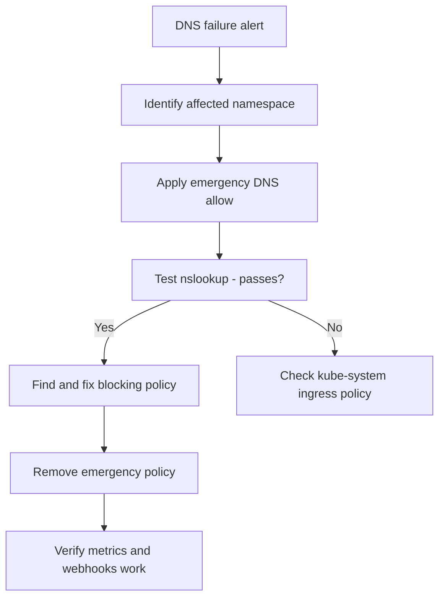

# Runbook: kube-system Access Problems with Calico NetworkPolicy

Author: [nawazdhandala](https://github.com/nawazdhandala)

Tags: Calico, Kubernetes, Networking, Troubleshooting

Description: On-call runbook for diagnosing and restoring kube-system service access when blocked by Calico NetworkPolicies including fast DNS restoration procedures.

---

## Introduction

This runbook guides on-call engineers through resolving kube-system access failures caused by Calico NetworkPolicies. The most impactful symptom is DNS failure, which causes cascading failures across all pods in the affected namespace as they lose the ability to resolve service names.

Rapid DNS restoration is the priority. Once DNS is working, other kube-system services (metrics-server, admission webhooks) can be addressed in order of priority.

## Symptoms

- Alert: DNS probe CronJob failing or CoreDNS SERVFAIL rate elevated
- Pods returning `NXDOMAIN` or connection timeout for service DNS names
- Admission webhooks timing out in a namespace

## Root Causes

- Newly applied NetworkPolicy missing DNS allow rule
- namespaceSelector labels incorrect for kube-system
- kube-system ingress policy changed

## Diagnosis Steps

**Step 1: Identify affected namespace**

```bash
# Find namespaces where DNS is failing
for NS in $(kubectl get namespaces -o jsonpath='{.items[*].metadata.name}'); do
  kubectl run dns-check --image=busybox -n $NS --restart=Never --rm -i \
    --timeout=10s -- nslookup kubernetes.default 2>&1 | grep -q "Address" \
    || echo "DNS FAIL: $NS"
done 2>/dev/null
```

**Step 2: Check for recently added NetworkPolicy**

```bash
kubectl get networkpolicy -n <failing-ns> \
  --sort-by='.metadata.creationTimestamp'
```

## Solution

**Immediate: Restore DNS access**

```bash
NS=<affected-namespace>
cat <<EOF | kubectl apply -f -
apiVersion: networking.k8s.io/v1
kind: NetworkPolicy
metadata:
  name: emergency-allow-dns
  namespace: $NS
spec:
  podSelector: {}
  policyTypes:
  - Egress
  egress:
  - to:
    - namespaceSelector:
        matchLabels:
          kubernetes.io/metadata.name: kube-system
    ports:
    - protocol: UDP
      port: 53
    - protocol: TCP
      port: 53
EOF

# Test immediately
kubectl run dns-test --image=busybox -n $NS --restart=Never --rm -i \
  --timeout=15s -- nslookup kubernetes.default
```

**Follow-up: Fix the blocking policy permanently**

```bash
# Edit the policy that was missing the DNS allow
kubectl edit networkpolicy <blocking-policy-name> -n $NS
# Add DNS egress allow rule

# Remove emergency policy
kubectl delete networkpolicy emergency-allow-dns -n $NS
```

**Verify metrics-server and webhooks**

```bash
kubectl top pods -n $NS 2>&1
kubectl get --raw /apis/metrics.k8s.io/v1beta1/namespaces/$NS/pods 2>&1
```



## Prevention

- Apply namespace bootstrap policies during namespace creation
- Monitor DNS probe CronJobs in all namespaces with NetworkPolicies
- Review NetworkPolicy changes in a network design review before merging

## Conclusion

kube-system access failures from Calico NetworkPolicies are primarily DNS failures. Apply the emergency DNS allow policy immediately to restore connectivity, then fix the underlying policy permanently and remove the emergency workaround. Verify DNS, metrics-server, and webhook connectivity before closing the incident.
