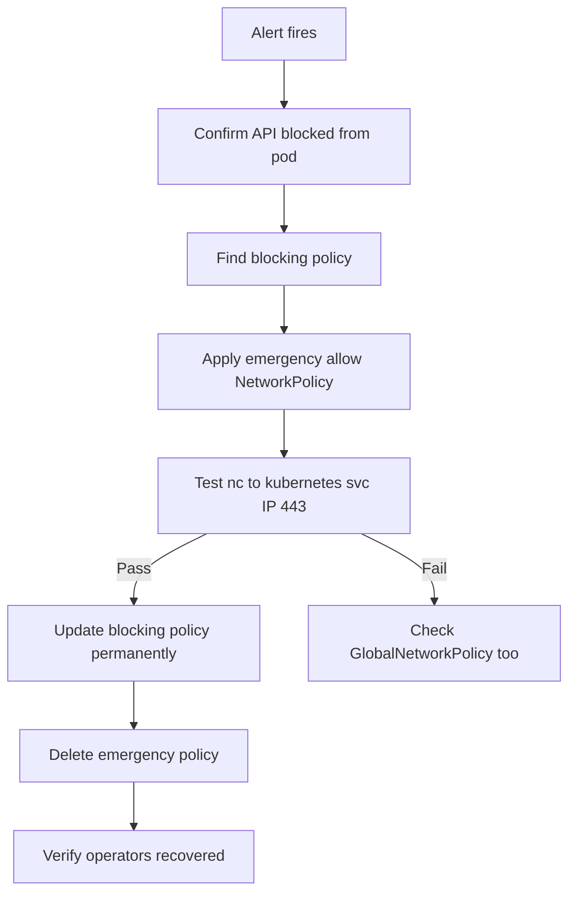

# Runbook: Kubernetes API Access Problems with Calico Egress Policy

Author: [nawazdhandala](https://github.com/nawazdhandala)

Tags: Calico, Kubernetes, Networking, Troubleshooting

Description: On-call runbook for resolving Kubernetes API access failures caused by Calico egress policies with step-by-step triage and quick-fix procedures.

---

## Introduction

This runbook guides on-call engineers through diagnosing and resolving Kubernetes API server access failures caused by Calico egress policies. This type of incident is high-impact because it affects all pods in a namespace that run operators, service accounts, or any code that calls the Kubernetes API.

Time is critical in this scenario: operators that cannot reach the API may begin making incorrect decisions or failing over, causing cascading issues. The triage sequence is optimized for speed - identify the blocking policy and add the allow rule within the first 10 minutes.

## Symptoms

- Alert: `KubernetesAPIAccessBlocked` fires
- Operators returning `context deadline exceeded` for API calls
- Service accounts failing to authenticate
- `kubectl exec <pod> -- nc -zv <kubernetes-svc-ip> 443` shows connection failure

## Root Causes

- Recently applied egress NetworkPolicy without API allow rule
- GlobalNetworkPolicy default-deny applied to all pods
- Service CIDR not covered by egress allow rules

## Diagnosis Steps

**Step 1: Confirm API access failure from affected pod**

```bash
NAMESPACE=<affected-namespace>
POD=$(kubectl get pods -n $NAMESPACE -o name | head -1)
KUBE_IP=$(kubectl get svc kubernetes -o jsonpath='{.spec.clusterIP}')

kubectl exec $POD -n $NAMESPACE -- nc -zv $KUBE_IP 443 2>&1
# If this fails: API is blocked by egress policy
```

**Step 2: Find the blocking policy**

```bash
# Check namespace-scoped policies
kubectl get networkpolicy -n $NAMESPACE -o yaml | grep -A 10 "policyTypes"

# Check Calico GlobalNetworkPolicies
calicoctl get globalnetworkpolicy -o yaml | grep -E "name:|order:|Deny|deny" | head -30
```

**Step 3: Identify most recently changed policy**

```bash
kubectl get networkpolicy -n $NAMESPACE \
  --sort-by='.metadata.creationTimestamp' | tail -5
```

## Solution

**Quick fix: Add API allow rule immediately**

```bash
# Apply emergency API access allow
cat <<EOF | kubectl apply -f -
apiVersion: networking.k8s.io/v1
kind: NetworkPolicy
metadata:
  name: emergency-allow-api-access
  namespace: $NAMESPACE
spec:
  podSelector: {}
  policyTypes:
  - Egress
  egress:
  - to:
    - ipBlock:
        cidr: $KUBE_IP/32
    ports:
    - protocol: TCP
      port: 443
  - to:
    - namespaceSelector:
        matchLabels:
          kubernetes.io/metadata.name: kube-system
    ports:
    - protocol: UDP
      port: 53
EOF

# Verify fix
kubectl exec $POD -n $NAMESPACE -- nc -zv $KUBE_IP 443 2>&1
```

**Permanent fix: Update the blocking policy**

```bash
# Edit the policy that was missing the allow rule
kubectl edit networkpolicy <blocking-policy-name> -n $NAMESPACE
# Add egress allow for API server and DNS
```

**Verify operators recovered**

```bash
# Check operator pods
kubectl get pods -n $NAMESPACE | grep -v Running

# Check for API error events
kubectl get events -n $NAMESPACE | grep -i "error\|timeout\|refused"
```



## Prevention

- Use the `baseline-allow-k8s-internals` GlobalNetworkPolicy as a permanent safety net
- Require API access testing in the NetworkPolicy change approval process
- Monitor synthetic API probes in all namespaces with egress policies

## Conclusion

Kubernetes API access failures from Calico egress policies require fast identification and a two-step response: apply an emergency allow rule immediately, then permanently fix the blocking policy. Always verify operator recovery after the fix, as some operators may require a restart to re-establish their API watches.
