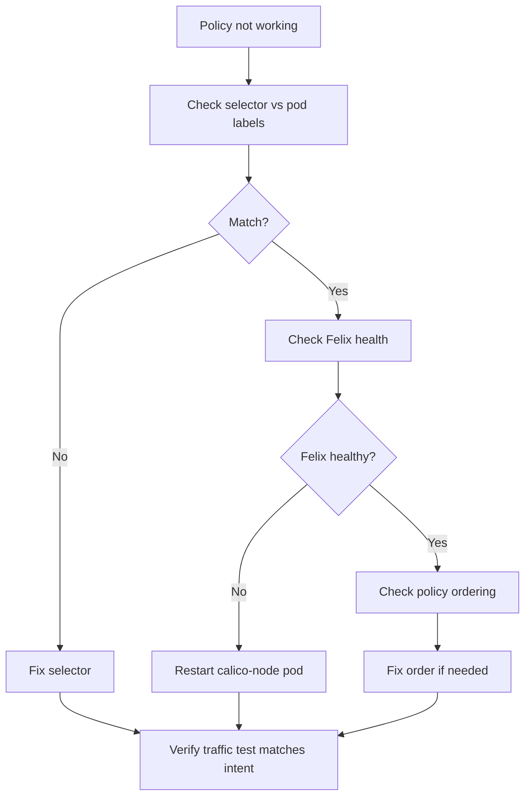

# Runbook: Network Policy Not Taking Effect in Calico

Author: [nawazdhandala](https://github.com/nawazdhandala)

Tags: Calico, Kubernetes, Networking, Troubleshooting

Description: On-call runbook for diagnosing and fixing Calico NetworkPolicy enforcement gaps with selector validation and Felix health checks.

---

## Introduction

This runbook guides engineers through resolving cases where Calico NetworkPolicies are not being enforced. Both security failures (traffic flowing through policies that should block it) and functionality failures (traffic blocked by policies that should allow it) require investigation. This runbook addresses both scenarios.

## Symptoms

- Alert: compliance check detecting policy not enforced
- Traffic flowing that should be blocked (security issue)
- Traffic blocked that should flow (functionality issue)

## Root Causes

- Pod selector mismatch, Felix unhealthy, or policy ordering issue

## Diagnosis Steps

**Step 1: Identify the policy and its target**

```bash
kubectl get networkpolicy <policy-name> -n <namespace> -o yaml
kubectl get pods -n <namespace> --show-labels | grep "<target-label>"
```

**Step 2: Check Felix health on the pod's node**

```bash
POD_NODE=$(kubectl get pod <pod-name> -n <namespace> -o jsonpath='{.spec.nodeName}')
NODE_POD=$(kubectl get pods -n kube-system -l k8s-app=calico-node \
  --field-selector spec.nodeName=$POD_NODE -o name)
kubectl exec $NODE_POD -n kube-system -- wget -qO- http://localhost:9099/readiness
```

**Step 3: Check iptables rules for the policy**

```bash
ssh $POD_NODE "sudo iptables -L | grep cali | head -30"
```

## Solution

**Fix selector mismatch:**

```bash
# Get actual pod labels
kubectl get pod <pod-name> -n <namespace> --show-labels

# Update policy selector
kubectl edit networkpolicy <policy-name> -n <namespace>
# Fix: spec.podSelector.matchLabels to match actual pod labels
```

**Fix Felix unhealthy:**

```bash
kubectl delete pod $NODE_POD -n kube-system
kubectl wait pods -n kube-system -l k8s-app=calico-node \
  --field-selector spec.nodeName=$POD_NODE \
  --for=condition=Ready --timeout=120s
```

**Verify policy takes effect:**

```bash
kubectl run verify-test --image=busybox --restart=Never -- sleep 60
TARGET_IP=$(kubectl get pod <target-pod> -n <ns> -o jsonpath='{.status.podIP}')
kubectl exec verify-test -- ping -c 2 -W 2 $TARGET_IP
# Result should match policy intent
kubectl delete pod verify-test
```



## Prevention

- Test all NetworkPolicy changes before production
- Monitor Felix health and policy sync state
- Use audit mode during policy development

## Conclusion

NetworkPolicy not taking effect is resolved by fixing the selector (most common), restoring Felix health, or adjusting policy ordering. Always verify with a concrete traffic test after applying the fix to confirm the policy is now enforcing the intended behavior.
