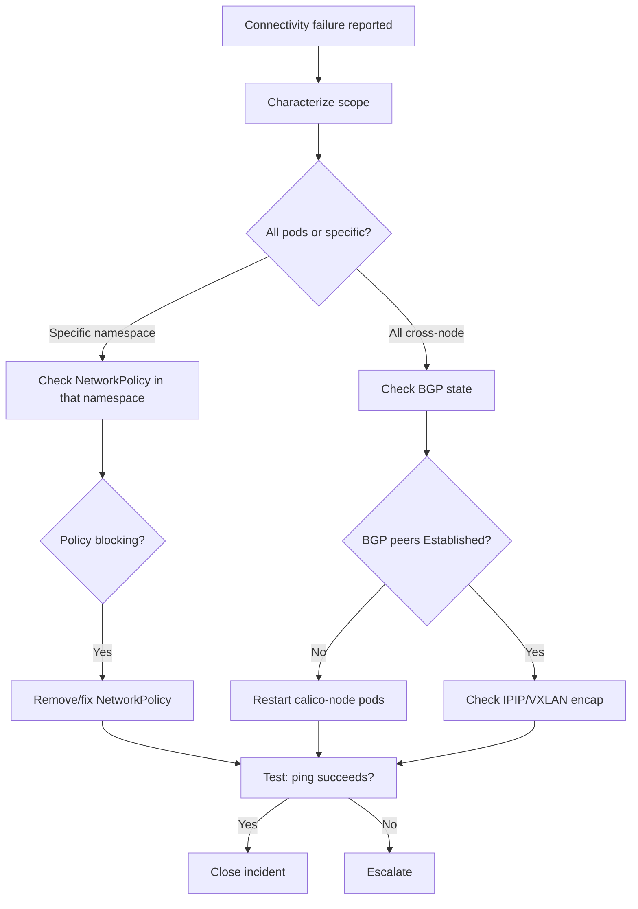

# Runbook: Pods Cannot Ping Each Other with Calico

Author: [nawazdhandala](https://github.com/nawazdhandala)

Tags: Calico, Kubernetes, Networking, Troubleshooting

Description: On-call runbook for resolving pod-to-pod connectivity failures in Calico with triage decision trees, fix commands, and escalation criteria.

---

## Introduction

This runbook provides structured response procedures for pod-to-pod connectivity failure incidents in Calico clusters. It is intended for on-call engineers responding to connectivity alerts or user-reported communication failures between pods.

The most important first action is to characterize the failure scope: is it all pods, a specific namespace, or specific pod-to-pod paths? This determines whether the cause is a global policy change, a namespace-scoped policy, or a node-level routing issue.

Record all command outputs in the incident ticket. For connectivity failures, the network policy state at the time of the incident is the most important artifact for post-incident analysis.

## Symptoms

- Pods cannot ping each other
- Application services returning connection timeouts between pods
- Alert: `CalicoHighPolicyDropRate` or synthetic probe failure

## Root Causes

- Recently applied NetworkPolicy with overly broad deny rules
- BGP routing failure on one or more nodes
- Encapsulation configuration change breaking cross-node traffic

## Diagnosis Steps

**Step 1: Characterize the failure scope**

```bash
# Test in multiple namespaces and across nodes
kubectl run diag-a --image=busybox -n default --restart=Never -- sleep 300
kubectl run diag-b --image=busybox -n default --restart=Never -- sleep 300

kubectl wait pod/diag-a pod/diag-b --for=condition=Ready --timeout=60s

B_IP=$(kubectl get pod diag-b -o jsonpath='{.status.podIP}')
kubectl exec diag-a -- ping -c 3 $B_IP
# Note result: success or failure
```

**Step 2: Check for recently changed NetworkPolicies**

```bash
# Look for recent changes
kubectl get networkpolicy --all-namespaces \
  --sort-by='.metadata.creationTimestamp' | tail -10
```

**Step 3: Check if failure is cross-node only**

```bash
DIAG_A_NODE=$(kubectl get pod diag-a -o jsonpath='{.spec.nodeName}')
DIAG_B_NODE=$(kubectl get pod diag-b -o jsonpath='{.spec.nodeName}')
echo "Pod A: $DIAG_A_NODE | Pod B: $DIAG_B_NODE"
```

**Step 4: Check BGP state**

```bash
calicoctl node status
```

## Solution

**If a recent NetworkPolicy is blocking ICMP:**

```bash
# Temporarily disable the policy to confirm
kubectl delete networkpolicy <policy-name> -n <namespace>
# Test connectivity
kubectl exec diag-a -- ping -c 3 $B_IP
# If restored, add ICMP allow rule to the policy before re-applying
```

**If cross-node only (BGP issue):**

```bash
# Restart BIRD on affected nodes
for NODE in $(kubectl get pods -n kube-system -l k8s-app=calico-node \
  -o jsonpath='{range .items[*]}{.metadata.name}{" "}{end}'); do
  echo "Restarting $NODE"
  kubectl delete pod $NODE -n kube-system
  sleep 30  # Wait between restarts to avoid routing disruption
done
```

**If encapsulation issue:**

```bash
# Check and fix IP pool encapsulation
calicoctl get ippool -o yaml | grep -E "ipipMode|vxlanMode"
calicoctl patch ippool default-ipv4-ippool \
  --patch='{"spec": {"ipipMode": "Always"}}'
```

**Cleanup test pods:**

```bash
kubectl delete pod diag-a diag-b --ignore-not-found
```



## Prevention

- Test connectivity in staging after every NetworkPolicy change
- Monitor Felix drop rate; alert when it spikes
- Review BGP peer state in weekly cluster health checks

## Conclusion

Pod connectivity failures follow predictable patterns in Calico. Characterizing the scope first (all pods vs. specific namespace, same-node vs. cross-node) directs you to the correct fix quickly. NetworkPolicy issues are the most common cause and can typically be resolved within minutes by identifying and correcting the blocking rule.
