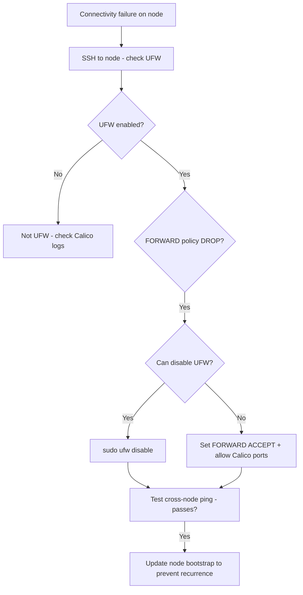

# Runbook: UFW Blocking Kubernetes When Using Calico

Author: [nawazdhandala](https://github.com/nawazdhandala)

Tags: Calico, Kubernetes, Networking, Troubleshooting

Description: On-call runbook for diagnosing and resolving UFW firewall conflicts with Calico and Kubernetes networking on affected nodes.

---

## Introduction

This runbook guides on-call engineers through diagnosing and resolving UFW-Calico networking conflicts. This incident type typically appears after OS maintenance, automated hardening, or UFW package upgrades that reset firewall defaults. The key diagnostic question is: was UFW recently enabled or changed on the affected node?

Because UFW changes affect the entire node's networking (not just Calico pods), the impact can be broad: all cross-node traffic may be affected, not just specific pods or namespaces.

## Symptoms

- Cross-node pod communication fails on specific nodes
- Alert: calico-node unavailable or cross-node connectivity probe failing
- Issue correlates with OS maintenance on affected nodes

## Root Causes

- UFW enabled during OS hardening without Kubernetes exceptions
- UFW upgraded and reset to defaults
- DEFAULT_FORWARD_POLICY reset to DROP

## Diagnosis Steps

**Step 1: Identify affected nodes**

```bash
kubectl get pods --all-namespaces | grep -v Running | grep -v Completed
# Identify which nodes have pods failing
```

**Step 2: Check UFW state on affected node**

```bash
# SSH to the affected node
export AFFECTED_NODE=<node-name>
ssh $AFFECTED_NODE "sudo ufw status verbose"
ssh $AFFECTED_NODE "sudo iptables -L FORWARD -n | head -3"
```

**Step 3: Check iptables FORWARD policy**

```bash
ssh $AFFECTED_NODE "sudo iptables -L FORWARD -n | head -1"
# If output shows "Chain FORWARD (policy DROP)": UFW is blocking
```

## Solution

**Fast path: Disable UFW (if safe to do)**

```bash
ssh $AFFECTED_NODE "sudo ufw disable"
ssh $AFFECTED_NODE "sudo iptables -L FORWARD -n | head -1"
# Should now show ACCEPT or Calico's chain

# Test cross-node connectivity immediately
kubectl run ufw-test --image=busybox --restart=Never \
  --overrides="{\"spec\":{\"nodeName\":\"$AFFECTED_NODE\"}}" -- sleep 30
kubectl wait pod/ufw-test --for=condition=Ready --timeout=60s
echo "Node $AFFECTED_NODE: Pod scheduling OK"
kubectl delete pod ufw-test
```

**Alternative: Configure UFW to allow Calico**

```bash
ssh $AFFECTED_NODE << 'EOF'
sudo sed -i 's/DEFAULT_FORWARD_POLICY="DROP"/DEFAULT_FORWARD_POLICY="ACCEPT"/' \
  /etc/default/ufw
sudo ufw allow proto 4 from any
sudo ufw allow 4789/udp
sudo ufw allow 179/tcp
sudo ufw reload
EOF
```

**Verify recovery**

```bash
# Check calico-node on affected node
kubectl get pods -n kube-system -l k8s-app=calico-node \
  --field-selector spec.nodeName=$AFFECTED_NODE

# Test cross-node ping
kubectl run test-src --image=busybox --restart=Never \
  --overrides="{\"spec\":{\"nodeName\":\"$AFFECTED_NODE\"}}" -- sleep 60
kubectl run test-dst --image=busybox --restart=Never -- sleep 60
kubectl wait pod/test-src pod/test-dst --for=condition=Ready --timeout=60s
DST_IP=$(kubectl get pod test-dst -o jsonpath='{.status.podIP}')
kubectl exec test-src -- ping -c 3 $DST_IP
kubectl delete pod test-src test-dst
```



## Prevention

- Add UFW state to automated node health checks
- Update node bootstrap to pre-configure UFW exceptions before enabling
- Alert on calico-node becoming unavailable on any node

## Conclusion

UFW blocking Calico is resolved by either disabling UFW or configuring FORWARD policy to ACCEPT with Calico-specific port allows. The fix is quick to apply but prevention through node bootstrap configuration is essential to avoid recurrence after OS maintenance.
