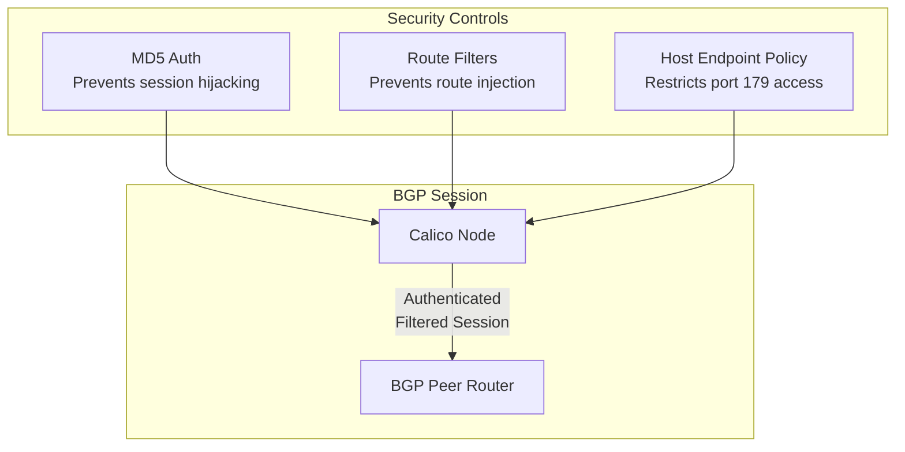

# How to Secure BGP Peering in Calico

Author: [nawazdhandala](https://github.com/nawazdhandala)

Tags: Calico, Kubernetes, BGP, Security, Networking

Description: Secure Calico BGP peering sessions using MD5 authentication, BGP route filters, and network policies to prevent unauthorized route injection and hijacking.

---

## Introduction

BGP peering sessions in Calico carry sensitive routing information: every pod CIDR and service IP being advertised. An attacker who can inject false BGP routes can redirect traffic, cause denial of service, or intercept pod communications. Securing BGP peering is therefore a critical security control for any production Kubernetes cluster.

Calico supports several mechanisms to harden BGP: MD5 session authentication prevents unauthorized peers from establishing sessions, prefix length filters reject unusually large or small prefixes that could indicate misconfiguration or attack, and Kubernetes NetworkPolicy can restrict which nodes are permitted to initiate BGP connections.

This guide covers the essential security hardening steps for Calico BGP peering, from authentication to filtering to monitoring for anomalous route changes.

## Prerequisites

- Calico v3.26+ with BGP mode
- `calicoctl` access
- BGP peer routers that support MD5 authentication (if using external peers)

## Enable MD5 Authentication

MD5 authentication prevents BGP session hijacking by requiring a shared secret between peers:

```yaml
apiVersion: projectcalico.org/v3
kind: BGPPeer
metadata:
  name: external-router-secure
spec:
  peerIP: 192.168.1.1
  asNumber: 64513
  password:
    secretKeyRef:
      name: bgp-passwords
      key: router-password
```

Create the Kubernetes Secret with the BGP password:

```bash
kubectl create secret generic bgp-passwords \
  --from-literal=router-password='S3cur3BGPp@ssw0rd' \
  -n calico-system
```

## Restrict BGP Connections with HostEndpoint Policies

Limit BGP connections (TCP port 179) to authorized peers only using Calico host endpoint policies:

```yaml
apiVersion: projectcalico.org/v3
kind: GlobalNetworkPolicy
metadata:
  name: allow-bgp-from-peers
spec:
  selector: "has(kubernetes.io/hostname)"
  types:
  - Ingress
  ingress:
  - action: Allow
    protocol: TCP
    source:
      nets:
      - 192.168.1.0/24
    destination:
      ports:
      - 179
  - action: Deny
    protocol: TCP
    destination:
      ports:
      - 179
```

## Configure Prefix Length Filters

Prevent route leaks by filtering out prefixes that are too large or too small:

```bash
# Check current BGP configuration
calicoctl get bgpconfiguration default -o yaml
```

Create a route filter to reject unexpected prefixes via BGPFilter resource (Calico v3.27+):

```yaml
apiVersion: projectcalico.org/v3
kind: BGPFilter
metadata:
  name: restrict-prefixes
spec:
  exportV4:
  - action: Accept
    matchOperator: In
    cidr: 10.0.0.0/8
    prefixLength:
      min: 24
      max: 32
  - action: Reject
  importV4:
  - action: Accept
    matchOperator: In
    cidr: 0.0.0.0/0
    prefixLength:
      min: 24
      max: 32
  - action: Reject
```

Apply the filter to a peer:

```yaml
apiVersion: projectcalico.org/v3
kind: BGPPeer
metadata:
  name: external-router
spec:
  peerIP: 192.168.1.1
  asNumber: 64513
  filters:
  - restrict-prefixes
```

## BGP Security Architecture



## Audit BGP Changes

Set up alerting on unexpected BGP peer state changes:

```bash
kubectl get events -n calico-system | grep -i bgp
kubectl logs -n calico-system ds/calico-node | grep -i "peer\|route"
```

## Conclusion

Securing Calico BGP peering is a multi-layered effort. MD5 authentication provides strong session-level security, prefix filters prevent route injection attacks, and host endpoint policies ensure only authorized systems can establish BGP connections. Combine these controls with regular auditing of BGP session and route changes to maintain a hardened network security posture.
