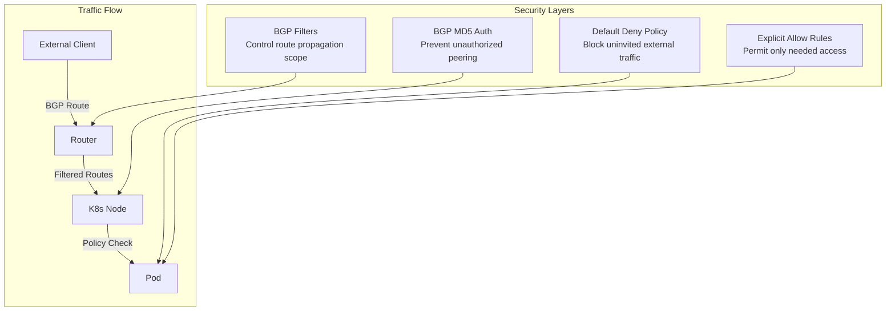

# How to Secure BGP to Workload Connectivity in Calico

Author: [nawazdhandala](https://github.com/nawazdhandala)

Tags: Calico, Kubernetes, BGP, Security, Networking

Description: Secure direct BGP-to-workload connectivity in Calico by combining network policies, BGP route filters, and access controls to protect pods from unauthorized external access.

---

## Introduction

When pod IPs are directly routable via BGP, every pod becomes potentially reachable from anywhere on your network — or even the internet if your BGP peers propagate routes externally. This creates significant security concerns: without proper controls, any host that has a route to the pod CIDR can connect directly to any pod on any port.

Calico's network policy engine provides the primary defense, but it must be configured explicitly. By default, Calico allows all traffic unless deny policies exist. The security model for direct pod connectivity requires a default-deny stance at the pod level, combined with explicit allow rules for legitimate traffic, BGP route filtering to limit where routes are propagated, and access controls on BGP peering sessions themselves.

## Prerequisites

- Calico BGP mode with direct pod connectivity enabled
- `calicoctl` access for creating global policies
- Understanding of which external systems need pod access

## Implement Default Deny for External Traffic

Create a GlobalNetworkPolicy that denies all external traffic to pods by default:

```yaml
apiVersion: projectcalico.org/v3
kind: GlobalNetworkPolicy
metadata:
  name: default-deny-external
spec:
  order: 1000
  selector: all()
  types:
  - Ingress
  ingress:
  - action: Allow
    source:
      nets:
      - 10.48.0.0/16  # Allow pod-to-pod
      - 10.96.0.0/12  # Allow service CIDR
  - action: Deny
    source:
      nets:
      - 0.0.0.0/0
```

## Allow Specific External Access

Create explicit allow rules for services that need external access:

```yaml
apiVersion: projectcalico.org/v3
kind: NetworkPolicy
metadata:
  name: allow-external-web
  namespace: production
spec:
  selector: app == 'web'
  types:
  - Ingress
  ingress:
  - action: Allow
    protocol: TCP
    source:
      nets:
      - 192.168.10.0/24  # Internal clients only
    destination:
      ports:
      - 80
      - 443
```

## Limit BGP Route Advertisement Scope

Use BGP filters to control which routes are advertised to which peers:

```yaml
apiVersion: projectcalico.org/v3
kind: BGPFilter
metadata:
  name: internal-routes-only
spec:
  exportV4:
  - action: Accept
    cidr: 10.48.0.0/16
    prefixLength:
      min: 24
      max: 32
  - action: Reject
```

Apply to specific peers:

```yaml
apiVersion: projectcalico.org/v3
kind: BGPPeer
metadata:
  name: internal-router
spec:
  peerIP: 192.168.0.1
  asNumber: 64513
  filters:
  - internal-routes-only
```

## Security Architecture



## Conclusion

Securing BGP-to-workload connectivity requires a defense-in-depth approach: control where BGP routes are propagated using filters, authenticate BGP sessions with MD5, implement default-deny network policies at the pod level, and create explicit allow rules for legitimate traffic. Together these controls ensure that direct pod reachability via BGP does not become a security liability.
