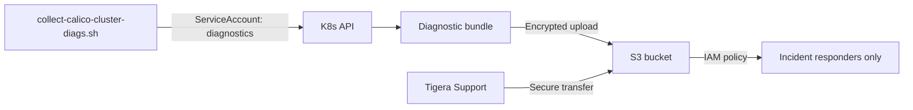

# How to Secure Calico Cluster Diagnostics

Author: [nawazdhandala](https://github.com/nawazdhandala)

Tags: Calico, Kubernetes, Networking, Diagnostics, Security

Description: Secure Calico cluster diagnostic access by implementing RBAC for cluster-wide resource reads, controlling calicoctl cluster diags execution, and ensuring diagnostic bundles are stored securely.

---

## Introduction

Calico cluster diagnostic bundles contain sensitive information: IP allocation tables, BGP peer configurations, network policies, and node topology. Securing diagnostics means controlling who can run `calicoctl cluster diags`, where bundles are stored, and who can access them after collection. The diagnostic service account needs read access to all Calico CRDs without write permissions.

## Cluster-Wide Read RBAC for Diagnostics

```yaml
# calico-cluster-diagnostics-role.yaml
apiVersion: rbac.authorization.k8s.io/v1
kind: ClusterRole
metadata:
  name: calico-cluster-diagnostics
rules:
  # All Calico CRDs - read only
  - apiGroups: ["projectcalico.org", "crd.projectcalico.org"]
    resources: ["*"]
    verbs: ["get", "list", "watch"]
  # Operator resources
  - apiGroups: ["operator.tigera.io"]
    resources: ["*"]
    verbs: ["get", "list", "watch"]
  # calico-system pods/logs
  - apiGroups: [""]
    resources: ["pods", "pods/log", "namespaces"]
    verbs: ["get", "list"]
  - apiGroups: ["apps"]
    resources: ["daemonsets", "deployments"]
    verbs: ["get", "list"]
---
apiVersion: rbac.authorization.k8s.io/v1
kind: ClusterRoleBinding
metadata:
  name: calico-cluster-diagnostics
subjects:
  - kind: ServiceAccount
    name: calico-diagnostics
    namespace: calico-system
roleRef:
  kind: ClusterRole
  name: calico-cluster-diagnostics
  apiGroup: rbac.authorization.k8s.io
```

## Secure Diagnostic Bundle Storage

```bash
# Store bundles in an access-controlled S3/GCS bucket
collect-calico-cluster-diags.sh

# Upload with restricted access
aws s3 cp calico-cluster-diags.tar.gz \
  s3://incident-diagnostics-bucket/calico/$(date +%Y/%m/%d)/ \
  --sse aws:kms \
  --kms-key-id arn:aws:kms:region:account:key/key-id

# Apply bucket policy: restrict to incident-response role only
```

## What's in the Diagnostic Bundle (Sensitivity Assessment)

```markdown
## Diagnostic Bundle Sensitivity Guide

| Content | Sensitivity | Reason |
|---------|-------------|--------|
| IP allocations (ipam-blocks.txt) | Medium | Node topology |
| BGP peer IPs (bgppeer.yaml) | High | Infrastructure topology |
| Network policies (gnp.yaml) | High | Security policy rules |
| Component logs | Medium | May contain node/pod names |
| TigeraStatus | Low | Health status only |

**Handling**: Treat bundles as confidential infrastructure data.
Share only with: on-call engineers, Tigera Support, security team.
```

## Security Architecture



## Conclusion

Calico cluster diagnostic bundles should be treated as confidential infrastructure documents because they contain BGP peer IPs and network policy details. Use a dedicated service account with read-only Calico CRD access for automated collection, encrypt bundles at rest in a restricted storage bucket, and control access with IAM policies. For Tigera Support tickets, use Tigera's secure case attachment mechanism rather than email to transfer diagnostic bundles.
