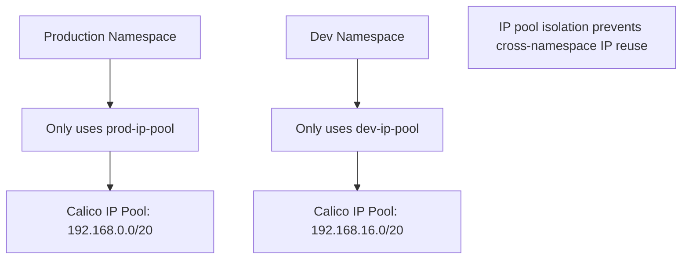

# Secure Calico CNI Plugin

Author: [nawazdhandala](https://github.com/nawazdhandala)

Tags: Calico, Kubernetes, Networking, CNI, Plugin, Security

Description: Security hardening for the Calico CNI plugin, covering CNI configuration file protection, IPAM access control, WorkloadEndpoint isolation, and preventing CNI bypass attacks.

---

## Introduction

The Calico CNI plugin runs with elevated privileges and writes network configuration for every pod. Securing the CNI plugin means protecting the CNI configuration files from unauthorized modification, restricting which workloads can request specific IP addresses from IPAM, and ensuring that the RBAC permissions granted to the CNI plugin are minimal.

A compromised or manipulated CNI configuration could assign pods to wrong IP pools (bypassing policy), skip WorkloadEndpoint creation (disabling policy enforcement), or configure incorrect routes that expose internal services.

## Prerequisites

- Calico installed with CNI plugin operational
- Understanding of Kubernetes RBAC
- Node-level access to inspect CNI configuration

## Security Practice 1: Protect CNI Configuration Files

CNI configuration files are critical — an attacker who can modify them could disable Calico's policy enforcement:

```bash
# Verify file permissions on nodes
kubectl debug node/worker-1 -it --image=ubuntu -- \
  ls -la /host/etc/cni/net.d/10-calico.conflist
# Should be: -rw-r--r-- root root (644)

# Set correct permissions
chmod 644 /etc/cni/net.d/10-calico.conflist
chown root:root /etc/cni/net.d/10-calico.conflist
```

Detect unauthorized modifications via a monitoring script:

```bash
# Store expected hash
sha256sum /etc/cni/net.d/10-calico.conflist > /etc/cni/net.d/.expected-hash

# Periodic verification (run via CronJob or auditd)
if ! sha256sum -c /etc/cni/net.d/.expected-hash 2>/dev/null; then
  echo "ALERT: CNI configuration file modified!"
fi
```

## Security Practice 2: Restrict CNI RBAC Permissions

The Calico CNI plugin needs minimal Kubernetes API access:

```yaml
apiVersion: rbac.authorization.k8s.io/v1
kind: ClusterRole
metadata:
  name: calico-cni
rules:
  - apiGroups: [""]
    resources: ["pods", "nodes", "namespaces"]
    verbs: ["get", "list"]
  - apiGroups: ["projectcalico.org"]
    resources: ["workloadendpoints"]
    verbs: ["get", "list", "create", "update", "delete"]
  - apiGroups: ["projectcalico.org"]
    resources: ["ippools", "ipamblocks", "ipamhandles", "ipamconfigs"]
    verbs: ["get", "list", "create", "update", "delete"]
```

## Security Practice 3: IP Pool Namespace Scoping



Configure pool selectors:

```yaml
apiVersion: projectcalico.org/v3
kind: IPPool
metadata:
  name: prod-pool
spec:
  cidr: 192.168.0.0/20
  nodeSelector: "all()"
  namespaceSelector: "kubernetes.io/metadata.name == 'production'"
```

## Security Practice 4: Prevent CNI Bypass

Pods should not be able to bypass CNI by using hostNetwork:

```yaml
# Use OPA/Kyverno to restrict hostNetwork usage
apiVersion: kyverno.io/v1
kind: ClusterPolicy
metadata:
  name: disallow-host-network
spec:
  rules:
    - name: deny-host-network
      match:
        resources:
          kinds: [Pod]
      validate:
        message: "Host network is not allowed"
        pattern:
          spec:
            hostNetwork: "false | null"
```

## Security Practice 5: Audit CNI Invocations

Log all CNI plugin invocations:

```json
{
  "log_level": "info",
  "log_file_path": "/var/log/calico/cni/cni.log"
}
```

Forward CNI logs to your SIEM for audit:

```bash
# Configure log forwarding from /var/log/calico/cni/ to central logging
# via FluentBit or Promtail DaemonSet
```

## Conclusion

Securing the Calico CNI plugin requires protecting CNI configuration files from unauthorized modification, applying minimal RBAC permissions to the CNI service account, using IP pool namespace scoping to prevent cross-namespace address reuse, restricting hostNetwork pod usage, and auditing all CNI invocations via log forwarding. File integrity monitoring of the CNI configuration is particularly important as it's a relatively unpublicized attack vector.
