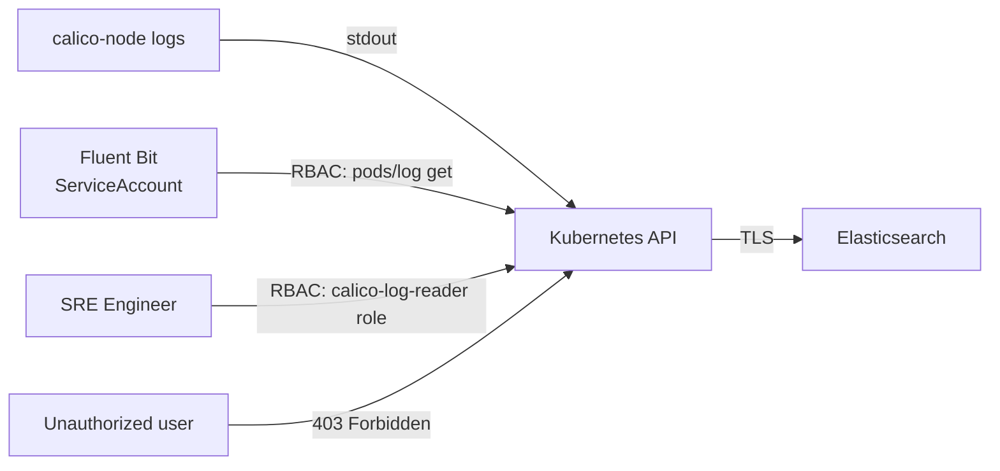

# How to Secure Calico Component Log Collection

Author: [nawazdhandala](https://github.com/nawazdhandala)

Tags: Calico, Kubernetes, Networking, Logging, Security

Description: Secure Calico log collection by controlling access to sensitive log data, implementing log shipper RBAC with least privilege, encrypting log transmission, and filtering sensitive fields from Calico logs before forwarding.

---

## Introduction

Calico logs can contain sensitive information including IP addresses, network policy names, and node topology data. Securing log collection means restricting who can read logs from the calico-system namespace, ensuring the log shipper service account has minimum required permissions, and optionally filtering or masking sensitive fields before logs leave the cluster.

## Least-Privilege RBAC for Log Shippers

```yaml
# fluent-bit-rbac.yaml
# Grants Fluent Bit read-only access to pod logs in calico-system
apiVersion: rbac.authorization.k8s.io/v1
kind: ClusterRole
metadata:
  name: fluent-bit-calico-log-reader
rules:
  - apiGroups: [""]
    resources: ["pods", "namespaces"]
    verbs: ["get", "list", "watch"]
  - apiGroups: [""]
    resources: ["pods/log"]
    verbs: ["get"]
---
apiVersion: rbac.authorization.k8s.io/v1
kind: ClusterRoleBinding
metadata:
  name: fluent-bit-calico-log-reader
subjects:
  - kind: ServiceAccount
    name: fluent-bit
    namespace: logging
roleRef:
  kind: ClusterRole
  name: fluent-bit-calico-log-reader
  apiGroup: rbac.authorization.k8s.io
```

## Restrict Direct kubectl Log Access

```yaml
# Restrict who can read calico-system logs via kubectl
apiVersion: rbac.authorization.k8s.io/v1
kind: Role
metadata:
  name: calico-log-reader
  namespace: calico-system
rules:
  - apiGroups: [""]
    resources: ["pods/log"]
    verbs: ["get"]
---
apiVersion: rbac.authorization.k8s.io/v1
kind: RoleBinding
metadata:
  name: calico-log-reader-binding
  namespace: calico-system
subjects:
  - kind: Group
    name: network-sre
    apiGroup: rbac.authorization.k8s.io
roleRef:
  kind: Role
  name: calico-log-reader
  apiGroup: rbac.authorization.k8s.io
```

## Encrypt Log Transmission with TLS

```yaml
# Fluent Bit output with TLS to Elasticsearch
apiVersion: v1
kind: ConfigMap
metadata:
  name: fluent-bit-output
  namespace: logging
data:
  output.conf: |
    [OUTPUT]
        Name            es
        Match           kube.calico-system.*
        Host            elasticsearch.logging.svc.cluster.local
        Port            9200
        TLS             On
        TLS.Verify      On
        TLS.CA_File     /etc/ssl/certs/ca-bundle.crt
        HTTP_User       fluentbit
        HTTP_Passwd     ${ELASTICSEARCH_PASSWORD}
```

## Security Architecture



## Filter Sensitive Fields Before Forwarding

```yaml
# Fluent Bit Lua filter to mask IP addresses in logs
apiVersion: v1
kind: ConfigMap
metadata:
  name: fluent-bit-lua-filters
  namespace: logging
data:
  mask-ips.lua: |
    function mask_ips(tag, timestamp, record)
      if record["log"] then
        -- Replace IPv4 addresses with masked version for non-SRE teams
        record["log"] = string.gsub(record["log"],
          "%d+%.%d+%.%d+%.%d+", "[IP-MASKED]")
      end
      return 1, timestamp, record
    end
```

## Conclusion

Securing Calico log collection requires three controls: RBAC that limits log shipper service accounts to read-only pod log access, RBAC that limits which engineers can directly kubectl logs into calico-system, and TLS encryption for log transmission to the aggregation backend. For compliance-sensitive environments, the Lua filter approach allows masking IP addresses before logs reach centralized storage, ensuring that network topology data is not visible to teams without a need-to-know. Apply the most restrictive access that still allows effective incident response.
