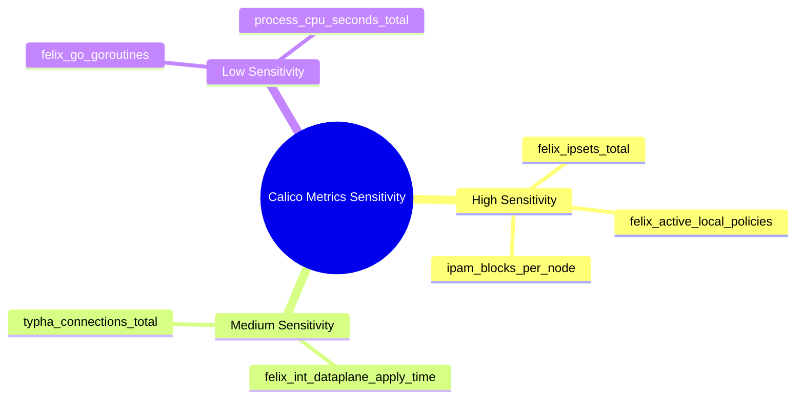

# How to Secure Calico Component Metrics Monitoring

Author: [nawazdhandala](https://github.com/nawazdhandala)

Tags: Calico, Kubernetes, Networking, Metrics, Prometheus, Security

Description: Secure Calico Prometheus metrics endpoints using TLS, authentication, network policies, and RBAC to prevent unauthorized access to sensitive networking telemetry.

---

## Introduction

Calico metrics endpoints expose sensitive information about your network topology: IP pool allocations, active policies, connected nodes, and connection counts. Without proper access controls, an attacker who gains access to the metrics endpoints can map your network architecture and identify security policy gaps.

Securing Calico metrics involves: TLS encryption for metrics transport, network policies restricting which pods can scrape metrics, RBAC for Prometheus ServiceMonitors, and audit logging for metrics access.

## Prerequisites

- Calico metrics enabled
- cert-manager for TLS certificate management
- Prometheus with TLS scraping support

## Security Control 1: TLS for Felix Metrics

```yaml
# Create a certificate for Felix metrics
apiVersion: cert-manager.io/v1
kind: Certificate
metadata:
  name: calico-felix-metrics-tls
  namespace: calico-system
spec:
  secretName: calico-felix-metrics-tls
  duration: 8760h
  renewBefore: 720h
  commonName: calico-felix
  dnsNames:
    - calico-felix.calico-system.svc
  issuerRef:
    name: cluster-ca-issuer
    kind: ClusterIssuer
  privateKey:
    algorithm: ECDSA
    size: 256
```

```yaml
# Configure Felix to use TLS for metrics (via FelixConfiguration)
# Note: TLS for metrics requires Calico Enterprise or specific versions
apiVersion: projectcalico.org/v3
kind: FelixConfiguration
metadata:
  name: default
spec:
  prometheusMetricsEnabled: true
  prometheusMetricsPort: 9091
  # Additional TLS configuration depends on Calico version
```

## Security Control 2: Network Policy Restricting Metrics Access

```yaml
# Allow only Prometheus namespace to scrape calico metrics
apiVersion: networking.k8s.io/v1
kind: NetworkPolicy
metadata:
  name: calico-felix-metrics-restrict
  namespace: calico-system
spec:
  podSelector:
    matchLabels:
      k8s-app: calico-node
  policyTypes:
    - Ingress
  ingress:
    # Only monitoring namespace can access metrics
    - from:
        - namespaceSelector:
            matchLabels:
              kubernetes.io/metadata.name: monitoring
          podSelector:
            matchLabels:
              app.kubernetes.io/name: prometheus
      ports:
        - port: 9091
          protocol: TCP
    # Kubelet health checks
    - from: []
      ports:
        - port: 9099
          protocol: TCP
```

## Security Control 3: RBAC for ServiceMonitor Management

```yaml
# Only monitoring-admin can create/modify ServiceMonitors
apiVersion: rbac.authorization.k8s.io/v1
kind: Role
metadata:
  name: calico-servicemonitor-admin
  namespace: monitoring
rules:
  - apiGroups: ["monitoring.coreos.com"]
    resources: ["servicemonitors"]
    resourceNames:
      - "calico-felix-metrics"
      - "calico-typha-metrics"
      - "calico-kube-controllers-metrics"
    verbs: ["get", "update", "patch"]
  - apiGroups: ["monitoring.coreos.com"]
    resources: ["servicemonitors"]
    verbs: ["list", "watch"]
```

## Security Control 4: Prometheus RBAC for Scraping

```yaml
# Prometheus service account needs to scrape calico-system
apiVersion: rbac.authorization.k8s.io/v1
kind: ClusterRole
metadata:
  name: prometheus-calico-scraper
rules:
  - apiGroups: [""]
    resources: ["pods", "endpoints", "services"]
    namespaces: ["calico-system"]
    verbs: ["get", "list", "watch"]
```

## Metrics Sensitivity Classification



## Conclusion

Securing Calico metrics monitoring balances access needs (Prometheus must scrape the endpoints) with sensitivity requirements (metrics reveal network topology). The most important controls are network policies restricting metrics port access to the Prometheus namespace, and RBAC ensuring only authorized administrators can modify the ServiceMonitor configuration. For the highest security posture, add TLS to the metrics transport to prevent credential-free scraping from compromised pods in the monitoring namespace.
