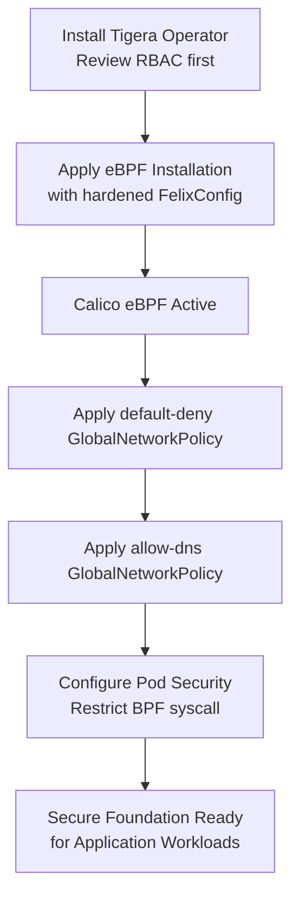

# How to Secure Calico eBPF Installation

Author: [nawazdhandala](https://github.com/nawazdhandala)

Tags: Calico, Kubernetes, Networking, eBPF, Installation, Security

Description: Apply security hardening during Calico eBPF installation to establish a secure-by-default networking foundation with default-deny policies, restricted BPF access, and minimal attack surface.

---

## Introduction

Securing a Calico eBPF installation from the start is far easier than retrofitting security controls onto an existing deployment. When you install Calico with eBPF, you have the opportunity to establish default-deny network policies immediately, configure Felix security settings, restrict BPF syscall access for non-Calico components, and set up certificate management before any application workloads are deployed.

A security-first eBPF installation establishes: default-deny global network policies (allowing only approved traffic), Felix configured with security-hardened settings, node-level BPF syscall restrictions, and proper secret management for any certificates.

## Prerequisites

- Fresh Kubernetes cluster (no CNI yet)
- Calico eBPF installation plan ready
- Understanding of your cluster's required network flows

## Security Step 1: Install with Minimal Permissions

```bash
# Audit what the Tigera Operator will do before applying
curl -s https://raw.githubusercontent.com/projectcalico/calico/v3.27.0/manifests/tigera-operator.yaml | \
  grep -E "apiGroups|resources|verbs" | head -40

# Apply operator only when you've reviewed permissions
kubectl create -f tigera-operator.yaml
```

## Security Step 2: Harden Felix Configuration

```yaml
# felix-security-config.yaml - Apply alongside Installation
apiVersion: projectcalico.org/v3
kind: FelixConfiguration
metadata:
  name: default
spec:
  # Enable Prometheus metrics (for security monitoring)
  prometheusMetricsEnabled: true
  prometheusMetricsPort: 9091

  # Log denied traffic for security analysis
  logSeverityScreen: Info

  # Fail-safe rules: prevent lockout during misconfiguration
  failsafeInboundHostPorts:
    - protocol: tcp
      port: 22   # SSH for emergency access
    - protocol: tcp
      port: 6443  # Kubernetes API
  failsafeOutboundHostPorts:
    - protocol: tcp
      port: 6443
    - protocol: udp
      port: 53   # DNS
```

## Security Step 3: Default-Deny Policies at Installation Time

```yaml
# default-deny-global.yaml - Apply immediately after Calico is ready
apiVersion: projectcalico.org/v3
kind: GlobalNetworkPolicy
metadata:
  name: default-deny-all
spec:
  order: 1000
  selector: "!has(calico-system) && !has(kube-system)"
  types:
    - Ingress
    - Egress
  # No rules = deny all matched traffic

---
# Allow DNS for all pods
apiVersion: projectcalico.org/v3
kind: GlobalNetworkPolicy
metadata:
  name: allow-dns
spec:
  order: 100
  selector: all()
  types:
    - Egress
  egress:
    - action: Allow
      protocol: UDP
      destination:
        ports: [53]
    - action: Allow
      protocol: TCP
      destination:
        ports: [53]
```

## Security Step 4: Restrict eBPF Access for Application Pods

```yaml
# Pod Security Admission: restrict privileged access
# (prevents application pods from loading BPF programs)
apiVersion: v1
kind: Namespace
metadata:
  name: production
  labels:
    pod-security.kubernetes.io/enforce: restricted
    pod-security.kubernetes.io/audit: restricted
```

## Secure Installation Architecture



## Security Validation

```bash
# Verify default-deny is in effect
kubectl run test-blocked --image=busybox --restart=Never -- \
  wget -qO/dev/null --timeout=3 http://1.1.1.1 \
  && echo "FAIL: External access not blocked" \
  || echo "OK: External traffic blocked by default-deny"

# Verify DNS still works (allowed by allow-dns policy)
kubectl run test-dns --image=busybox --restart=Never -- \
  nslookup kubernetes.default.svc.cluster.local \
  && echo "OK: DNS works" \
  || echo "FAIL: DNS blocked"

kubectl delete pod test-blocked test-dns
```

## Conclusion

A security-first Calico eBPF installation establishes a defense-in-depth foundation before any application workloads are deployed. By applying default-deny global network policies immediately after Calico becomes ready, hardening Felix configuration, and using Pod Security Admission to restrict BPF access for application pods, you ensure every workload deployed into the cluster starts from a secure network baseline. This is significantly easier than retrofitting security controls onto a cluster that already has permissive networking.
