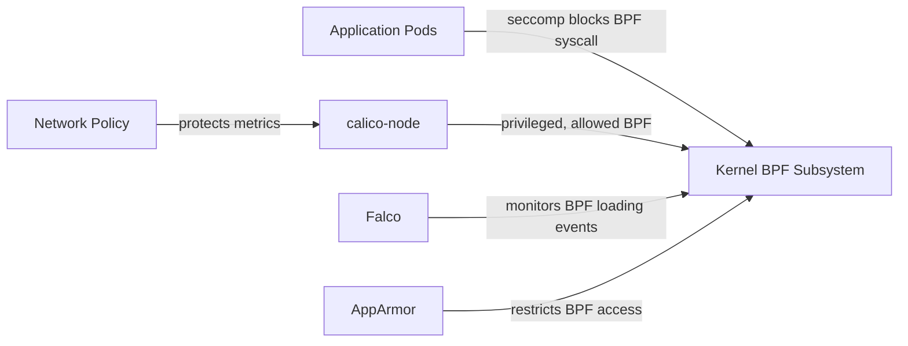

# How to Secure Calico eBPF Mode

Author: [nawazdhandala](https://github.com/nawazdhandala)

Tags: Calico, Kubernetes, Networking, EBPF, Security

Description: Apply security hardening for Calico eBPF mode, covering BPF program access controls, kernel security settings, and eBPF-specific threat mitigations.

---

## Introduction

Calico eBPF mode introduces a new attack surface: BPF programs running in the kernel with elevated privileges. While Calico's BPF programs are designed securely, understanding the BPF security model and applying appropriate controls helps defend against both exploitation of Calico itself and misuse of the BPF subsystem by other processes on the same nodes.

The BPF security model relies on the Linux kernel's BPF verifier to ensure programs cannot harm the kernel, but privileged containers can still interact with BPF maps and programs. Additional security controls include restricting BPF access via seccomp/AppArmor, monitoring BPF program loading events, and auditing BPF map access.

## Prerequisites

- Calico with eBPF mode active
- Understanding of Linux security modules (AppArmor/seccomp)
- Falco or similar runtime security tooling

## Security Control 1: Restrict BPF Syscall Access

```bash
# Verify Calico's seccomp profile restricts BPF syscall for non-privileged containers
# Calico-node itself needs BPF syscall access, but other pods should not

# Create a restrictive seccomp profile for application pods
cat > /etc/kubernetes/seccomp/restricted-no-bpf.json <<'EOF'
{
  "defaultAction": "SCMP_ACT_ERRNO",
  "architectures": ["SCMP_ARCH_X86_64"],
  "syscalls": [
    {
      "names": ["bpf"],
      "action": "SCMP_ACT_ERRNO",
      "comment": "BPF syscall blocked for non-network components"
    }
  ]
}
EOF

# Apply via PodSecurityContext for application workloads
# (seccomp profile should block bpf syscall unless pod needs it)
```

## Security Control 2: Monitor BPF Program Loading

```yaml
# Falco rule to detect unexpected BPF program loading
# falco-rules-ebpf.yaml
- rule: Unexpected BPF Program Loaded
  desc: Detect BPF program loading outside of Calico components
  condition: >
    evt.type = bpf and
    not proc.name in (calico-node, felix, bpftool) and
    not container.image.repository contains "calico"
  output: >
    Unexpected BPF program loading
    (proc=%proc.name user=%user.name container=%container.id
     image=%container.image.repository)
  priority: WARNING
  tags: [network, ebpf, mitre_persistence]
```

## Security Control 3: Network Policy for eBPF Control Plane

```yaml
# Protect Calico's BPF-related health and metrics endpoints
apiVersion: networking.k8s.io/v1
kind: NetworkPolicy
metadata:
  name: calico-ebpf-metrics
  namespace: calico-system
spec:
  podSelector:
    matchLabels:
      k8s-app: calico-node
  policyTypes:
    - Ingress
  ingress:
    # Only allow Prometheus to scrape metrics
    - from:
        - namespaceSelector:
            matchLabels:
              kubernetes.io/metadata.name: monitoring
      ports:
        - port: 9091
          protocol: TCP
    # Allow kubelet health probes
    - from: []
      ports:
        - port: 9099
          protocol: TCP
```

## Security Control 4: Kernel Lockdown Mode Considerations

```bash
# Linux Kernel Lockdown mode (available in kernels 5.4+)
# restricts BPF program loading to reduce attack surface
# NOTE: This may conflict with Calico's eBPF mode

# Check if lockdown is active
cat /sys/kernel/security/lockdown 2>/dev/null || echo "Lockdown not configured"

# If using lockdown with eBPF, use "integrity" mode, not "confidentiality"
# "confidentiality" mode blocks BPF entirely and is incompatible with Calico eBPF
```

## Security Architecture



## Security Control 5: BPF Map Access Auditing

```bash
# List all BPF maps loaded by Calico
kubectl exec -n calico-system ds/calico-node -c calico-node -- \
  bpftool map list 2>/dev/null | grep -i calico

# Monitor BPF map operations with bpftrace (advanced)
# Only run for security auditing purposes
bpftrace -e 'kprobe:sys_bpf { printf("BPF syscall: pid=%d comm=%s\n", pid, comm); }'
```

## Conclusion

Securing Calico eBPF mode involves restricting BPF syscall access for non-network workloads via seccomp profiles, monitoring for unexpected BPF program loading with runtime security tools like Falco, protecting Calico's metrics and health endpoints with network policies, and understanding the implications of Linux kernel lockdown mode. The eBPF security model is fundamentally different from iptables - instead of file-based security, it relies on the kernel's BPF verifier and process privilege controls. Building monitoring for unexpected BPF activity is the most impactful security control for eBPF deployments.
