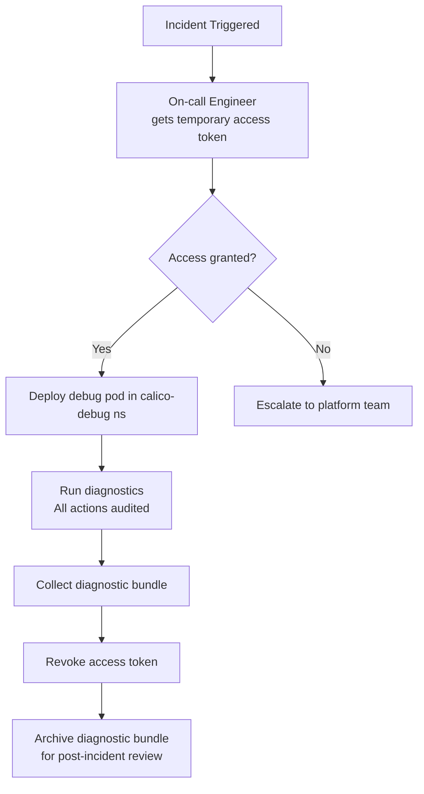

# How to Secure Calico eBPF Troubleshooting

Author: [nawazdhandala](https://github.com/nawazdhandala)

Tags: Calico, Kubernetes, Networking, EBPF, Troubleshooting, Security

Description: Implement security controls for Calico eBPF troubleshooting access, ensuring diagnostic tools are available when needed but restricted to authorized users.

---

## Introduction

eBPF troubleshooting requires privileged access - running privileged containers, accessing the host's BPF filesystem, and reading BPF maps that contain sensitive network state (NAT tables, conntrack entries). Without proper access controls, these capabilities could be abused. The challenge is making troubleshooting tools available to on-call engineers while restricting them from general use.

The security model for eBPF troubleshooting tools should be: authorized on-call engineers can access diagnostic tools, but not all developers, and all access is audited.

## Prerequisites

- Calico eBPF active
- RBAC configured
- Kubernetes audit logging enabled

## Security Control 1: RBAC for Troubleshooting Access

```yaml
# calico-ebpf-troubleshoot-role.yaml
apiVersion: rbac.authorization.k8s.io/v1
kind: ClusterRole
metadata:
  name: calico-ebpf-troubleshooter
rules:
  # Can exec into calico-system pods
  - apiGroups: [""]
    resources: ["pods/exec"]
    namespaces: ["calico-system"]
    verbs: ["create"]

  # Can view pod logs
  - apiGroups: [""]
    resources: ["pods/log"]
    verbs: ["get"]

  # Can view Calico resources (read-only)
  - apiGroups: ["projectcalico.org"]
    resources: ["*"]
    verbs: ["get", "list", "watch"]

  # Can deploy debug pods
  - apiGroups: [""]
    resources: ["pods"]
    namespaces: ["calico-debug"]
    verbs: ["create", "delete", "get", "list"]

---
apiVersion: rbac.authorization.k8s.io/v1
kind: ClusterRoleBinding
metadata:
  name: calico-ebpf-troubleshooter-oncall
roleRef:
  apiGroup: rbac.authorization.k8s.io
  kind: ClusterRole
  name: calico-ebpf-troubleshooter
subjects:
  - kind: Group
    name: oncall-engineers
    apiGroup: rbac.authorization.k8s.io
```

## Security Control 2: Dedicated Namespace for Debug Pods

```yaml
# calico-debug-namespace.yaml
apiVersion: v1
kind: Namespace
metadata:
  name: calico-debug
  labels:
    # Allow privileged pods in this namespace only
    pod-security.kubernetes.io/enforce: privileged
    # But audit restricted everywhere else
    pod-security.kubernetes.io/audit: restricted

---
# Limit debug pods to stay in the debug namespace
apiVersion: v1
kind: ResourceQuota
metadata:
  name: debug-pod-limit
  namespace: calico-debug
spec:
  hard:
    pods: "5"  # Maximum 5 debug pods at once
    requests.cpu: "2"
    requests.memory: "2Gi"
```

## Security Control 3: Audit Logging for Troubleshooting Actions

```bash
# Ensure audit policy captures exec and BPF-related actions
# In kube-apiserver audit-policy.yaml:
cat <<EOF
- level: Request
  verbs: ["create"]
  resources:
    - group: ""
      resources: ["pods/exec"]
  namespaces: ["calico-system", "calico-debug"]
EOF

# Review audit logs for troubleshooting sessions
kubectl get events -A --field-selector reason=exec | grep calico
```

## Security Control 4: Time-Limited Debug Access

```bash
# For emergency access, create time-limited tokens
# Create a short-lived token for an on-call engineer
kubectl create token calico-troubleshooter \
  --duration=4h \
  --namespace=calico-system

# Or use impersonation for audit trail
kubectl --as=user@example.com exec -n calico-system \
  ds/calico-node -c calico-node -- bpftool prog list
```

## Secure Troubleshooting Flow



## Conclusion

Securing eBPF troubleshooting access requires balancing operational needs (fast access during incidents) with security requirements (restricted, audited access). By creating a dedicated RBAC role for on-call engineers, using a dedicated namespace for debug pods with appropriate Pod Security settings, enabling audit logging for all exec operations, and using time-limited tokens for emergency access, you ensure troubleshooting is possible when needed but controlled and audited throughout.
