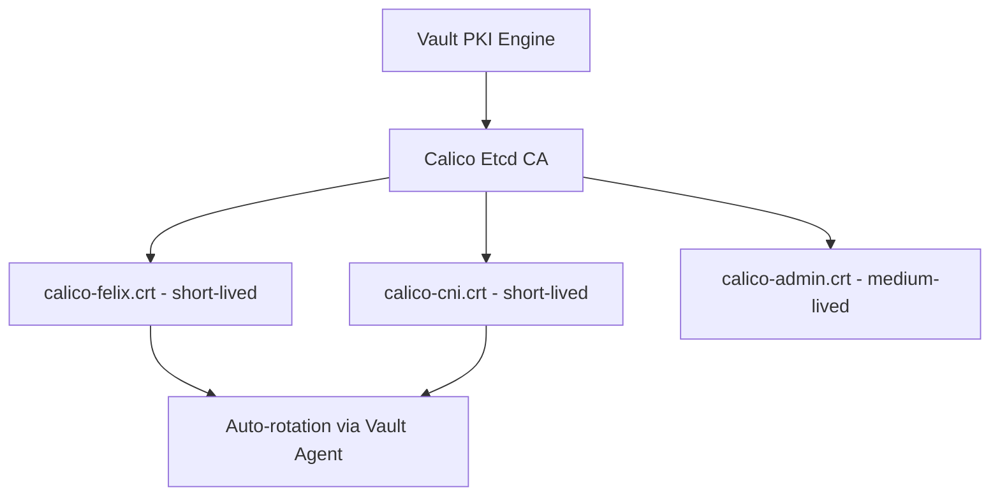

# Secure Calico etcd Certificate Generation

Author: [nawazdhandala](https://github.com/nawazdhandala)

Tags: Calico, Kubernetes, Networking, Etcd, TLS, Certificates, Security, PKI

Description: Best practices for securing the Calico etcd certificate generation process, including PKI design, key protection, and certificate lifecycle security controls.

---

## Introduction

The security of Calico's etcd TLS configuration depends not just on the certificates themselves, but on the entire certificate generation and management process. A well-designed certificate is worthless if the private key is stored insecurely, if the CA private key is exposed, or if the certificate generation process can be compromised to produce fraudulent certificates.

Securing certificate generation involves protecting the CA private key, using strong key algorithms and parameters, implementing proper certificate lifecycle controls, and integrating with enterprise PKI systems where available. This guide covers these security practices for Calico etcd certificate management.

## Prerequisites

- Authority to design and implement PKI for your cluster
- Kubernetes cluster with Secrets encryption at rest enabled
- Familiarity with TLS and certificate concepts

## Practice 1: Protect the CA Private Key

The CA private key is the most sensitive secret in your PKI. Anyone with access to it can generate fraudulent certificates:

```bash
# Encrypt the CA private key with a strong passphrase
openssl genrsa -aes256 -passout pass:"$(openssl rand -base64 48)" \
  -out calico-etcd-ca.key.encrypted 4096

# Store the passphrase in a hardware security module or vault
vault kv put secret/calico/etcd-ca-passphrase \
  value="$(cat ca-passphrase.txt)"

# For offline CA: store the encrypted key on removable media, not in cluster
```

## Practice 2: Use Strong Key Sizes and Algorithms

```bash
# For CA: 4096-bit RSA or EC P-384
openssl ecparam -name secp384r1 -genkey -noout -out calico-etcd-ca.key

# For component certs: 2048-bit RSA minimum (or EC P-256)
openssl ecparam -name prime256v1 -genkey -noout -out calico-felix.key
```

## Practice 3: Encrypt Secrets at Rest

Ensure Kubernetes secrets containing private keys are encrypted:

```yaml
# encryption-config.yaml
apiVersion: apiserver.config.k8s.io/v1
kind: EncryptionConfiguration
resources:
  - resources:
      - secrets
    providers:
      - aescbc:
          keys:
            - name: key1
              secret: <base64-encoded-32-byte-key>
      - identity: {}
```

## Practice 4: Integrate with HashiCorp Vault



Configure Vault PKI for Calico:

```bash
vault secrets enable -path=calico-etcd pki
vault secrets tune -max-lease-ttl=87600h calico-etcd

vault write calico-etcd/root/generate/internal \
  common_name="calico-etcd-ca" \
  ttl=87600h

vault write calico-etcd/roles/calico-client \
  allowed_domains="calico-felix,calico-cni,calico-admin" \
  allow_bare_domains=true \
  max_ttl=720h \
  key_type=ec \
  key_bits=256 \
  ext_key_usage=ClientAuth \
  no_store=false
```

## Practice 5: Certificate Revocation

Implement CRL or OCSP for certificate revocation:

```bash
# Generate a CRL to revoke a compromised certificate
openssl ca -config openssl.cnf \
  -revoke compromised-calico-felix.crt \
  -keyfile calico-etcd-ca.key \
  -cert calico-etcd-ca.crt

openssl ca -config openssl.cnf \
  -gencrl -out calico-etcd-crl.pem \
  -keyfile calico-etcd-ca.key \
  -cert calico-etcd-ca.crt
```

Configure etcd to check the CRL:

```bash
etcd --trusted-ca-file=calico-etcd-ca.crt \
     --crl-file=calico-etcd-crl.pem
```

## Conclusion

Securing Calico etcd certificate generation requires protecting the CA private key at rest (ideally offline or in a HSM), using strong cryptographic parameters, encrypting Kubernetes secrets that hold private keys, integrating with Vault for automated short-lived certificate issuance, and implementing revocation for compromised certificates. A secure PKI process prevents certificate-based attacks even if individual component credentials are compromised.
