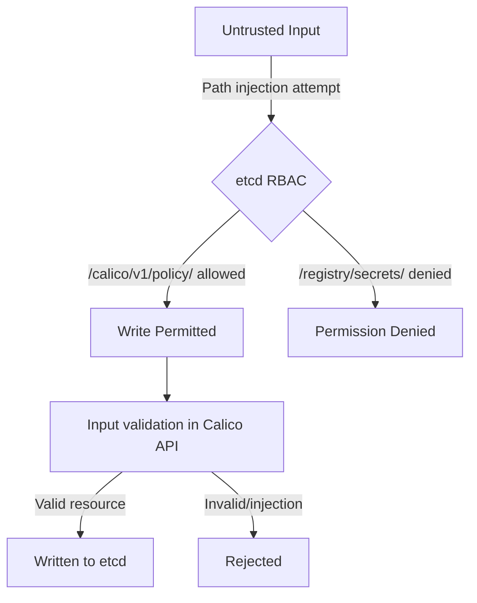

# Secure Calico etcdv3 Paths

Author: [nawazdhandala](https://github.com/nawazdhandala)

Tags: Calico, Kubernetes, Networking, etcd, etcdv3, Security, Hardening

Description: Security best practices for protecting Calico etcdv3 path data, including access controls, encryption, and preventing unauthorized modification of network policy data.

---

## Introduction

Calico's etcdv3 paths contain the authoritative network policy configuration for your cluster. An attacker who can write to these paths can modify firewall rules, create new IP allocations for malicious workloads, or delete policies to remove security controls. Protecting this data is a critical aspect of Kubernetes cluster security.

Security for etcdv3 paths covers multiple layers: authentication (only authorized components can connect), authorization (each component can only access its required paths), encryption in transit (TLS), encryption at rest (etcd data encryption), and audit logging for all access events.

## Prerequisites

- etcd v3.x with RBAC and TLS configured
- Calico components using per-component credentials
- Understanding of the Calico etcdv3 path structure

## Security Layer 1: Limit Path Access via RBAC

Each Calico component should only be able to write to the paths it actually needs to modify:

| Component | Writable Paths | Read-Only Paths |
|-----------|---------------|-----------------|
| Felix | `/calico/v1/host/`, `/calico/felix/v1/` | `/calico/v1/policy/`, `/calico/v1/config/` |
| CNI | `/calico/v1/ipam/`, `/calico/v1/host/` | `/calico/v1/config/` |
| API Server | `/calico/v1/` (all) | - |

```bash
# Verify Felix cannot write to policy paths
etcdctl --cert=calico-felix.crt --key=calico-felix.key \
  put /calico/v1/policy/test "value"
# Should fail: permission denied
```

## Security Layer 2: Encrypt etcd Data at Rest

Enable etcd encryption at rest to protect Calico policy data from physical storage attacks:

```bash
# etcd encryption at rest via kms or aescbc
etcd --experimental-encryption-provider-config=/etc/etcd/encryption.yaml
```

```yaml
# encryption.yaml
kind: EncryptionConfig
apiVersion: v1
resources:
  - resources:
      - secrets
    providers:
      - aescbc:
          keys:
            - name: key1
              secret: <base64-encoded-key>
```

## Security Layer 3: Protect Against Path Injection



Always interact with etcd through calicoctl or the Calico API server, which validates input before writing to etcd.

## Security Layer 4: Audit All Path Access

Enable etcd audit logging for Calico paths:

```yaml
# etcd audit configuration
--audit-log-path=/var/log/etcd/audit.log
```

Create a monitoring rule to alert on unauthorized access:

```yaml
- alert: CalicoEtcdUnauthorizedAccess
  expr: increase(etcd_grpc_requests_total{grpc_code="PermissionDenied",grpc_service=~".*calico.*"}[5m]) > 0
  for: 1m
  labels:
    severity: critical
  annotations:
    summary: "Unauthorized etcd access attempt for Calico paths"
```

## Security Layer 5: Restrict etcd Network Access

Combine etcd RBAC with network-level restrictions:

```yaml
apiVersion: projectcalico.org/v3
kind: GlobalNetworkPolicy
metadata:
  name: restrict-etcd-network-access
spec:
  selector: "node-role == 'control-plane'"
  order: 1
  ingress:
    - action: Allow
      protocol: TCP
      destination:
        ports: [2379]
      source:
        selector: "has(node-role)"
    - action: Deny
      protocol: TCP
      destination:
        ports: [2379, 2380]
```

## Conclusion

Securing Calico etcdv3 paths requires defense in depth: RBAC to limit per-component access, encryption at rest for sensitive policy data, audit logging for all access events, network-level restrictions on etcd connectivity, and using Calico's API layer (calicoctl) to benefit from input validation before data reaches etcd. Together, these controls make it extremely difficult for an attacker to leverage etcd access to modify Calico's network security configuration.
