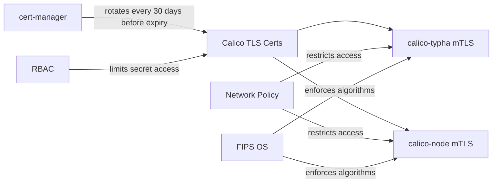

# How to Secure Calico FIPS Mode

Author: [nawazdhandala](https://github.com/nawazdhandala)

Tags: Calico, Kubernetes, Networking, FIPS, Security, Compliance, Hardening

Description: Apply additional security hardening on top of Calico FIPS mode, including TLS 1.3 enforcement, certificate rotation policies, and network policy for Calico control plane components.

---

## Introduction

Enabling FIPS mode is the foundation of cryptographic compliance for Calico, but it is not sufficient on its own to achieve a hardened security posture. FIPS mode restricts algorithm choices but does not automatically enforce TLS version minimums, certificate rotation schedules, or access controls for Calico's management endpoints. Additional security hardening is needed to build a defense-in-depth posture.

Security hardening for FIPS-enabled Calico focuses on five areas: enforcing minimum TLS versions (TLS 1.2 minimum, TLS 1.3 preferred), implementing certificate rotation automation, restricting access to Calico management endpoints with network policies, hardening the Tigera Operator RBAC, and ensuring secrets management for certificates and credentials.

## Prerequisites

- Calico deployed with `fipsMode: Enabled`
- cert-manager installed (for certificate rotation)
- `kubectl` with cluster-admin access

## Security Hardening 1: Enforce Minimum TLS Version

```yaml
# felixconfiguration-fips-tls.yaml
apiVersion: projectcalico.org/v3
kind: FelixConfiguration
metadata:
  name: default
spec:
  # Felix health server TLS (requires cert-manager integration)
  # Felix uses the OS FIPS policy for minimum TLS version
  # Additional hardening via environment variables on the pod
  logSeverityScreen: Info
```

Configure the Tigera Operator to use TLS 1.2 minimum:

```bash
# Patch the operator deployment to enforce TLS minimum
kubectl patch deployment tigera-operator -n tigera-operator \
  --type=json \
  -p='[{
    "op": "add",
    "path": "/spec/template/spec/containers/0/env/-",
    "value": {
      "name": "GODEBUG",
      "value": "tlsrsakex=0,tls13=1"
    }
  }]'
```

## Security Hardening 2: Certificate Rotation with cert-manager

```yaml
# calico-typha-cert.yaml
apiVersion: cert-manager.io/v1
kind: Certificate
metadata:
  name: calico-typha-tls
  namespace: calico-system
spec:
  secretName: calico-typha-tls
  duration: 8760h    # 1 year
  renewBefore: 720h  # Renew 30 days before expiry
  subject:
    organizations:
      - calico
  commonName: calico-typha
  dnsNames:
    - calico-typha.calico-system.svc
    - calico-typha.calico-system.svc.cluster.local
  issuerRef:
    name: calico-ca-issuer
    kind: ClusterIssuer
  privateKey:
    algorithm: ECDSA  # FIPS-approved
    size: 256
```

## Security Hardening 3: Network Policy for Calico Control Plane

```yaml
# netpol-calico-system.yaml
apiVersion: networking.k8s.io/v1
kind: NetworkPolicy
metadata:
  name: restrict-calico-metrics
  namespace: calico-system
spec:
  podSelector:
    matchLabels:
      k8s-app: calico-node
  policyTypes:
    - Ingress
  ingress:
    # Allow only Prometheus scraping
    - from:
        - namespaceSelector:
            matchLabels:
              name: monitoring
      ports:
        - protocol: TCP
          port: 9091  # Felix metrics
        - protocol: TCP
          port: 9094  # Typha metrics
    # Allow kubelet health checks
    - from: []
      ports:
        - protocol: TCP
          port: 9099  # Felix health
```

## Security Hardening 4: RBAC Hardening for Calico FIPS

```yaml
# Restrict who can read Calico TLS secrets
apiVersion: rbac.authorization.k8s.io/v1
kind: Role
metadata:
  name: calico-tls-secrets-viewer
  namespace: calico-system
rules:
  - apiGroups: [""]
    resources: ["secrets"]
    resourceNames:
      - "calico-typha-tls"
      - "calico-node-tls"
    verbs: ["get"]

---
# Deny default service account access
apiVersion: rbac.authorization.k8s.io/v1
kind: RoleBinding
metadata:
  name: deny-default-secrets-access
  namespace: calico-system
roleRef:
  apiGroup: rbac.authorization.k8s.io
  kind: ClusterRole
  name: calico-tls-secrets-viewer
subjects:
  - kind: ServiceAccount
    name: calico-typha
    namespace: calico-system
```

## Security Architecture



## Security Hardening 5: Secrets Management

```bash
# Use sealed secrets or external secrets for Calico credentials
# Example with External Secrets Operator
cat <<EOF | kubectl apply -f -
apiVersion: external-secrets.io/v1beta1
kind: ExternalSecret
metadata:
  name: calico-etcd-secrets
  namespace: calico-system
spec:
  refreshInterval: 1h
  secretStoreRef:
    name: vault-backend
    kind: ClusterSecretStore
  target:
    name: calico-etcd-secrets
  data:
    - secretKey: etcd-ca
      remoteRef:
        key: calico/etcd/ca
    - secretKey: etcd-cert
      remoteRef:
        key: calico/etcd/cert
    - secretKey: etcd-key
      remoteRef:
        key: calico/etcd/key
EOF
```

## Conclusion

Securing FIPS-enabled Calico goes beyond the FIPS configuration flag. By enforcing TLS 1.2+ minimum, automating certificate rotation with cert-manager, applying network policies to restrict access to Calico metrics and health endpoints, hardening RBAC for secret access, and using secrets management solutions, you build a robust security posture that satisfies both FIPS compliance and broader security hardening requirements. These controls work together to protect Calico's control plane communications in high-security environments.
