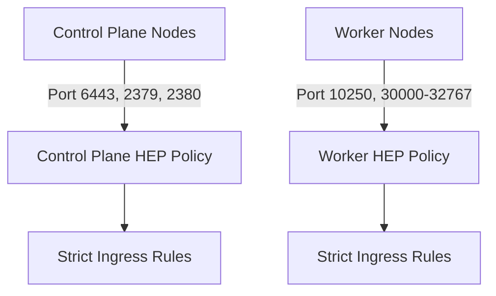

# Secure Calico Host Endpoint Security

Author: [nawazdhandala](https://github.com/nawazdhandala)

Tags: Calico, Kubernetes, Networking, Security, Host Endpoint, Hardening

Description: Best practices and hardening techniques for strengthening Calico host endpoint security policies to enforce least-privilege access at the Kubernetes node network layer.

---

## Introduction

Configuring Calico host endpoints is the first step; securing them to meet production security standards requires additional hardening. Default configurations often leave room for improvement in terms of policy specificity, logging, and access control. Threat actors who gain access to pod workloads may attempt to pivot to node-level services, making host endpoint hardening a critical defense layer.

Securing host endpoint policies means applying the principle of least privilege — allowing only the precise traffic that your cluster components require, from the precise sources that should send it. It also means protecting the Calico control plane itself from manipulation and ensuring that policy changes are audited and reviewed.

This guide covers advanced hardening techniques for Calico host endpoint security configurations in production Kubernetes environments.

## Prerequisites

- Calico v3.20+ installed with host endpoints configured
- RBAC configured for Calico custom resources
- Understanding of your cluster's required network flows
- `calicoctl` and `kubectl` with cluster admin access

## Hardening Practice 1: Source-Restricted Policies

Replace broad allow rules with source-restricted policies:

```yaml
apiVersion: projectcalico.org/v3
kind: GlobalNetworkPolicy
metadata:
  name: allow-ssh-restricted
spec:
  selector: "has(node)"
  order: 10
  ingress:
    - action: Allow
      protocol: TCP
      destination:
        ports: [22]
      source:
        nets:
          - 10.0.0.0/8
          - 192.168.1.0/24
  egress:
    - action: Allow
```

## Hardening Practice 2: Separate Control Plane and Worker Policies



Label nodes by role and apply targeted policies:

```bash
kubectl label node control-plane-1 node-role=control-plane
kubectl label node worker-1 node-role=worker
```

```yaml
apiVersion: projectcalico.org/v3
kind: GlobalNetworkPolicy
metadata:
  name: control-plane-hep
spec:
  selector: "node-role == 'control-plane'"
  order: 5
  ingress:
    - action: Allow
      protocol: TCP
      destination:
        ports: [6443]
      source:
        nets: ["0.0.0.0/0"]
    - action: Allow
      protocol: TCP
      destination:
        ports: [2379, 2380]
      source:
        selector: "node-role == 'control-plane'"
```

## Hardening Practice 3: Restrict ICMP

Allow only ICMP echo (ping) and suppress all other ICMP types:

```yaml
ingress:
  - action: Allow
    protocol: ICMP
    icmp:
      type: 8
      code: 0
  - action: Deny
    protocol: ICMP
```

## Hardening Practice 4: Log Denied Traffic

Configure Felix to log denied packets for audit purposes:

```bash
kubectl patch felixconfiguration default \
  --type=merge \
  --patch='{"spec":{"logSeverityScreen":"Info","logFilePath":"/var/log/calico/felix.log"}}'
```

Add log actions before deny rules:

```yaml
ingress:
  - action: Log
    destination:
      ports: [22]
  - action: Deny
    destination:
      ports: [22]
    source:
      notNets: ["10.0.0.0/8"]
```

## Hardening Practice 5: Protect Calico RBAC

Restrict who can modify HostEndpoint and GlobalNetworkPolicy resources:

```yaml
apiVersion: rbac.authorization.k8s.io/v1
kind: ClusterRole
metadata:
  name: calico-hep-admin
rules:
  - apiGroups: ["projectcalico.org"]
    resources: ["hostendpoints", "globalnetworkpolicies"]
    verbs: ["get", "list", "watch", "create", "update", "delete"]
```

Bind only to trusted operator accounts.

## Conclusion

Securing Calico host endpoint policies requires moving beyond basic allow/deny rules to source-restricted, role-specific policies with audit logging enabled. By applying least-privilege principles at the node network layer, restricting Calico RBAC access, and continuously logging denied traffic, you establish a robust defense against both external attacks and lateral movement within your Kubernetes cluster.
