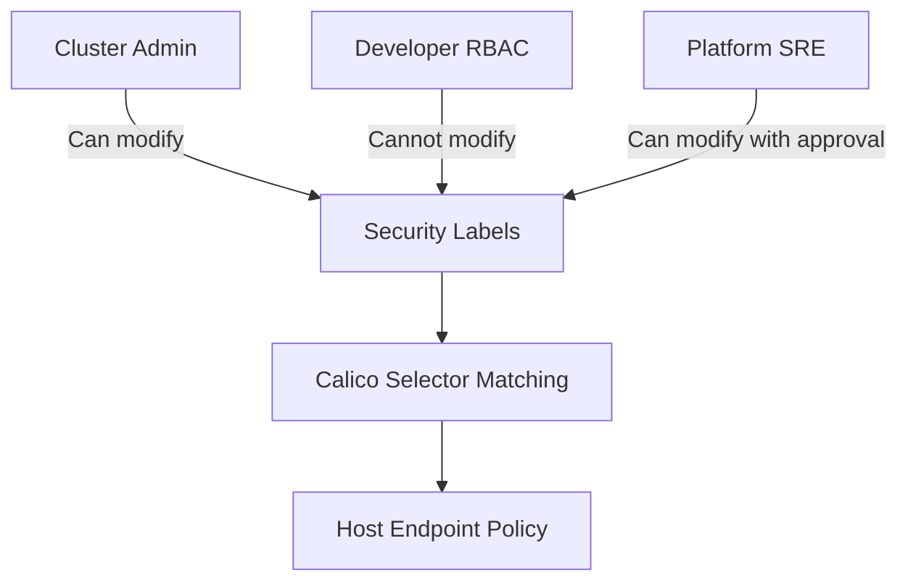

# Secure Calico Host Endpoint Selectors

Author: [nawazdhandala](https://github.com/nawazdhandala)

Tags: Calico, Kubernetes, Networking, Host Endpoint, Selectors, Security, Hardening

Description: Best practices for securing Calico host endpoint selector configurations to prevent selector bypass attacks and unintended policy escapes in Kubernetes clusters.

---

## Introduction

Calico host endpoint selectors are a powerful targeting mechanism, but they introduce a security consideration: if any actor can modify node or HostEndpoint labels, they can change which security policies apply to those endpoints. In a compromised cluster or a misconfigured RBAC environment, this could allow an attacker to effectively remove host endpoint security by modifying a label.

Securing the selector model requires protecting the label space used by security-critical selectors, restricting who can modify those labels, and designing selectors so they default to the most restrictive behavior in ambiguous cases. This guide covers defensive strategies for selector security in Calico host endpoint configurations.

## Prerequisites

- RBAC configured in your Kubernetes cluster
- Calico host endpoints with label-based policies applied
- `kubectl` with cluster admin access

## Principle 1: Use Positive Labels for Security Policies

Design selectors so that a missing label results in the most restrictive policy being applied:

```yaml
# UNSAFE: A missing 'trusted' label means no restriction
selector: "trusted == 'true'"

# SAFER: A missing 'unrestricted' label means policy applies
selector: "!has(unrestricted)"
```

This ensures that new nodes or HostEndpoints without explicit labels fall under the restrictive default policy.

## Principle 2: Restrict Label Modification RBAC



Create a ClusterRole that restricts node label modification:

```yaml
apiVersion: rbac.authorization.k8s.io/v1
kind: ClusterRole
metadata:
  name: restricted-node-access
rules:
  - apiGroups: [""]
    resources: ["nodes"]
    verbs: ["get", "list", "watch"]
    # No update/patch - prevents label changes
```

Use a separate admin role for operators who need label management:

```yaml
apiVersion: rbac.authorization.k8s.io/v1
kind: ClusterRole
metadata:
  name: node-label-admin
rules:
  - apiGroups: [""]
    resources: ["nodes"]
    verbs: ["get", "list", "watch", "patch", "update"]
    resourceNames: []
```

## Principle 3: Protect HostEndpoint Resources

Restrict who can modify HostEndpoint labels and specs:

```yaml
apiVersion: rbac.authorization.k8s.io/v1
kind: ClusterRole
metadata:
  name: hostendpoint-readonly
rules:
  - apiGroups: ["projectcalico.org"]
    resources: ["hostendpoints"]
    verbs: ["get", "list", "watch"]
```

## Principle 4: Use Namespace-Scoped Where Possible

For policies that don't need cluster-wide scope, prefer NetworkPolicy over GlobalNetworkPolicy to limit blast radius.

## Principle 5: Validate Selector Specificity

Avoid overly broad selectors that could accidentally match new nodes:

```yaml
# DANGEROUS: Matches everything
selector: "all()"

# BETTER: Explicitly scoped
selector: "node-role == 'worker' && environment == 'production'"
```

Check for overly broad selectors in CI:

```bash
# Fail CI if policy has 'all()' selector on a deny rule
calicoctl get globalnetworkpolicies -o yaml | \
  python3 -c "
import sys, yaml
for doc in yaml.safe_load_all(sys.stdin):
  for item in doc.get('items', []):
    sel = item.get('spec', {}).get('selector', '')
    if 'all()' in sel:
      print(f'WARNING: Broad selector in {item[\"metadata\"][\"name\"]}')
"
```

## Principle 6: Audit Label History

Use Kubernetes audit logs to maintain a history of node label changes:

```bash
# Retrieve audit log events for node label changes
kubectl get events --field-selector reason=NodeLabelUpdated
```

## Conclusion

Securing Calico host endpoint selectors means treating the label space as a security boundary. Restrict who can modify security-critical labels, design selectors to default to restrictive behavior when labels are absent, and audit label changes regularly. A well-secured selector model prevents label manipulation from being used as an attack vector to bypass your host endpoint security policies.
