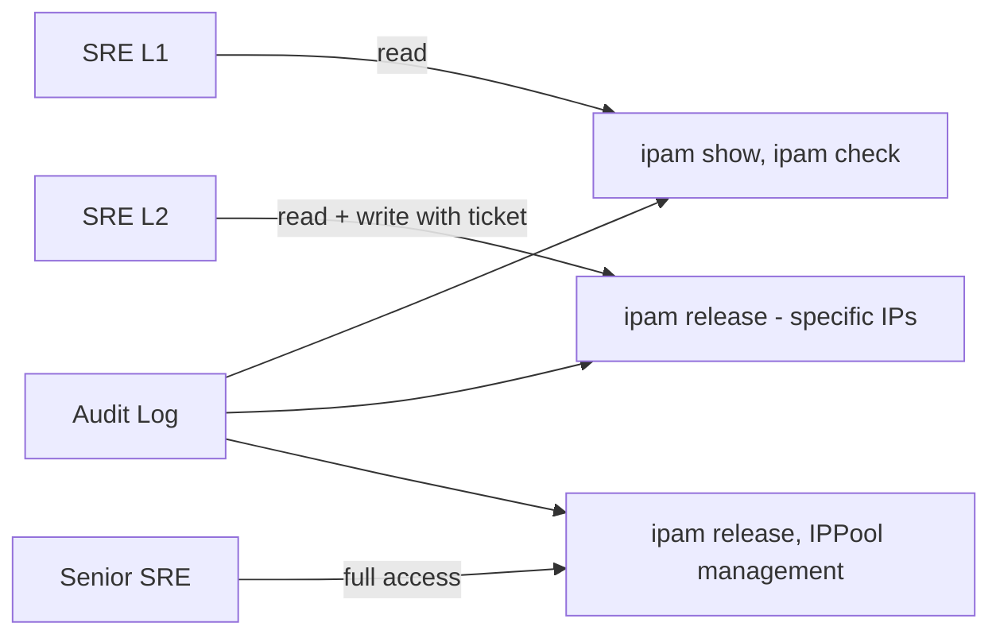

# How to Secure Calico IPAM Checks

Author: [nawazdhandala](https://github.com/nawazdhandala)

Tags: Calico, Kubernetes, Networking, IPAM, Security

Description: Secure access to Calico IPAM diagnostic and management operations by implementing least-privilege RBAC for ipam check and ipam show, and restricting ipam release to authorized engineers only.

---

## Introduction

Calico IPAM commands span a wide privilege spectrum: `calicoctl ipam show` and `calicoctl ipam check` are safe read operations, while `calicoctl ipam release` can corrupt IPAM state if run incorrectly. Securing IPAM access means giving diagnostic engineers read-only IPAM access, reserving `calicoctl ipam release` for senior engineers with explicit approval, and auditing all IPAM write operations.

## Read-Only IPAM RBAC

```yaml
# IPAM read-only access for diagnostic users
apiVersion: rbac.authorization.k8s.io/v1
kind: ClusterRole
metadata:
  name: calico-ipam-reader
rules:
  - apiGroups: ["crd.projectcalico.org"]
    resources:
      - ipamblocks
      - ipamconfigs
      - ipamhandles
      - blockaffinities
      - ippools
    verbs: ["get", "list", "watch"]
```

## IPAM Write Operations: Approval Required

```markdown
## IPAM Write Operation Policy

Operations requiring senior engineer approval + change ticket:

1. calicoctl ipam release --ip=<ip>
   Risk: Corrupts IPAM if pod still exists
   Approval: Senior SRE + second engineer verification

2. calicoctl apply -f ippool.yaml (new IPPool)
   Risk: Route advertisement changes, potential overlap
   Approval: Senior SRE + network team

3. calicoctl delete ippool <name>
   Risk: Breaks routing for affected CIDRs
   Approval: Senior SRE + incident commander
```

## Audit IPAM Operations

```yaml
# Kubernetes audit policy for IPAM operations
apiVersion: audit.k8s.io/v1
kind: Policy
rules:
  - level: RequestResponse
    resources:
      - group: "crd.projectcalico.org"
        resources: ["ipamblocks", "ipamhandles", "blockaffinities"]
    verbs: ["create", "update", "delete", "patch"]
```

## IPAM Operations Permission Matrix



## Safe ipam release Procedure

```bash
# BEFORE running ipam release:
# 1. Verify no pod is using the IP
SUSPECT_IP="192.168.1.42"
kubectl get pod --all-namespaces -o wide | grep "${SUSPECT_IP}"
# Must show: no output (no pod using this IP)

# 2. Get a second engineer to verify
echo "IP ${SUSPECT_IP} confirmed as leaked by: $(whoami)"

# 3. Document in change ticket
echo "Change ticket: CHG-12345"

# 4. Then release
calicoctl ipam release --ip="${SUSPECT_IP}"
```

## Conclusion

IPAM security requires clear separation between read operations (ipam show, ipam check - available to all diagnostic engineers) and write operations (ipam release, IPPool changes - requiring senior approval and change ticket). The two-engineer verification requirement for `calicoctl ipam release` prevents the most damaging IPAM mistake: releasing an IP that is still in use by a running pod. Audit logging of all IPAM CRD write operations provides accountability and helps detect unauthorized changes.
