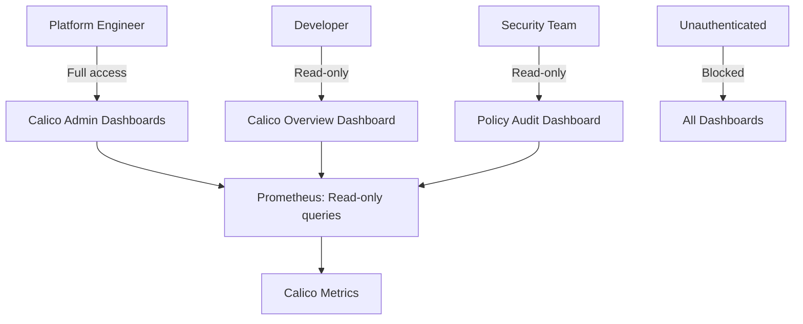

# How to Secure Calico Metrics Visualization

Author: [nawazdhandala](https://github.com/nawazdhandala)

Tags: Calico, Kubernetes, Networking, Metrics, Grafana, Security

Description: Secure Calico Grafana dashboards with access controls, read-only roles, and data source restrictions to protect sensitive network topology information.

---

## Introduction

Calico Grafana dashboards expose sensitive network information including topology, policy counts, and IP allocation patterns. Securing access ensures that only authorized users can view this information, and that dashboards are read-only for operational users to prevent accidental modification.

## Security Control 1: Grafana RBAC for Calico Dashboards

```bash
# Create a read-only viewer role for Calico dashboards
curl -X POST "http://grafana.monitoring.svc:3000/api/teams" \
  -H "Authorization: Bearer ${ADMIN_TOKEN}" \
  -H "Content-Type: application/json" \
  -d '{"name": "calico-viewers"}'

# Add Calico dashboards to a specific folder with restricted access
curl -X POST "http://grafana.monitoring.svc:3000/api/folders" \
  -H "Authorization: Bearer ${ADMIN_TOKEN}" \
  -H "Content-Type: application/json" \
  -d '{"title": "Calico Networking", "uid": "calico-networking"}'

# Grant read-only access to the team
curl -X POST "http://grafana.monitoring.svc:3000/api/folders/calico-networking/permissions" \
  -H "Authorization: Bearer ${ADMIN_TOKEN}" \
  -H "Content-Type: application/json" \
  -d '[{"teamId": 1, "permission": 1}]'  # 1 = View only
```

## Security Control 2: Prometheus Data Source Restrictions

```yaml
# Create a restricted Prometheus data source for Calico dashboards
# This data source can only query calico-prefixed metrics
apiVersion: v1
kind: ConfigMap
metadata:
  name: grafana-datasource-calico
  namespace: monitoring
  labels:
    grafana_datasource: "1"
data:
  calico-prometheus.yaml: |
    apiVersion: 1
    datasources:
      - name: Calico-Prometheus
        type: prometheus
        url: http://prometheus-operated.monitoring.svc:9090
        access: proxy
        jsonData:
          httpMethod: GET
          prometheusType: Prometheus
          # Restrict query scope if using Thanos tenant labels
          customQueryParameters: "namespace=calico-system"
```

## Security Control 3: Dashboard Encryption for Sensitive Data

```bash
# For highly sensitive environments, use Grafana Enterprise's
# fine-grained access control to restrict specific panels

# Alternative: Use variable-based filtering to hide sensitive data
# In dashboard variables, restrict to non-sensitive dimensions
# e.g., show policy count but not policy content
```

## Access Control Architecture



## Conclusion

Securing Calico visualizations requires Grafana RBAC to control who can view which dashboards, folder-level permissions to separate sensitive networking dashboards from general observability, and using read-only access for operational users to prevent accidental dashboard modification. Ensure all Calico dashboards are in a dedicated Grafana folder with explicit access controls - never rely on security through obscurity (hiding dashboards) as the sole protection.
