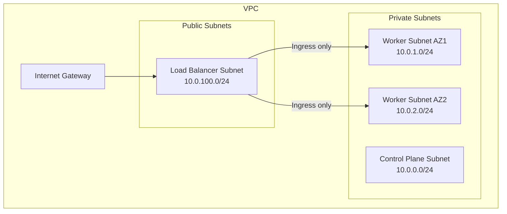

# Secure Calico Networking on AWS

Author: [nawazdhandala](https://github.com/nawazdhandala)

Tags: Calico, Kubernetes, Networking, AWS, Cloud, Security, VPC

Description: Security hardening practices for Calico networking on AWS, combining VPC security controls with Calico network policies to implement defense-in-depth for Kubernetes clusters.

---

## Introduction

Securing Calico networking on AWS means leveraging both AWS network security controls (security groups, NACLs, VPC design) and Calico's network policy engine to create a defense-in-depth security model. Neither layer alone is sufficient — AWS security groups protect the node network boundary but can't enforce pod-level microsegmentation, while Calico policies can enforce pod-level rules but can't protect against VPC-level attacks.

The combination of both layers — security groups for coarse-grained node access control and Calico policies for fine-grained pod-level enforcement — creates a robust security posture for Kubernetes workloads on AWS.

## Prerequisites

- Self-managed Kubernetes on AWS with Calico installed
- AWS CLI with EC2, VPC, and IAM permissions
- `kubectl` and `calicoctl` with cluster admin access

## Security Layer 1: VPC Isolation

Design VPC with dedicated subnets per node tier:



## Security Layer 2: Restrict Security Group Rules

Apply minimum required rules to worker node security groups:

```bash
# Create a restrictive worker security group
SG_ID=$(aws ec2 create-security-group \
  --group-name k8s-workers-sg \
  --description "Calico Kubernetes Workers" \
  --vpc-id vpc-0123456789 \
  --query GroupId --output text)

# Allow only required traffic
# Kubelet from control plane
aws ec2 authorize-security-group-ingress \
  --group-id $SG_ID --protocol tcp --port 10250 \
  --source-group sg-control-plane

# VXLAN encapsulation between nodes
aws ec2 authorize-security-group-ingress \
  --group-id $SG_ID --protocol udp --port 4789 \
  --source-group $SG_ID

# NodePort services (if needed)
aws ec2 authorize-security-group-ingress \
  --group-id $SG_ID --protocol tcp --port 30000-32767 \
  --cidr 0.0.0.0/0
```

## Security Layer 3: Calico NetworkPolicy for Pod Microsegmentation

```yaml
# Deny all ingress by default, then allow explicitly
apiVersion: networking.k8s.io/v1
kind: NetworkPolicy
metadata:
  name: default-deny-ingress
  namespace: production
spec:
  podSelector: {}
  policyTypes:
    - Ingress
---
apiVersion: networking.k8s.io/v1
kind: NetworkPolicy
metadata:
  name: allow-frontend-to-backend
  namespace: production
spec:
  podSelector:
    matchLabels:
      app: backend
  ingress:
    - from:
        - podSelector:
            matchLabels:
              app: frontend
      ports:
        - port: 8080
```

## Security Layer 4: Block AWS Metadata Service from Pods

Prevent pods from accessing the EC2 metadata service (169.254.169.254):

```yaml
apiVersion: projectcalico.org/v3
kind: GlobalNetworkPolicy
metadata:
  name: block-metadata-service
spec:
  selector: "all()"
  order: 1
  egress:
    - action: Deny
      destination:
        nets:
          - 169.254.169.254/32
```

## Security Layer 5: Enable VPC Flow Log Monitoring

```bash
# Detect unexpected traffic patterns with CloudWatch Insights
aws logs start-query \
  --log-group-name /aws/vpc/flow-logs/k8s-cluster \
  --start-time $(date -d '1 hour ago' +%s) \
  --end-time $(date +%s) \
  --query-string 'fields @timestamp, srcAddr, dstAddr, action | filter action="REJECT" | stats count() by srcAddr | sort count() desc | limit 10'
```

## Conclusion

Securing Calico networking on AWS requires coordinating AWS and Calico security controls. AWS security groups and VPC design provide the outer network boundary; Calico network policies provide pod-level microsegmentation and block access to sensitive services like the EC2 metadata endpoint. VPC Flow Logs provide the audit trail needed to detect policy violations and unexpected traffic patterns. Together, these layers create a defense-in-depth security model appropriate for production workloads.
