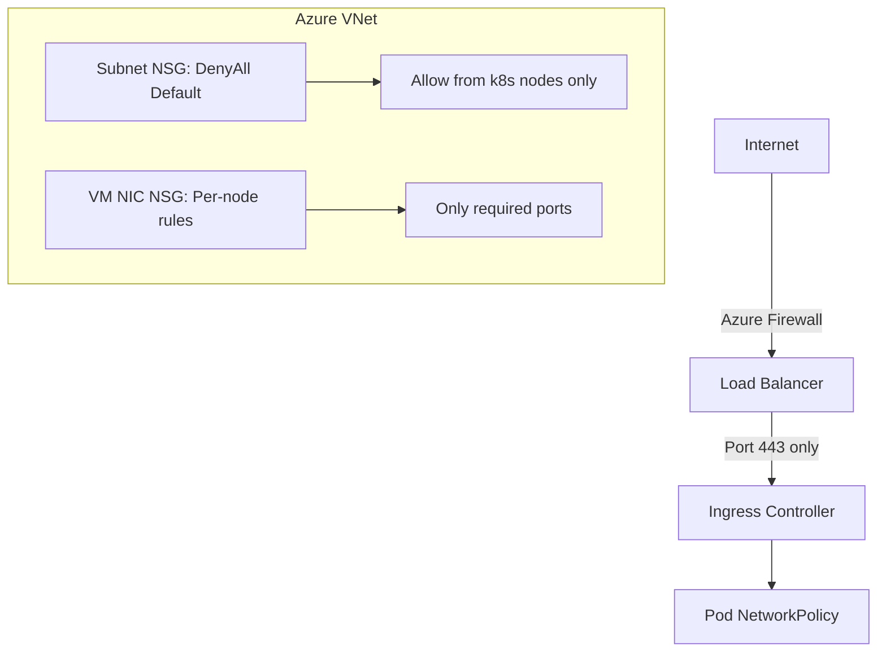

# Secure Calico Networking on Azure

Author: [nawazdhandala](https://github.com/nawazdhandala)

Tags: Calico, Kubernetes, Networking, Azure, Cloud, Security, NSG

Description: Security hardening practices for Calico networking on Azure, combining Azure NSG rules, VNet isolation, and Calico network policies for comprehensive Kubernetes cluster security.

---

## Introduction

Securing Calico on Azure involves layering Azure's network security controls with Calico's microsegmentation capabilities. Azure NSGs provide node-level access control, Azure DDoS Protection and Azure Firewall can protect at the VNet edge, and Calico network policies enforce pod-level microsegmentation that Azure's platform cannot provide.

Azure has some security-favorable defaults: NSGs deny all traffic not explicitly allowed, and VM NICs don't forward traffic by default. These defaults align well with a least-privilege security model, but they require careful configuration to allow the traffic that Calico and Kubernetes legitimately need.

## Prerequisites

- Self-managed Kubernetes on Azure with Calico installed
- Azure RBAC with Network Contributor role
- Understanding of Azure VNet and NSG concepts

## Security Layer 1: NSG Defense-in-Depth

Structure NSGs for multiple isolation tiers:



## Security Layer 2: Restrict NSG Rules to Minimum Required

```bash
# Control plane NSG - only required ports
az network nsg rule create \
  --resource-group k8s-rg \
  --nsg-name control-plane-nsg \
  --name AllowAPIServer \
  --priority 100 \
  --direction Inbound \
  --protocol Tcp \
  --destination-port-ranges 6443 \
  --source-address-prefixes VirtualNetwork \
  --access Allow

# Worker NSG - kubelet and VXLAN only from VNet
az network nsg rule create \
  --resource-group k8s-rg \
  --nsg-name workers-nsg \
  --name AllowKubelet \
  --priority 100 \
  --direction Inbound \
  --protocol Tcp \
  --destination-port-ranges 10250 \
  --source-address-prefixes 10.240.0.0/16 \
  --access Allow
```

## Security Layer 3: Block Azure IMDS from Pods

The Azure Instance Metadata Service (169.254.169.254) contains sensitive VM credentials. Block pod access:

```yaml
apiVersion: projectcalico.org/v3
kind: GlobalNetworkPolicy
metadata:
  name: block-azure-imds
spec:
  selector: "all()"
  order: 1
  egress:
    - action: Deny
      destination:
        nets:
          - 169.254.169.254/32
```

## Security Layer 4: Calico Microsegmentation

Apply namespace-level isolation:

```yaml
apiVersion: networking.k8s.io/v1
kind: NetworkPolicy
metadata:
  name: default-deny-all
  namespace: production
spec:
  podSelector: {}
  policyTypes:
    - Ingress
    - Egress
---
apiVersion: networking.k8s.io/v1
kind: NetworkPolicy
metadata:
  name: allow-same-namespace
  namespace: production
spec:
  podSelector: {}
  ingress:
    - from:
        - podSelector: {}
  egress:
    - to:
        - podSelector: {}
```

## Security Layer 5: Enable Azure Defender for Kubernetes

```bash
az security pricing create \
  --name KubernetesService \
  --tier Standard

# This enables threat detection for:
# - Suspicious API server activity
# - Anomalous network behavior
# - Container escape attempts
```

## Security Layer 6: Private API Server Endpoint

Restrict kubectl access to VNet:

```bash
# For AKS, enable private cluster
# For self-managed, ensure API server binding
# is on private IP and NSG restricts port 6443
az network nsg rule create \
  --nsg-name control-plane-nsg \
  --name AllowKubectlVPN \
  --priority 110 \
  --direction Inbound \
  --protocol Tcp \
  --destination-port-ranges 6443 \
  --source-address-prefixes 10.0.0.0/8 \
  --access Allow
```

## Conclusion

Securing Calico on Azure leverages the platform's default-deny NSG model while adding Calico network policies for pod-level microsegmentation. Blocking access to the Azure IMDS service from pods is a critical control for credential protection. Azure Defender provides threat detection that complements Calico's policy enforcement by detecting anomalous behavior at the cluster level.
