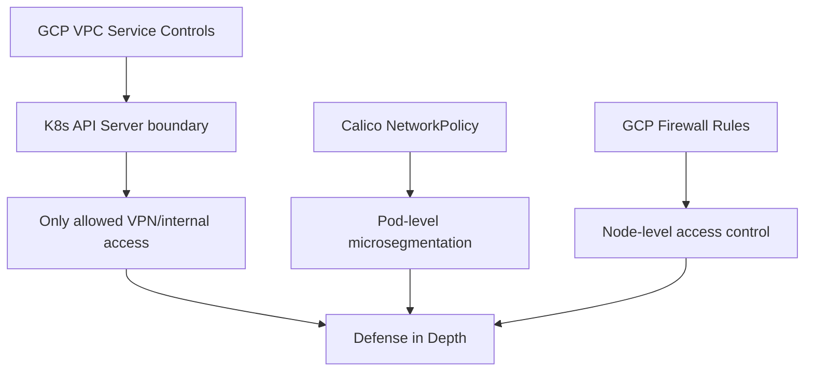

# Secure Calico Networking on Google Compute Engine

Author: [nawazdhandala](https://github.com/nawazdhandala)

Tags: Calico, Kubernetes, Networking, GCE, Google Cloud, Security, Firewall

Description: Security hardening for Calico networking on GCE, combining GCP VPC firewall rules, hierarchical firewalls, and Calico network policies for defense-in-depth Kubernetes cluster security.

---

## Introduction

GCE provides powerful security tools that complement Calico's microsegmentation capabilities. GCP's hierarchical firewall policies (at the organization, folder, and project level), VPC Service Controls, and Cloud Armor can be layered with Calico network policies to create a comprehensive security posture that protects workloads at every network layer.

On GCE, a key security advantage is the ability to use network tags and service accounts in firewall rules, which provides more reliable pod identity for firewall policy than CIDR-based rules. This pairs well with Calico's label-based selector model.

## Prerequisites

- GCE-based Kubernetes with Calico installed
- GCP organization or project with firewall admin permissions
- `kubectl` and `calicoctl` with cluster admin access

## Security Layer 1: Hierarchical Firewall Policy

Create a firewall policy at the folder level to enforce baseline rules across all Kubernetes clusters:

```bash
# Create hierarchical firewall policy
gcloud compute firewall-policies create k8s-baseline-policy \
  --description "Baseline security for all K8s clusters"

# Add deny-all as lowest priority (evaluated last)
gcloud compute firewall-policies rules create 65534 \
  --firewall-policy k8s-baseline-policy \
  --action deny \
  --direction INGRESS \
  --layer4-configs all \
  --description "Default deny ingress"

# Add allow rules above it
gcloud compute firewall-policies rules create 100 \
  --firewall-policy k8s-baseline-policy \
  --action allow \
  --direction INGRESS \
  --layer4-configs tcp:22 \
  --src-ip-ranges 10.0.0.0/8 \
  --description "Allow SSH from internal only"
```

## Security Layer 2: Block GCP Metadata Server from Pods

```yaml
apiVersion: projectcalico.org/v3
kind: GlobalNetworkPolicy
metadata:
  name: block-gcp-metadata
spec:
  selector: "all()"
  order: 1
  egress:
    - action: Deny
      destination:
        nets:
          - 169.254.169.254/32
          - metadata.google.internal/32
```

This prevents pods from accessing the GCE metadata server which could expose service account credentials and instance metadata.

## Security Layer 3: VPC Service Controls for Kubernetes APIs



## Security Layer 4: Restrict GCP Firewall Rules by Service Account

Use GCP VM service accounts for more precise firewall targeting:

```bash
# Create separate service accounts for different node roles
gcloud iam service-accounts create k8s-worker \
  --display-name "Kubernetes Worker Node"

gcloud iam service-accounts create k8s-control-plane \
  --display-name "Kubernetes Control Plane"

# Apply firewall rule targeting service account
gcloud compute firewall-rules create allow-kubelet-to-worker \
  --network k8s-network \
  --allow tcp:10250 \
  --target-service-accounts k8s-worker@project.iam.gserviceaccount.com \
  --source-service-accounts k8s-control-plane@project.iam.gserviceaccount.com
```

## Security Layer 5: Calico Microsegmentation

```yaml
# Restrict access between namespaces
apiVersion: networking.k8s.io/v1
kind: NetworkPolicy
metadata:
  name: deny-cross-namespace
  namespace: production
spec:
  podSelector: {}
  ingress:
    - from:
        - namespaceSelector:
            matchLabels:
              kubernetes.io/metadata.name: production
```

## Security Layer 6: Enable Cloud Armor for Ingress

```bash
# Create Cloud Armor policy for Kubernetes ingress
gcloud compute security-policies create k8s-ingress-policy \
  --description "Security policy for K8s ingress"

gcloud compute security-policies rules create 1000 \
  --security-policy k8s-ingress-policy \
  --action deny-403 \
  --expression "origin.asn == 1234"  # Block specific ASNs
```

## Conclusion

Securing Calico on GCE leverages GCP's hierarchical firewall policies for organization-wide baseline controls, GCP VM service accounts for more precise firewall targeting, Calico policies for pod-level microsegmentation, and GCP metadata server blocking to protect service account credentials. This multi-layer approach ensures that compromise of any single layer does not expose the entire cluster to exploitation.
