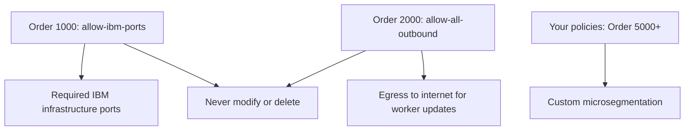

# Secure Calico Networking on IBM Cloud

Author: [nawazdhandala](https://github.com/nawazdhandala)

Tags: Calico, Kubernetes, Networking, IBM Cloud, Security, VPC

Description: Security hardening for Calico networking on IBM Cloud, leveraging IBM Cloud VPC security groups, IKS managed policies, and Calico network policies for defense-in-depth cluster security.

---

## Introduction

Securing Calico networking on IBM Cloud benefits from both IBM's built-in security controls and Calico's fine-grained policy model. IBM Cloud IKS includes a set of managed Calico policies that establish a security baseline — these are designed to ensure cluster components can communicate while blocking unauthorized traffic. Your custom policies extend this baseline with application-specific microsegmentation.

IBM Cloud VPC's security groups provide node-level access control, while Calico network policies enforce pod-level rules. Understanding how these layers interact — and ensuring custom policies don't conflict with IBM's managed policies — is the foundation of a secure IBM Cloud Kubernetes deployment.

## Prerequisites

- IBM Cloud Kubernetes Service or self-managed Kubernetes on IBM Cloud VPC
- IBM Cloud CLI with Kubernetes and VPC plugins
- `kubectl` and `calicoctl` with cluster admin access

## Security Layer 1: Understand IBM's Managed Calico Policies

IKS pre-installs several GlobalNetworkPolicies. Respect their order space:

```bash
calicoctl get globalnetworkpolicies | grep ibm
```



## Security Layer 2: Block IBM Metadata Service from Pods

Similar to other clouds, prevent pods from accessing the IBM Cloud metadata service:

```yaml
apiVersion: projectcalico.org/v3
kind: GlobalNetworkPolicy
metadata:
  name: block-ibm-metadata
spec:
  selector: "all()"
  order: 4900
  egress:
    - action: Deny
      destination:
        nets:
          - 169.254.169.254/32
```

## Security Layer 3: IBM Cloud VPC Security Groups Hardening

Apply minimal permissions to VPC security groups:

```bash
# Create a restrictive security group for workers
ibmcloud is security-group-create k8s-workers-secure

# Allow only required inbound traffic
ibmcloud is security-group-rule-add k8s-workers-secure inbound tcp \
  --remote k8s-workers-secure --port-min 10250 --port-max 10250

ibmcloud is security-group-rule-add k8s-workers-secure inbound udp \
  --remote k8s-workers-secure --port-min 4789 --port-max 4789

# Allow SSH only from VPN/bastion
ibmcloud is security-group-rule-add k8s-workers-secure inbound tcp \
  --remote 10.0.0.0/8 --port-min 22 --port-max 22

# Deny all other inbound (default behavior, but document it)
```

## Security Layer 4: Namespace Isolation with Calico

```yaml
# GlobalNetworkPolicy for strict namespace isolation
apiVersion: projectcalico.org/v3
kind: GlobalNetworkPolicy
metadata:
  name: namespace-isolation
spec:
  order: 5000
  namespaceSelector: "name not in {'kube-system', 'ibm-system', 'calico-system'}"
  ingress:
    - action: Allow
      source:
        namespaceSelector: same as destination
    - action: Deny
  egress:
    - action: Allow
      destination:
        ports: [53]
        protocols: [UDP]
    - action: Allow
      source:
        namespaceSelector: same as destination
    - action: Deny
```

## Security Layer 5: Enable IBM Cloud Security Advisor

```bash
# IBM Cloud Security Advisor integrates with Calico for cluster threat detection
ibmcloud security-advisor network-insights enable --cluster my-cluster

# This provides:
# - Suspicious outbound connections detection
# - Port scanning detection
# - DGA domain detection
```

## Security Layer 6: Private Endpoint for Kubernetes API

```bash
# Restrict kubectl access to private network only
ibmcloud ks cluster feature enable private-service-endpoint --cluster my-cluster

# Disable public API endpoint
ibmcloud ks cluster feature disable public-service-endpoint --cluster my-cluster
```

## Conclusion

Securing Calico on IBM Cloud requires working within IBM's managed policy structure — custom policies should use order numbers above 5000 to avoid conflicting with IBM's baseline. The combination of IBM Cloud VPC security groups for node-level access control, Calico policies for pod-level microsegmentation, IBM Cloud Security Advisor for threat detection, and private API endpoints creates a strong defense-in-depth security posture for Kubernetes workloads on IBM Cloud.
