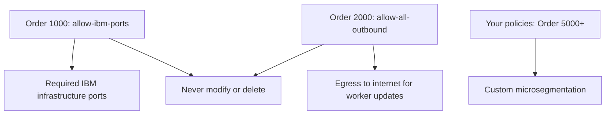

# Secure Calico Networking on IBM Cloud

Author: [nawazdhandala](https://github.com/nawazdhandala)

Tags: Calico, Kubernetes, Networking, IBM Cloud, Security, VPC

Description: Security hardening for Calico networking on IBM Cloud, leveraging IBM Cloud VPC security groups, IKS managed policies, and Calico network policies for defense-in-depth cluster security.

---

## Introduction

Securing Calico networking on IBM Cloud benefits from both IBM's built-in security controls and Calico's fine-grained policy model. IBM Cloud IKS includes a set of managed Calico policies that establish a security baseline - these are designed to ensure cluster components can communicate while blocking unauthorized traffic. Your custom policies extend this baseline with application-specific microsegmentation.

IBM Cloud VPC's security groups provide node-level access control, while Calico network policies enforce pod-level rules. Understanding how these layers interact - and ensuring custom policies don't conflict with IBM's managed policies - is the foundation of a secure IBM Cloud Kubernetes deployment.

## Prerequisites

- IBM Cloud Kubernetes Service or self-managed Kubernetes on IBM Cloud VPC
- IBM Cloud CLI with Kubernetes and VPC plugins
- `kubectl` and `calicoctl` with cluster admin access

## Security Layer 1: Understand IBM's Managed Calico Policies

IKS pre-installs several GlobalNetworkPolicies. Respect their order space:

```bash
calicoctl get globalnetworkpolicies | grep ibm
```


```mermaid
graph TD
    A[Order 1000: allow-ibm-ports] --> B[Required IBM infrastructure ports]
    C[Order 2000: allow-all-outbound] --> D[Egress to internet for worker updates]
    E[Your policies: Order 5000+] --> F[Custom microsegmentation]
    A --> G[Never modify or delete]
    C --> G
```

## Security Layer 2: Block IBM Metadata Service from Pods

Similar to other clouds, prevent pods from accessing the IBM Cloud metadata service:

```yaml
apiVersion: projectcalico.org/v3
kind: GlobalNetworkPolicy
metadata:
  name: block-ibm-metadata
spec:
  selector: "all()"
  order: 4900
  egress:
    - action: Deny
      destination:
        nets:
          - 169.254.169.254/32
```

## Security Layer 3: IBM Cloud VPC Security Groups Hardening

Apply minimal permissions to VPC security groups:

```bash
# Create a restrictive security group for workers

ibmcloud is security-group-create k8s-workers-secure

# Allow only required inbound traffic
ibmcloud is security-group-rule-add k8s-workers-secure inbound tcp \
  --remote k8s-workers-secure --port-min 10250 --port-max 10250

ibmcloud is security-group-rule-add k8s-workers-secure inbound udp \
  --remote k8s-workers-secure --port-min 4789 --port-max 4789

# Allow SSH only from VPN/bastion
ibmcloud is security-group-rule-add k8s-workers-secure inbound tcp \
  --remote 10.0.0.0/8 --port-min 22 --port-max 22

# Deny all other inbound (default behavior, but document it)
```

## Security Layer 4: Namespace Isolation with Calico

Calico does not provide a single global policy expression for "same namespace as the workload." The valid pattern is a per-namespace `NetworkPolicy` that selects on the namespace by name via the `projectcalico.org/name` label. Apply one of these to each non-system namespace:

```yaml
# NetworkPolicy for namespace isolation (apply per namespace)
apiVersion: projectcalico.org/v3
kind: NetworkPolicy
metadata:
  name: namespace-isolation
  namespace: my-app
spec:
  order: 5000
  selector: all()
  ingress:
    - action: Allow
      source:
        namespaceSelector: projectcalico.org/name == "my-app"
    - action: Deny
  egress:
    - action: Allow
      protocol: UDP
      destination:
        ports: [53]
    - action: Allow
      destination:
        namespaceSelector: projectcalico.org/name == "my-app"
    - action: Deny
```

## Security Layer 5: Enable IBM Cloud Security and Compliance Center Workload Protection

IBM Cloud Security Advisor Network Insights was deprecated in 2021. The current service for container threat detection on IBM Cloud is Security and Compliance Center Workload Protection (built on Sysdig Secure and Falco). Provision an instance from the IBM Cloud catalog and connect it to your cluster:

```bash
# Create a Workload Protection instance
ibmcloud resource service-instance-create my-workload-protection \
  sysdig-secure graduated-tier us-south

# Install the agent (Helm) into your cluster using the access key from the instance
# See: https://cloud.ibm.com/docs/workload-protection
```

This provides:
- Container runtime threat detection (Falco-based)
- Suspicious process and network activity detection
- Vulnerability scanning across registries and runtimes
- Compliance posture management

## Security Layer 6: Private Endpoint for Kubernetes API

```bash
# Restrict kubectl access to private network only (classic clusters; for VPC
# clusters the endpoint configuration is set at cluster creation time)
ibmcloud ks cluster master private-service-endpoint enable --cluster my-cluster

# Disable public API endpoint
ibmcloud ks cluster master public-service-endpoint disable --cluster my-cluster

# Refresh the master to apply the endpoint changes
ibmcloud ks cluster master refresh --cluster my-cluster
```

## Conclusion

Securing Calico on IBM Cloud requires working within IBM's managed policy structure - custom policies should use order numbers above 5000 to avoid conflicting with IBM's baseline. The combination of IBM Cloud VPC security groups for node-level access control, Calico policies for pod-level microsegmentation, IBM Cloud Security and Compliance Center Workload Protection for threat detection, and private API endpoints creates a strong defense-in-depth security posture for Kubernetes workloads on IBM Cloud.
