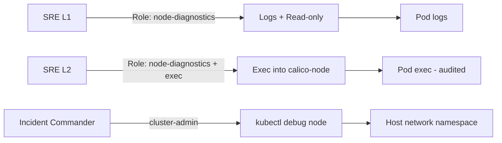

# How to Secure Calico Node Diagnostics

Author: [nawazdhandala](https://github.com/nawazdhandala)

Tags: Calico, Kubernetes, Networking, Diagnostics, Security

Description: Secure access to Calico node diagnostic tools by applying least-privilege RBAC for node debug operations, controlling kubectl debug node access, and auditing exec commands into calico-node pods.

---

## Introduction

Calico node diagnostics require privileged access: `kubectl exec` into calico-node pods and `kubectl debug node` for host-level iptables inspection. Both capabilities can expose sensitive host-level information and the ability to modify node state. Securing this access requires dedicated RBAC roles, audit logging, and restricting `kubectl debug node` to specific users.

## RBAC for Node Diagnostic Access

```yaml
# calico-node-diagnostics-role.yaml
apiVersion: rbac.authorization.k8s.io/v1
kind: Role
metadata:
  name: calico-node-diagnostics
  namespace: calico-system
rules:
  # Read pod state and logs
  - apiGroups: [""]
    resources: ["pods"]
    verbs: ["get", "list"]
  - apiGroups: [""]
    resources: ["pods/log"]
    verbs: ["get"]
  # Exec (required for calicoctl node status, felix-live check)
  - apiGroups: [""]
    resources: ["pods/exec"]
    verbs: ["create"]
---
# Restrict kubectl debug node to cluster-admin only
# (no specific RBAC - this uses node/proxy which requires cluster-admin)
```

## Audit Policy for Node Diagnostic Access

```yaml
# kube-apiserver audit policy additions
apiVersion: audit.k8s.io/v1
kind: Policy
rules:
  # Log all exec into calico-system pods
  - level: RequestResponse
    resources:
      - group: ""
        resources: ["pods/exec"]
    namespaces: ["calico-system"]
    verbs: ["create"]
  # Log node debug operations
  - level: RequestResponse
    resources:
      - group: ""
        resources: ["nodes/proxy"]
    verbs: ["*"]
```

## Safe vs Sensitive Diagnostic Operations

```bash
# SAFE: Read-only, no host access
kubectl logs -n calico-system "${CALICO_POD}" -c calico-node
calicoctl get felixconfiguration
calicoctl ipam show

# SENSITIVE: Requires exec into privileged pod
kubectl exec -n calico-system "${CALICO_POD}" -c calico-node -- \
  calico-node -felix-live
kubectl exec -n calico-system "${CALICO_POD}" -c calico-node -- \
  calicoctl node status

# HIGHLY SENSITIVE: Host-level access
kubectl debug node/"${NODE}" --image=alpine -- \
  nsenter -t 1 -n -- iptables -L
# This gives full host network namespace access
# Restrict to incident commanders only
```

## Security Architecture



## Conclusion

Securing Calico node diagnostics requires tiered access: read-only log and resource access for first-responders, pod exec access for senior engineers who need Felix liveness checks and BGP state, and cluster-admin (or equivalent) restricted to incident commanders for host-level `kubectl debug node` operations. Apply audit logging to all exec and node-proxy operations in the calico-system namespace to maintain visibility into diagnostic activity.
