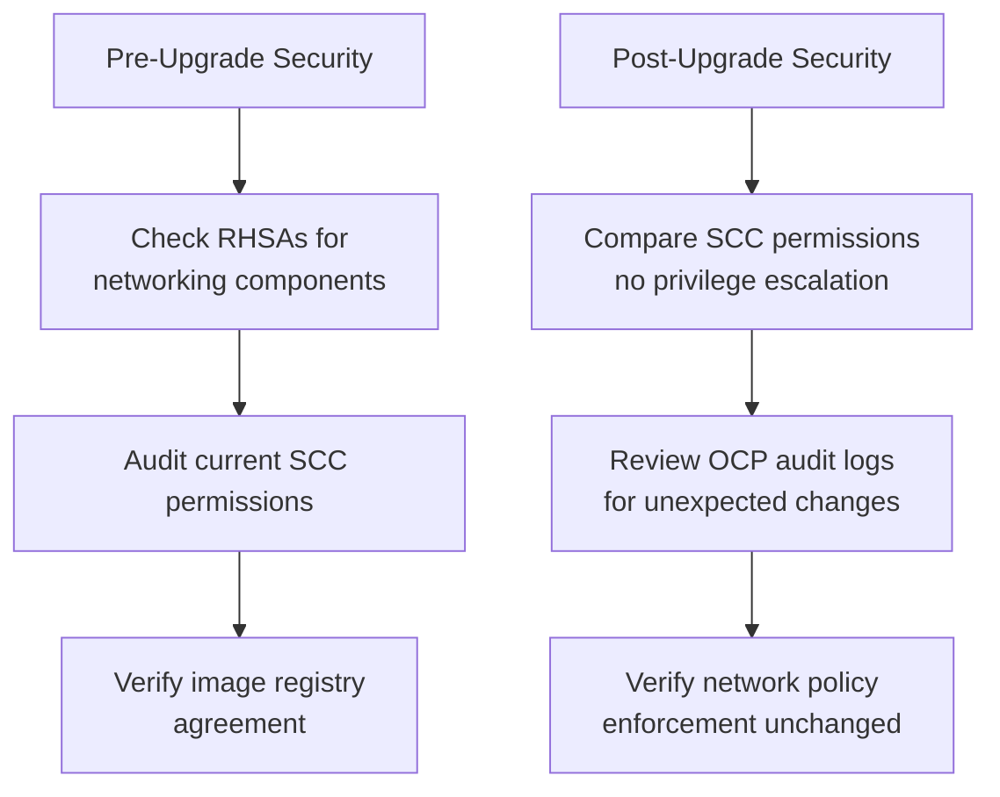

# How to Secure Calico on OpenShift Upgrades

Author: [nawazdhandala](https://github.com/nawazdhandala)

Tags: Calico, OpenShift, Kubernetes, Networking, Upgrade, Security

Description: Apply OpenShift-specific security controls during Calico upgrades, including SCC validation, OCP audit logging, and coordinating with Red Hat's security advisory process.

---

## Introduction

Securing Calico upgrades on OpenShift involves additional considerations: Red Hat's Security Advisories (RHSA) may include Calico-related fixes that need coordination, OpenShift's SCC framework requires validation to ensure privileges aren't accidentally broadened, and OCP's built-in audit logging provides richer tracking of network-related changes during upgrades.

## Security Control 1: Check for Related RHSAs

```bash
# Before upgrading, check if there are related Red Hat Security Advisories
# that affect OpenShift networking

# Check OpenShift errata for the current OCP version
curl -s "https://access.redhat.com/labs/ocpupgradegraph/update_path" \
  --data "channel=stable-4.14&from=4.14.0&to=4.14.x" 2>/dev/null | head -20

# For Calico Enterprise, check Tigera's security advisories
# https://docs.tigera.io/security-advisories
```

## Security Control 2: SCC Audit Before and After Upgrade

```bash
#!/bin/bash
# audit-calico-scc.sh
echo "=== Calico SCC Audit ==="

echo "Before/After Upgrade SCC Comparison:"
echo ""
echo "Calico-related SCCs:"
oc get scc | grep -i calico

echo ""
echo "calico-node SCC details:"
oc get scc calico-node -o yaml | \
  grep -E "allowPrivileged|hostNetwork|hostPID|hostIPC|volumes|capabilities"

echo ""
echo "Service accounts using calico SCCs:"
oc adm policy who-can use scc calico-node
oc adm policy who-can use scc privileged | grep calico
```

## Security Control 3: OpenShift Audit Log Review

```bash
# Review OpenShift audit logs for Calico-related changes during upgrade
# (requires access to master node or OCP must-gather)

# Using must-gather to collect audit logs:
oc adm must-gather -- gather_audit_logs

# After collecting, search for calico-related changes
grep '"namespace":"calico-system"' audit.log | \
  grep '"verb":"update\|patch\|delete"' | \
  jq '{time: .requestReceivedTimestamp, user: .user.username, verb: .verb, resource: .objectRef.resource}' | \
  head -20
```

## Security Control 4: Image Pull Policy Validation

```bash
# On OpenShift with restricted network, verify images can be pulled
# from approved registries after upgrade

# Check if upgraded images are from approved registry
kubectl get pods -n calico-system \
  -o jsonpath='{range .items[*]}{.spec.containers[*].image}{"\n"}{end}' | \
  sort -u | while read img; do
    if echo "${img}" | grep -q "registry.internal"; then
      echo "OK:   ${img}"
    else
      echo "WARN: Unexpected registry: ${img}"
    fi
  done
```

## Security Validation Checklist



## Conclusion

Securing Calico upgrades on OpenShift requires checking for relevant Red Hat Security Advisories, auditing SCC permissions before and after to detect privilege changes, reviewing OCP audit logs for unexpected changes, and validating image pull sources. The most important security check is comparing SCC permissions before and after - any broadening of privileges (new `allowPrivileged: true` or new capability additions) should trigger a security review before the upgrade is accepted.
