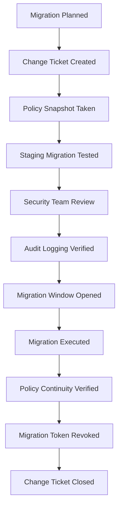

# How to Secure Calico Operator Migration

Author: [nawazdhandala](https://github.com/nawazdhandala)

Tags: Calico, Kubernetes, Networking, Operator, Migration, Security

Description: Apply security best practices during Calico operator migration, including least-privilege migration procedures, audit logging, and change control for the migration process.

---

## Introduction

The Calico operator migration is a high-privilege operation that requires cluster-admin access and temporarily places the cluster in a transitional state. During this window, extra security attention is required to ensure the migration doesn't introduce vulnerabilities or leave security controls partially applied.

Key security concerns during migration include: ensuring policy enforcement is continuous (no gap where policies are unenforced), protecting the migration scripts and credentials, auditing all changes made during migration, and verifying the operator's RBAC permissions align with least-privilege principles.

## Prerequisites

- Calico operator migration planned and tested in staging
- Kubernetes audit logging enabled
- Change management ticket approved
- Dedicated migration service account prepared

## Security Control 1: Dedicated Migration Service Account

```bash
# Create a dedicated service account for the migration
# This enables fine-grained audit logging of migration actions

kubectl create serviceaccount calico-migration-runner \
  -n kube-system

# Grant only the permissions needed for migration
kubectl create clusterrolebinding calico-migration-runner-admin \
  --clusterrole=cluster-admin \
  --serviceaccount=kube-system:calico-migration-runner

# Generate a kubeconfig for the migration service account
kubectl create token calico-migration-runner \
  -n kube-system --duration=2h > migration-token.txt

# Use this kubeconfig for the migration job
KUBECONFIG_MIGRATION=$(kubectl config view --minify --raw | \
  sed "s/$(kubectl config view --minify -o jsonpath='{.users[0].user.token}')/$(cat migration-token.txt)/g")
```

## Security Control 2: Pre-Migration Policy Snapshot

```bash
#!/bin/bash
# capture-policy-snapshot.sh
SNAPSHOT_DIR="policy-snapshot-$(date +%Y%m%d-%H%M%S)"
mkdir -p "${SNAPSHOT_DIR}"

# Save all network policies
kubectl get networkpolicy --all-namespaces -o yaml > "${SNAPSHOT_DIR}/k8s-netpols.yaml"
calicoctl get globalnetworkpolicies -o yaml > "${SNAPSHOT_DIR}/calico-gnps.yaml"
calicoctl get networkpolicies --all-namespaces -o yaml > "${SNAPSHOT_DIR}/calico-netpols.yaml"
calicoctl get globalnetworksets -o yaml > "${SNAPSHOT_DIR}/globalnetworksets.yaml"

# Create checksum
sha256sum "${SNAPSHOT_DIR}"/* > "${SNAPSHOT_DIR}/checksums.sha256"

echo "Policy snapshot saved to: ${SNAPSHOT_DIR}"
echo "Review and preserve these files before migration"
```

## Security Control 3: Operator RBAC Review

```bash
# Review the permissions the Tigera Operator will have
kubectl get clusterrole tigera-operator -o yaml | \
  grep -E "apiGroups|resources|verbs" | head -60

# Key permissions to verify:
# - Should have access to operator.tigera.io resources
# - Should have access to core Kubernetes resources for managing DaemonSets/Deployments
# - Should NOT have access to secret reading beyond what's necessary

# Check if the operator RBAC follows least privilege
# For a standard deployment, the operator needs extensive access
# Document this in your change request as a known requirement
```

## Security Control 4: Audit Log Configuration

```yaml
# Ensure Kubernetes audit policy captures migration events
# Add to kube-apiserver audit-policy.yaml before migration:
apiVersion: audit.k8s.io/v1
kind: Policy
rules:
  # Log all operator.tigera.io changes at Request level
  - level: Request
    resources:
      - group: "operator.tigera.io"
        resources: ["*"]

  # Log DaemonSet changes in calico namespaces
  - level: Request
    resources:
      - group: "apps"
        resources: ["daemonsets", "deployments"]
    namespaces: ["calico-system", "tigera-operator", "kube-system"]
```

## Security Control 5: Policy Continuity Verification

```bash
#!/bin/bash
# verify-policy-continuity.sh
# Run BEFORE and AFTER migration to detect any policy gaps

POLICY_COUNT_FILE="policy-count.txt"

echo "Policy count at $(date):" >> "${POLICY_COUNT_FILE}"
echo "K8s NetworkPolicies: $(kubectl get networkpolicy --all-namespaces --no-headers | wc -l)" >> "${POLICY_COUNT_FILE}"
echo "Calico GNPs: $(calicoctl get gnp --no-headers | wc -l)" >> "${POLICY_COUNT_FILE}"
echo "Calico NetworkPolicies: $(calicoctl get np --all-namespaces --no-headers | wc -l)" >> "${POLICY_COUNT_FILE}"
echo "" >> "${POLICY_COUNT_FILE}"

cat "${POLICY_COUNT_FILE}"
```

## Migration Change Control Checklist



## Post-Migration Security Cleanup

```bash
# Revoke migration token and cleanup
kubectl delete clusterrolebinding calico-migration-runner-admin
kubectl delete serviceaccount calico-migration-runner -n kube-system
rm -f migration-token.txt

# Verify no leftover permissive policies from migration
kubectl get clusterrolebinding | grep migration

# Confirm operator RBAC is at expected state
kubectl get clusterrole tigera-operator -o yaml | wc -l
```

## Conclusion

Securing the Calico operator migration requires treating it as a high-privilege change with full audit trail requirements. Use a dedicated short-lived service account for migration actions, capture policy snapshots before and after to detect any gaps, verify operator RBAC permissions are documented and justified, and always revoke migration credentials immediately after the migration window closes. The goal is to have a complete audit trail showing that network security controls were continuously enforced throughout the migration window.
