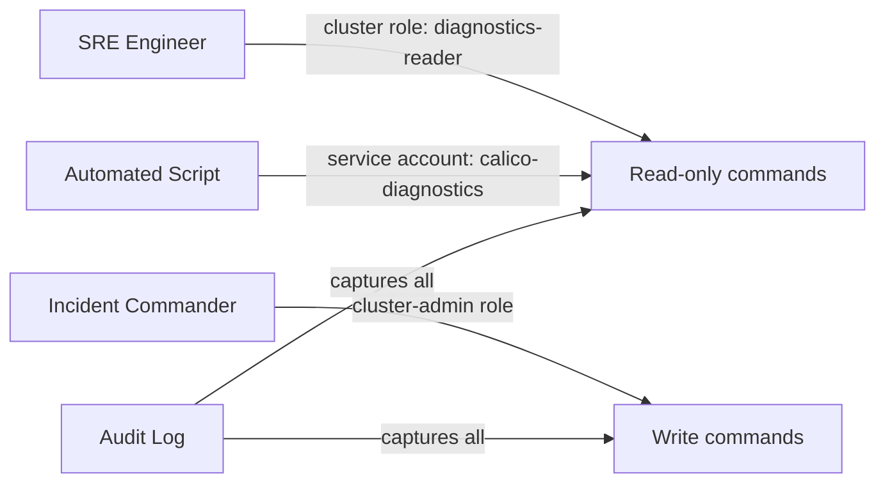

# How to Secure Calico Troubleshooting Commands

Author: [nawazdhandala](https://github.com/nawazdhandala)

Tags: Calico, Kubernetes, Networking, Troubleshooting, Security

Description: Secure access to Calico troubleshooting commands by implementing least-privilege RBAC for calicoctl, audit logging diagnostic command runs, and preventing destructive commands during read-only diagnostic sessions.

---

## Introduction

Calico troubleshooting commands include both safe read-only queries (calicoctl get, ipam show) and potentially disruptive write operations (calicoctl delete, ipam release). Securing the troubleshooting toolkit means giving engineers read access to all Calico resources without write access, audit logging diagnostic command runs, and using a dedicated service account for automated diagnostic scripts.

## Read-Only RBAC for Diagnostic Access

```yaml
# calico-read-only-role.yaml
apiVersion: rbac.authorization.k8s.io/v1
kind: ClusterRole
metadata:
  name: calico-diagnostics-reader
rules:
  # Calico CRDs - read only
  - apiGroups: ["projectcalico.org", "crd.projectcalico.org"]
    resources:
      - felixconfigurations
      - bgpconfigurations
      - bgppeers
      - globalnetworkpolicies
      - networkpolicies
      - ippools
      - ipamblocks
      - ipreservations
    verbs: ["get", "list", "watch"]
  # TigeraStatus
  - apiGroups: ["operator.tigera.io"]
    resources: ["tigerastatuses", "installations"]
    verbs: ["get", "list"]
  # Pod logs and exec (for calico-node status)
  - apiGroups: [""]
    resources: ["pods/log"]
    verbs: ["get"]
  - apiGroups: [""]
    resources: ["pods"]
    verbs: ["get", "list"]
```

## Separate Service Account for Automated Scripts

```yaml
apiVersion: v1
kind: ServiceAccount
metadata:
  name: calico-diagnostics
  namespace: calico-system
---
apiVersion: rbac.authorization.k8s.io/v1
kind: ClusterRoleBinding
metadata:
  name: calico-diagnostics-binding
subjects:
  - kind: ServiceAccount
    name: calico-diagnostics
    namespace: calico-system
roleRef:
  kind: ClusterRole
  name: calico-diagnostics-reader
  apiGroup: rbac.authorization.k8s.io
```

## Read-Only vs Destructive Command Reference

```bash
# SAFE - Read-only diagnostic commands
calicoctl get felixconfiguration
calicoctl get bgppeer
calicoctl get globalnetworkpolicy
calicoctl ipam show
calicoctl ipam check
kubectl get tigerastatus

# REQUIRES APPROVAL - State-modifying commands
calicoctl delete bgppeer <name>         # Removes BGP peer
calicoctl ipam release --ip=<ip>        # Releases IP allocation
calicoctl apply -f policy.yaml          # Creates/updates policies
calicoctl patch felixconfiguration ...  # Changes Felix config
```

## Security Architecture



## Conclusion

Securing Calico troubleshooting access requires a dedicated read-only ClusterRole that grants access to all Calico CRDs without write permissions. Most troubleshooting scenarios are fully covered by read operations: `calicoctl get`, `calicoctl ipam show`, and `calicoctl ipam check` provide all the diagnostic information needed. Reserve write access (cluster-admin or custom write role) for incident commanders who need to apply configuration changes, and require a change ticket before any write operation during an incident.
