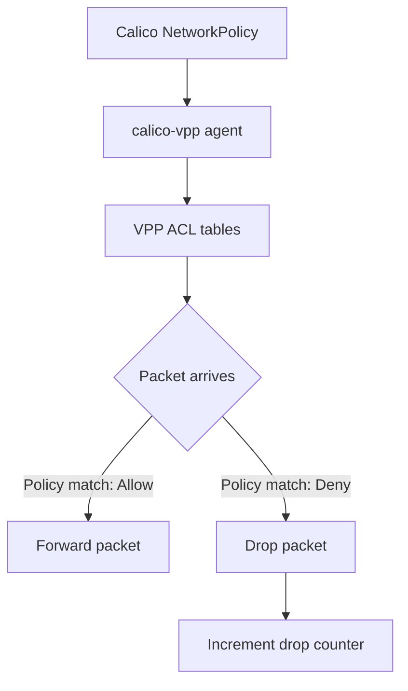

# Secure Calico VPP Host Networking

Author: [nawazdhandala](https://github.com/nawazdhandala)

Tags: Calico, Kubernetes, Networking, VPP, Security, DPDK

Description: Security hardening for Calico VPP host networking, covering VPP access controls, hugepage memory security, and Calico policy enforcement in the VPP dataplane.

---

## Introduction

Calico VPP introduces security considerations beyond standard Calico deployments. VPP runs as a privileged process that takes ownership of physical network interfaces via DPDK, making it a critical component that requires careful access control. The VPP management socket provides unrestricted access to the VPP control plane, and must be protected from unauthorized access.

At the same time, VPP provides powerful security capabilities: ACL-based policy enforcement at line rate, hardware offload support for policy enforcement, and the ability to implement stateful session tracking at very high throughput. This guide covers securing the VPP deployment itself as well as leveraging VPP's security capabilities.

## Prerequisites

- Calico VPP deployed and operational
- Understanding of VPP's security model
- `kubectl` with cluster admin access

## Security Practice 1: Restrict VPP Socket Access

The VPP management socket (`/run/vpp/cli.sock`) must be protected:

```bash
# Verify socket permissions on the node
ls -la /run/vpp/
# cli.sock should be owned by root with restricted permissions

# If accessible too broadly
sudo chmod 600 /run/vpp/cli.sock
sudo chown root:root /run/vpp/cli.sock
```

## Security Practice 2: Run VPP Pods with Minimal Privileges

```yaml
# Restrict VPP pod capabilities
securityContext:
  runAsNonRoot: false  # VPP requires root for DPDK
  capabilities:
    add:
      - SYS_ADMIN       # For hugepages
      - NET_ADMIN       # For interface management
      - IPC_LOCK        # For hugepage locking
    drop:
      - ALL
  # Never use privileged: true - use specific capabilities instead
```

## Security Practice 3: Calico Policy Enforcement via VPP ACLs



Verify policies are programmed into VPP:

```bash
kubectl exec -n calico-vpp-dataplane ds/calico-vpp-node -c vpp -- \
  vppctl show acl-plugin interface
# Each pod interface should have ACLs programmed
```

## Security Practice 4: Protect Hugepage Memory

Hugepage memory contains packet buffers that may include sensitive application data:

```bash
# Ensure hugepages are properly cleared between uses
# VPP does this by default, but verify no debugging flags enable memory dumps

# Check that VPP coredumps are disabled (they can expose packet buffer contents)
kubectl get configmap calico-vpp-config -n calico-vpp-dataplane -o yaml | grep COREDUMP
```

## Security Practice 5: Network Policy for VPP Management

Apply network policies to restrict access to VPP pods:

```yaml
apiVersion: networking.k8s.io/v1
kind: NetworkPolicy
metadata:
  name: restrict-vpp-access
  namespace: calico-vpp-dataplane
spec:
  podSelector:
    matchLabels:
      app: calico-vpp-node
  ingress:
    - from:
        - namespaceSelector:
            matchLabels:
              kubernetes.io/metadata.name: calico-system
```

## Security Practice 6: Audit VPP CLI Access

Log all VPP CLI commands for audit:

```bash
# VPP can log API calls
# Configure in VPP startup configuration
cat /etc/vpp/startup.conf | grep log

# Add API logging
api-trace { on }
```

## Conclusion

Securing Calico VPP requires protecting the VPP management socket, using minimal capabilities rather than full privilege, verifying that Calico network policies are programmed into VPP ACL tables, and protecting hugepage memory that contains packet data. VPP's high-performance ACL engine makes it an excellent security enforcement point for line-rate policy evaluation, but the VPP process itself must be hardened to prevent unauthorized control plane access.
