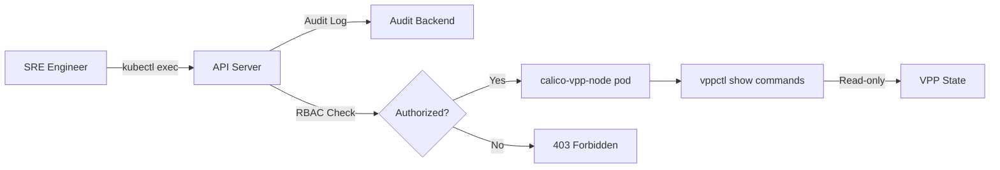

# How to Secure Calico VPP Troubleshooting Access

Author: [nawazdhandala](https://github.com/nawazdhandala)

Tags: Calico, VPP, Kubernetes, Networking, Troubleshooting, Security

Description: Secure access to VPP troubleshooting tools by implementing RBAC controls for calico-vpp-dataplane access, audit logging for vppctl commands, and least-privilege pod exec policies.

---

## Introduction

Calico VPP troubleshooting requires exec access to privileged pods in the `calico-vpp-dataplane` namespace. The `vppctl` CLI can modify live VPP configuration - adding routes, changing NAT rules, enabling packet traces - which makes unrestricted access a security risk. Securing this access means applying least-privilege RBAC, audit logging kubectl exec calls, and using read-only commands during normal operations.

## RBAC for VPP Troubleshooting Access

```yaml
# vpp-troubleshoot-role.yaml
# Grants read-only pod exec access to VPP pods
apiVersion: rbac.authorization.k8s.io/v1
kind: Role
metadata:
  name: vpp-troubleshooter
  namespace: calico-vpp-dataplane
rules:
  - apiGroups: [""]
    resources: ["pods"]
    verbs: ["get", "list"]
  - apiGroups: [""]
    resources: ["pods/exec"]
    verbs: ["create"]
  - apiGroups: [""]
    resources: ["pods/log"]
    verbs: ["get"]
---
apiVersion: rbac.authorization.k8s.io/v1
kind: RoleBinding
metadata:
  name: vpp-troubleshooter-binding
  namespace: calico-vpp-dataplane
subjects:
  - kind: Group
    name: sre-team
    apiGroup: rbac.authorization.k8s.io
roleRef:
  kind: Role
  name: vpp-troubleshooter
  apiGroup: rbac.authorization.k8s.io
```

## Audit Policy for VPP Pod Exec

```yaml
# Add to kube-apiserver audit policy
apiVersion: audit.k8s.io/v1
kind: Policy
rules:
  # Log all exec commands into calico-vpp-dataplane namespace
  - level: RequestResponse
    resources:
      - group: ""
        resources: ["pods/exec"]
    namespaces: ["calico-vpp-dataplane"]
    verbs: ["create"]
```

## Read-Only VPP Commands Reference

```bash
# Safe read-only vppctl commands for troubleshooting
# These do NOT modify VPP state

kubectl exec -n calico-vpp-dataplane "${VPP_POD}" -c vpp -- vppctl show version
kubectl exec -n calico-vpp-dataplane "${VPP_POD}" -c vpp -- vppctl show interface
kubectl exec -n calico-vpp-dataplane "${VPP_POD}" -c vpp -- vppctl show ip fib
kubectl exec -n calico-vpp-dataplane "${VPP_POD}" -c vpp -- vppctl show error
kubectl exec -n calico-vpp-dataplane "${VPP_POD}" -c vpp -- vppctl show nat44 summary

# Commands that MODIFY state (require elevated approval):
# vppctl trace add ...        (enables packet capture)
# vppctl clear trace          (clears trace buffer)
# vppctl set interface state  (changes interface up/down)
```

## Security Architecture



## Restrict Interactive VPP CLI Sessions

```bash
# Restrict users to specific vppctl show commands only
# Use a wrapper script instead of direct vppctl access

cat > /usr/local/bin/vpp-readonly << 'SCRIPT'
#!/bin/bash
CMD="$1"
case "${CMD}" in
  show) kubectl exec -n calico-vpp-dataplane "${VPP_POD}" -c vpp -- vppctl show "${@:2}" ;;
  *) echo "Error: only 'show' commands are permitted"; exit 1 ;;
esac
SCRIPT
```

## Conclusion

Securing Calico VPP troubleshooting access requires RBAC that limits pod exec to the calico-vpp-dataplane namespace, audit logging of all exec calls to capture what vppctl commands were run, and a clear separation between read-only show commands and state-modifying commands. During normal troubleshooting, all needed information is available through `vppctl show` commands - there is no need to modify VPP state. Reserve write access for incident commanders only, and require a change ticket before executing any state-modifying vppctl commands.
