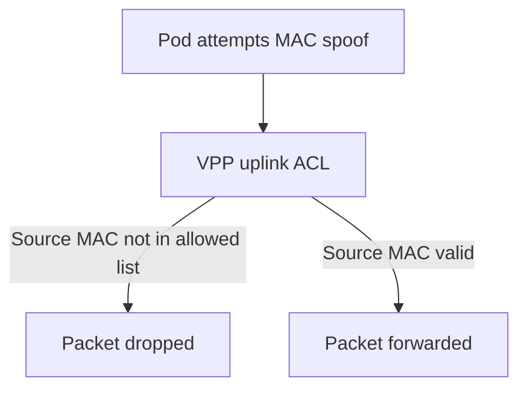

# Secure Calico VPP Uplink Configuration

Author: [nawazdhandala](https://github.com/nawazdhandala)

Tags: Calico, Kubernetes, Networking, VPP, DPDK, Uplink, Security

Description: Security hardening for Calico VPP uplink interfaces, including IOMMU configuration for DPDK, MAC address spoofing prevention, and network-level access controls for VPP-managed interfaces.

---

## Introduction

The Calico VPP uplink interface is the point where Kubernetes pod traffic enters and exits the physical network fabric. Securing this interface prevents attacks that target the DPDK layer — including DMA attacks against non-IOMMU-protected NIC drivers, MAC address spoofing from pods, and unauthorized configuration of the VPP uplink through the management plane.

IOMMU protection via vfio-pci is the foundational security control for DPDK deployments. Without IOMMU, a compromised VPP process could theoretically use DPDK's DMA capabilities to access arbitrary system memory.

## Prerequisites

- Hardware with IOMMU support (VT-d on Intel, AMD-Vi on AMD)
- Nodes with IOMMU enabled in BIOS and kernel
- `kubectl` and node-level access

## Security Practice 1: Enable and Verify IOMMU

```bash
# Check IOMMU is enabled in kernel
dmesg | grep -i iommu
# Expected: "IOMMU: enabling"

# Check IOMMU groups are available
ls /sys/kernel/iommu_groups/
# Should list IOMMU groups

# Verify vfio-pci is using IOMMU
cat /sys/bus/pci/drivers/vfio-pci/0000:00:0a.0/iommu_group/type
# Expected: DMA (IOMMU DMA protection active)
```

Add to GRUB configuration:

```bash
# For Intel CPUs
GRUB_CMDLINE_LINUX="intel_iommu=on iommu=pt"

# For AMD CPUs
GRUB_CMDLINE_LINUX="amd_iommu=on iommu=pt"
```

## Security Practice 2: Use vfio-pci Instead of uio_pci_generic

```yaml
data:
  CALICOVPP_INTERFACES: |
    {
      "uplinkInterfaces": [
        {
          "interfaceName": "eth0",
          "vppDriver": "dpdk",
          "newDriverName": "vfio-pci"    # NEVER use uio_pci_generic in production
        }
      ]
    }
```

`vfio-pci` provides IOMMU isolation; `uio_pci_generic` does not and allows DMA to arbitrary physical addresses.

## Security Practice 3: Prevent MAC Spoofing



Configure VPP to filter by MAC address:

```bash
# Add MAC source filter for pods
kubectl exec -n calico-vpp-dataplane ds/calico-vpp-node -c vpp -- \
  vppctl set interface l2 tag-rewrite GigabitEthernet0/0/0 pop 0
```

## Security Practice 4: Protect VPP ConfigMap

Restrict who can modify the VPP uplink ConfigMap:

```yaml
apiVersion: rbac.authorization.k8s.io/v1
kind: Role
metadata:
  name: vpp-config-admin
  namespace: calico-vpp-dataplane
rules:
  - apiGroups: [""]
    resources: ["configmaps"]
    resourceNames: ["calico-vpp-config"]
    verbs: ["get", "list", "watch"]
    # No update/patch - only admins can change uplink config
```

## Security Practice 5: Physical Network Security

The VPP uplink connects to the physical switch. Apply switch-level security:

```bash
# Document required switch configurations:
# - Port security: limit MAC addresses per port
# - 802.1X authentication: require node authentication
# - DHCP snooping: prevent rogue DHCP
# - Dynamic ARP inspection: prevent ARP spoofing
```

## Security Practice 6: Audit Uplink Configuration Changes

```yaml
# Kubernetes audit policy for ConfigMap changes
apiVersion: audit.k8s.io/v1
kind: Policy
rules:
  - level: RequestResponse
    resources:
      - group: ""
        resources: ["configmaps"]
    namespaces: ["calico-vpp-dataplane"]
    verbs: ["update", "patch"]
```

## Conclusion

Securing Calico VPP uplink configuration requires IOMMU via vfio-pci as the foundational DPDK security control, MAC filtering to prevent spoofing from pods, RBAC protection for the uplink ConfigMap, and physical switch-level controls at the network boundary. IOMMU is the most critical control — without it, a compromised VPP process could use DPDK's DMA access to read or write arbitrary system memory, making it a serious security vulnerability in multi-tenant environments.
