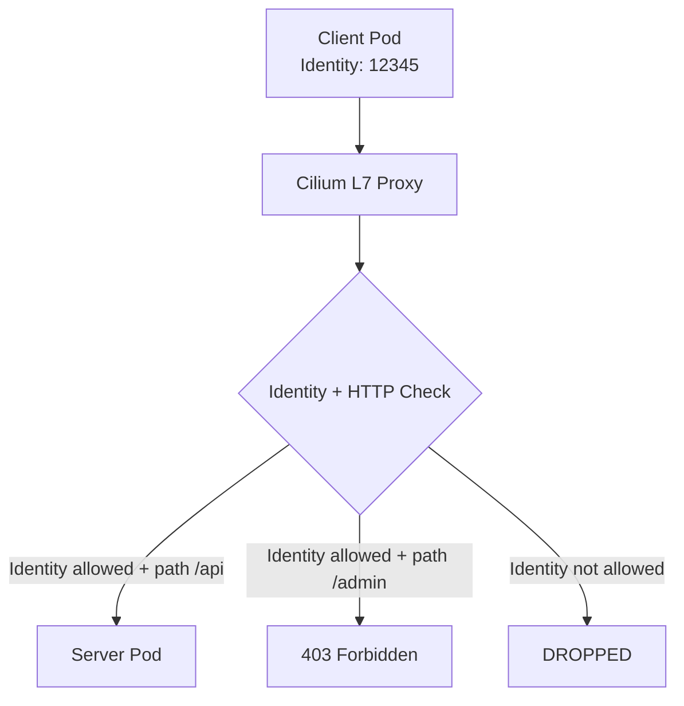

# How to Secure Cilium Identity-Aware and HTTP-Aware Policy Enforcement

Author: [nawazdhandala](https://github.com/nawazdhandala)

Tags: Cilium, Kubernetes, Security, L7 Policy, Identity, HTTP, EBPF

Description: Implement identity-aware and HTTP-aware network policies in Cilium to enforce access control based on workload identity and HTTP request attributes.

---

## Introduction

Cilium's identity-aware policy enforcement ties network access control to the cryptographic identity of Kubernetes workloads rather than to ephemeral IP addresses. Combined with HTTP-aware policies that inspect request method, path, and headers, this creates a robust zero-trust networking model.

Traditional firewall rules based on IPs break when pods scale, reschedule, or share IP addresses. Cilium uses endpoint identities derived from Kubernetes labels to create rules that persist correctly as workloads move across the cluster.

## Prerequisites

- Cilium with L7 HTTP proxy support
- Envoy enabled (for L7 policy)
- Test application with HTTP endpoints

## Understanding Cilium Identity

Each Cilium endpoint has an identity derived from its pod labels:

```bash
kubectl exec -n kube-system ds/cilium -- \
  cilium-dbg endpoint list | grep <pod-name>
```

The identity number is used in eBPF policy maps to match allowed sources.

## Architecture



## Create Identity-Aware L3/L4 Policy

Allow only specific workloads to access a service:

```yaml
apiVersion: cilium.io/v2
kind: CiliumNetworkPolicy
metadata:
  name: api-access-policy
  namespace: default
spec:
  endpointSelector:
    matchLabels:
      app: api-server
  ingress:
    - fromEndpoints:
        - matchLabels:
            app: frontend
            role: web
      toPorts:
        - ports:
            - port: "8080"
              protocol: TCP
```

## Add HTTP-Aware Rules

Restrict HTTP methods and paths per identity:

```yaml
spec:
  endpointSelector:
    matchLabels:
      app: api-server
  ingress:
    - fromEndpoints:
        - matchLabels:
            app: admin-portal
      toPorts:
        - ports:
            - port: "8080"
              protocol: TCP
          rules:
            http:
              - method: GET
                path: "^/admin/.*"
              - method: POST
                path: "^/admin/.*"
    - fromEndpoints:
        - matchLabels:
            app: frontend
      toPorts:
        - ports:
            - port: "8080"
              protocol: TCP
          rules:
            http:
              - method: GET
                path: "^/api/v1/.*"
              - method: POST
                path: "^/api/v1/.*"
```

## Verify with Policy Trace

```bash
kubectl exec -n kube-system ds/cilium -- \
  cilium-dbg policy trace \
  --src-label app=frontend \
  --dst-label app=api-server \
  --dport 8080/tcp
```

## Monitor L7 Policy Decisions

```bash
kubectl exec -n kube-system ds/cilium -- \
  cilium-dbg monitor --type l7
```

## Hubble L7 Visibility

```bash
hubble observe --namespace default \
  --to-label app=api-server \
  --protocol http --follow
```

## Conclusion

Cilium's identity-aware and HTTP-aware policies create a zero-trust network model where both the source workload identity and the HTTP request attributes are verified before allowing traffic. This is significantly more robust than IP-based rules and enables precise access control that remains accurate as workloads scale and reschedule.
