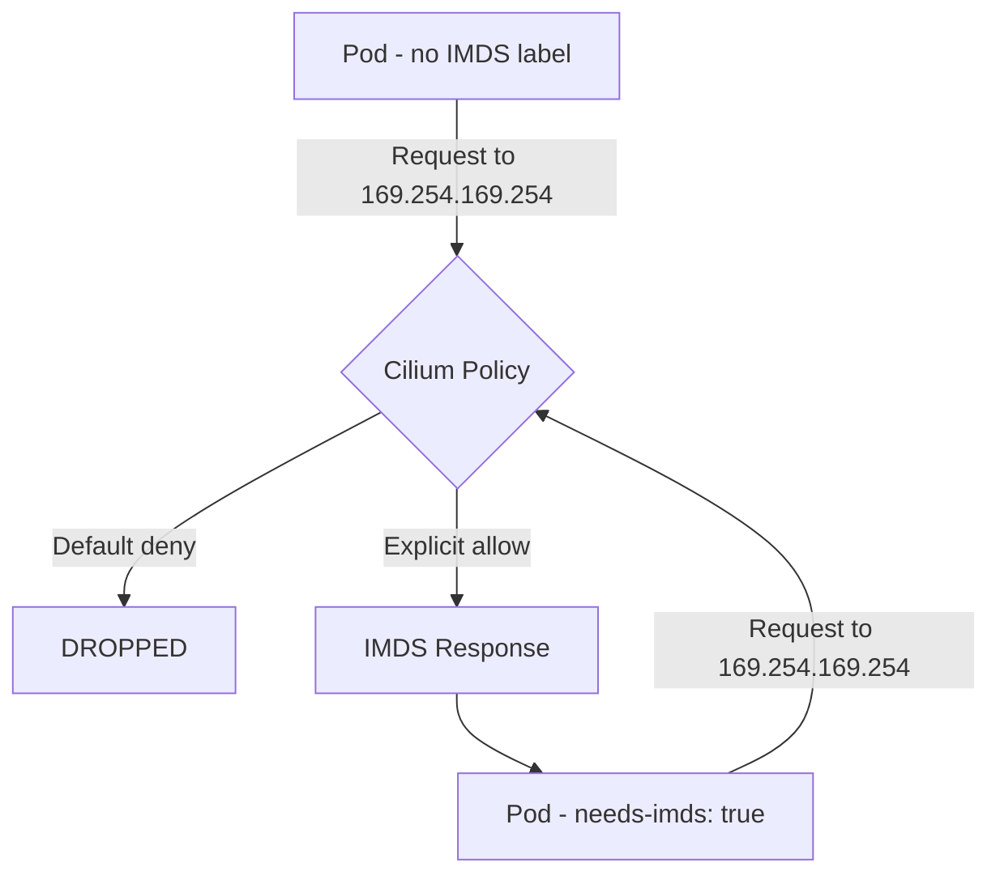

# How to Secure External Access Using AWS Metadata in Cilium

Author: [nawazdhandala](https://github.com/nawazdhandala)

Tags: Cilium, Kubernetes, AWS, Security, IMDS, Network Policy, EBPF

Description: Use Cilium network policies to control and secure access to the AWS EC2 Instance Metadata Service (IMDS) endpoint from pods running on EKS.

---

## Introduction

The AWS EC2 Instance Metadata Service (IMDS) endpoint at 169.254.169.254 provides sensitive information including IAM credentials, instance configuration, and user data. On EKS clusters, every pod that can reach this endpoint can potentially access the node's IAM role credentials-a significant security risk.

Cilium can enforce fine-grained policies controlling which pods can access the IMDS endpoint. Combined with IMDSv2 enforcement at the EC2 level, Cilium policies provide defense-in-depth for metadata service access.

This guide demonstrates how to create Cilium policies that restrict IMDS access to only the pods that legitimately need it.

## Prerequisites

- Cilium on EKS
- Pods that need IAM role access (e.g., workloads using IRSA)
- `kubectl` and `cilium` CLIs

## Understand the Threat

Without policies, any pod can access IMDS:

```bash
kubectl run test --image=curlimages/curl --rm -it --restart=Never -- \
  curl http://169.254.169.254/latest/meta-data/
```

This returns node metadata accessible to all pods.

## Create a Default-Deny Policy for IMDS

Block all pods from accessing the metadata endpoint by default:

```yaml
apiVersion: cilium.io/v2
kind: CiliumClusterwideNetworkPolicy
metadata:
  name: block-imds-default
spec:
  endpointSelector: {}
  egress:
    - toCIDRSet:
        - cidr: "169.254.169.254/32"
          except: []
```

## Architecture



## Allow IMDS for Specific Pods

Label pods that legitimately need metadata access and create an explicit allow:

```yaml
apiVersion: cilium.io/v2
kind: CiliumNetworkPolicy
metadata:
  name: allow-imds-for-privileged-pods
  namespace: default
spec:
  endpointSelector:
    matchLabels:
      needs-imds: "true"
  egress:
    - toCIDRSet:
        - cidr: "169.254.169.254/32"
      toPorts:
        - ports:
            - port: "80"
              protocol: TCP
```

Label the pods that need access:

```bash
kubectl label pod <pod-name> needs-imds=true
```

## Verify with Hubble

Monitor access attempts to IMDS:

```bash
hubble observe --to-ip 169.254.169.254 --follow
```

## Enforce IMDSv2 Hop Limit (Defense in Depth)

At the node level, restrict IMDSv2 to hop limit 1 to prevent containers from accessing it without explicit host-forwarded calls:

```bash
aws ec2 modify-instance-metadata-options \
  --instance-id <instance-id> \
  --http-put-response-hop-limit 1 \
  --http-endpoint enabled
```

## Conclusion

Securing AWS IMDS access with Cilium provides pod-level granularity for metadata service access control. By combining default-deny policies with explicit allow rules for labeled pods, you can enforce least-privilege access to IAM credentials and instance metadata across your EKS cluster.
