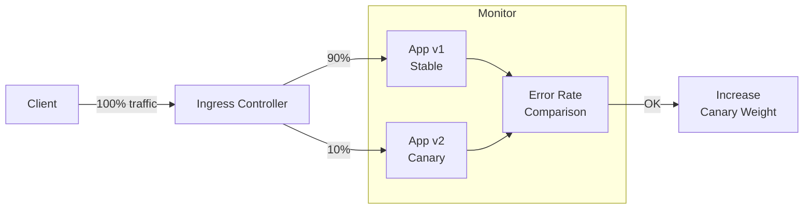

# How to Secure Ingress Gateway Canary Rollouts with Calico

Author: [nawazdhandala](https://github.com/nawazdhandala)

Tags: Calico, Kubernetes, Canary, Ingress, Deployment

Description: Secure canary deployments with Calico by ensuring new service versions maintain security policies before receiving production traffic.

---

## Introduction

Canary rollouts allow you to gradually shift traffic from a stable version of an application to a new version, monitoring for errors before completing the rollout. When combined with Calico's network policy enforcement, canary rollouts gain an additional safety layer: you can enforce that the canary version meets security policy requirements before it receives significant production traffic.

This pattern is particularly valuable for microservices where a buggy new version could cascade failures to dependent services. By limiting traffic exposure during the canary phase, you contain the blast radius of potential issues.

## Prerequisites

- Calico with ingress controller support
- Two versions of an application deployed
- NGINX Ingress Controller or similar for canary annotations

## Configure Canary Ingress

```yaml
# Stable version
apiVersion: networking.k8s.io/v1
kind: Ingress
metadata:
  name: app-stable
spec:
  rules:
  - host: app.example.com
    http:
      paths:
      - path: /
        pathType: Prefix
        backend:
          service:
            name: app-v1
            port:
              number: 80
---
# Canary version - 10% of traffic
apiVersion: networking.k8s.io/v1
kind: Ingress
metadata:
  name: app-canary
  annotations:
    nginx.ingress.kubernetes.io/canary: "true"
    nginx.ingress.kubernetes.io/canary-weight: "10"
spec:
  rules:
  - host: app.example.com
    http:
      paths:
      - path: /
        pathType: Prefix
        backend:
          service:
            name: app-v2
            port:
              number: 80
```

## Apply Calico Policies for Both Versions

```yaml
apiVersion: projectcalico.org/v3
kind: NetworkPolicy
metadata:
  name: allow-ingress-to-app-versions
  namespace: production
spec:
  selector: app in {'app-v1', 'app-v2'}
  ingress:
  - action: Allow
    source:
      selector: app == 'ingress-nginx'
```

## Monitor Canary Traffic

```bash
# Watch error rates for both versions
kubectl logs -l app=app-v1 --prefix=true | grep "500\|error" | wc -l
kubectl logs -l app=app-v2 --prefix=true | grep "500\|error" | wc -l

# Increase canary weight after validation
kubectl annotate ingress app-canary   nginx.ingress.kubernetes.io/canary-weight=50 --overwrite
```

## Canary Rollout Flow



## Conclusion

Canary rollouts with Calico ingress gateway combine traffic splitting at the ingress layer with network policy enforcement for the canary pods. Start with a small percentage of traffic, monitor error rates for both versions, and gradually increase the canary weight as confidence grows. Use Calico policies to ensure the canary version adheres to security requirements before it receives significant traffic.
