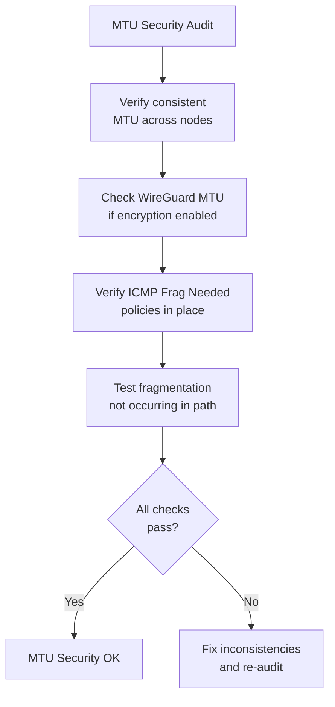

# How to Secure MTU Sizing for Calico

Author: [nawazdhandala](https://github.com/nawazdhandala)

Tags: Calico, Kubernetes, MTU, Security, Networking

Description: Understand the security implications of MTU configuration in Calico and implement controls to prevent MTU-based attacks and fragmentation-based evasion techniques.

---

## Introduction

MTU configuration has security implications beyond performance. Attackers can exploit MTU mismatches to craft packets that evade network security controls: a technique called IP fragmentation overlapping allows crafting packets that reassemble into different content than what was inspected by a firewall or IDS. Additionally, ICMP-based path MTU discovery can reveal network topology information to attackers.

In Kubernetes environments, consistent MTU configuration across all nodes prevents the fragmentation scenarios that security tools may not handle correctly. Calico's eBPF dataplane and WireGuard encryption both have specific MTU requirements that must be met to ensure security features function as intended.

## Prerequisites

- Calico with consistent MTU configuration
- Understanding of network security requirements

## Prevent Fragmentation-Based Evasion

Set consistent MTU across all nodes to prevent fragmentation:

```bash
# Verify all nodes have consistent MTU
kubectl get nodes -o custom-columns=NAME:.metadata.name,IP:.status.addresses[0].address | \
  while read name ip; do
    echo "Checking $name ($ip)..."
  done
```

Disable IP fragment forwarding if your pods don't need it:

```bash
# On nodes (requires caution - test before applying)
sysctl -w net.ipv4.conf.all.accept_source_route=0
```

## Secure PMTU Discovery

Control ICMP responses to prevent topology disclosure:

```yaml
apiVersion: projectcalico.org/v3
kind: GlobalNetworkPolicy
metadata:
  name: allow-pmtu-icmp
spec:
  order: 100
  types:
  - Ingress
  - Egress
  ingress:
  - action: Allow
    protocol: ICMP
    icmp:
      type: 3
      code: 4  # Fragmentation needed (PMTU discovery)
  egress:
  - action: Allow
    protocol: ICMP
    icmp:
      type: 3
      code: 4
```

## WireGuard MTU Security Requirements

When WireGuard encryption is enabled, the MTU must account for WireGuard overhead (60 bytes) to ensure encrypted packets are never fragmented:

```bash
# For WireGuard: host MTU 1500 - 60 bytes = 1440
calicoctl patch felixconfiguration default --type merge \
  --patch '{"spec":{"wireguardMTU":1440}}'

# Verify WireGuard interface has correct MTU
ip link show wireguard.cali | grep mtu
```

## Security Audit of MTU Configuration



## Conclusion

Securing MTU in Calico means ensuring consistent configuration across all nodes to prevent fragmentation-based security evasion, accounting for WireGuard overhead when encryption is enabled, and permitting only the ICMP messages needed for legitimate PMTU discovery while monitoring for unusual fragmentation patterns. Consistent MTU is both a performance requirement and a security control.
