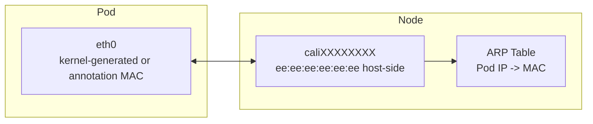

# How to Secure Pod MAC Addresses with Calico

Author: [nawazdhandala](https://github.com/nawazdhandala)

Tags: Calico, Kubernetes, MAC Address, Networking, CNI

Description: Secure pod MAC address assignment in Calico to prevent MAC spoofing and ARP-based attacks from compromised pods.

---

## Introduction

Calico assigns MAC addresses to pod virtual ethernet (veth) interfaces in a specific way. The host-side of every veth pair (the `cali*` interface) is assigned the literal, hardcoded MAC address `ee:ee:ee:ee:ee:ee` — the same value for every pod on the node. This is safe because Calico operates as a point-to-point routed (L3) dataplane with proxy ARP, so the host-side MAC is never used on the wire. The pod-side `eth0` MAC is generated by the kernel by default, and can optionally be overridden per pod via the `cni.projectcalico.org/hwAddr` annotation.

Understanding Calico's MAC address assignment is important for debugging layer-2 networking issues, configuring certain network security controls, and ensuring compatibility with network monitoring tools that track device identity by MAC address.

## Prerequisites

- Calico v3.20+ installed
- kubectl access to the cluster
- Access to node networking stack

## Check Pod MAC Addresses

```bash
# View MAC address of a pod interface

kubectl exec test-pod -- ip link show eth0

# View the corresponding veth on the host
ip link | grep -A1 cali

# Verify MAC address uniqueness across pods
kubectl get pods -A -o wide | while read ns pod rest; do
  mac=$(kubectl exec -n ${ns} ${pod} -- ip link show eth0 2>/dev/null |     grep -oP '([0-9a-f]{2}:){5}[0-9a-f]{2}' | head -1)
  echo "${ns}/${pod}: ${mac}"
done | sort -t: -k2
```

## Configure Pod MAC Address

The host-side `cali*` MAC is hardcoded to `ee:ee:ee:ee:ee:ee` and is not user-configurable. The pod-side `eth0` MAC can be set per pod using the `cni.projectcalico.org/hwAddr` annotation (must be present at pod creation time):

```yaml
apiVersion: v1
kind: Pod
metadata:
  name: test-pod
  annotations:
    cni.projectcalico.org/hwAddr: "ca:fe:00:00:00:01"
spec:
  containers:
  - name: app
    image: nginx
```

## Check for MAC Conflicts

```bash
# Look for duplicate MACs in arp table
arp -n | awk '{print $3}' | sort | uniq -d
```

## MAC Address Architecture



## Conclusion

Calico's host-side veth MAC is fixed at `ee:ee:ee:ee:ee:ee` for every pod — safe because the dataplane is L3/point-to-point-routed and the host-side MAC is never used on the wire. The pod-side `eth0` MAC is kernel-generated by default and can be overridden per pod via the `cni.projectcalico.org/hwAddr` annotation. Understanding this scheme helps diagnose layer-2 networking issues and configure security controls appropriately in your Kubernetes environment.
