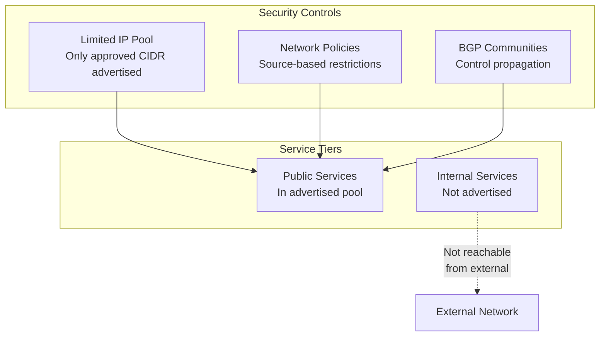

# How to Secure Service IP Advertisement with Calico

Author: [nawazdhandala](https://github.com/nawazdhandala)

Tags: Calico, Kubernetes, BGP, Security, Service Advertisement

Description: Secure Calico service IP advertisement by controlling which services are advertised, applying network policies to service traffic, and restricting BGP route propagation scope.

---

## Introduction

Service IP advertisement makes Kubernetes service IPs directly routable from your network. Without proper security controls, this means any host with a route to the service CIDR can attempt connections to any service in the cluster. Services that were previously protected by being accessible only within the cluster or via controlled load balancers become potentially exposed.

Securing service IP advertisement requires a combination of controls: selective advertisement of only approved service IPs, network policies restricting which sources can reach services, BGP route filters controlling propagation scope, and monitoring for unauthorized service access.

## Prerequisites

- Calico with service advertisement enabled
- `calicoctl` and `kubectl` access
- Clear definition of which services should be externally accessible

## Advertise Only Specific Service Pools

Instead of advertising the entire service CIDR, create a dedicated IP pool for externally-accessible services:

```yaml
apiVersion: projectcalico.org/v3
kind: BGPConfiguration
metadata:
  name: default
spec:
  serviceLoadBalancerIPs:
  - cidr: 192.168.100.0/24  # Only this range is advertised externally
```

Do NOT add `serviceClusterIPs` unless internal pod access to ClusterIPs from outside is needed.

## Create Services with Explicit External IPs

Only assign LoadBalancer IPs from the advertised pool to services that genuinely need external access:

```yaml
apiVersion: v1
kind: Service
metadata:
  name: public-api
  annotations:
    projectcalico.org/ipv4pools: '["external-lb-pool"]'
spec:
  type: LoadBalancer
  selector:
    app: public-api
  ports:
  - port: 443
    targetPort: 8443
```

Services without LoadBalancer IPs from the advertised pool remain inaccessible externally.

## Apply Network Policies to Restrict Service Access

Even with limited advertisement, apply source-based restrictions:

```yaml
apiVersion: projectcalico.org/v3
kind: NetworkPolicy
metadata:
  name: restrict-public-api-access
  namespace: production
spec:
  selector: app == 'public-api'
  types:
  - Ingress
  ingress:
  - action: Allow
    protocol: TCP
    source:
      nets:
      - 0.0.0.0/0  # Internet-facing API
    destination:
      ports:
      - 8443
  - action: Deny
```

## Use BGP Communities to Control Propagation

Tag service routes with communities that upstream routers use to limit propagation:

```yaml
apiVersion: projectcalico.org/v3
kind: BGPConfiguration
metadata:
  name: default
spec:
  communities:
  - name: do-not-export
    value: "65000:999"
  prefixAdvertisements:
  - cidr: 192.168.100.0/24
    communities:
    - do-not-export
```

## Security Architecture



## Conclusion

Securing service IP advertisement requires a least-privilege approach: advertise only the IP pool used for intentionally public services, apply network policies restricting which sources can reach advertised services, and use BGP communities to control how widely routes propagate in your network. Regularly audit which services have LoadBalancer IPs in the advertised pool to prevent accidental exposure of internal services.
