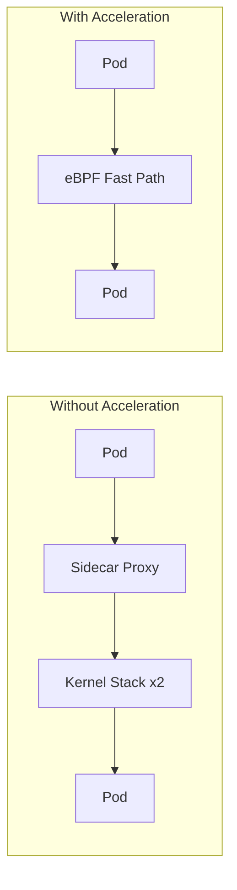

# How to Secure Sidecar Acceleration in Calico

Author: [nawazdhandala](https://github.com/nawazdhandala)

Tags: Calico, Kubernetes, eBPF, Sidecar, Service Mesh

Description: Ensure Calico sidecar acceleration does not bypass security controls by maintaining mTLS enforcement and network policy while enabling eBPF optimizations.

---

## Introduction

Calico's sidecar acceleration feature uses an eBPF SOCKMAP program to short-circuit the loopback path between an Envoy sidecar and the application container in the same pod. When pods use sidecar proxies, packets normally traverse the kernel TCP/IP stack twice on the loopback interface; SOCKMAP lets matched sockets exchange data directly, reducing the per-hop overhead introduced by sidecar interception.

This optimization is documented for Istio-style sidecar deployments and is marked **experimental** in the Calico documentation - it should be evaluated carefully before being used in production. The Calico documentation does not publish a specific latency-improvement figure; benchmark against your own workload.

## Prerequisites

- Calico eBPF dataplane enabled (`bpfEnabled: true`)
- Linux kernel 5.7+ on every node (SOCKMAP requirements)
- Service mesh with sidecar injection (Istio, Linkerd, etc.)
- kubectl and calicoctl access

## Configure and Verify

```bash
# Verify eBPF is enabled
calicoctl get felixconfiguration default -o yaml | grep bpfEnabled

# Enable sidecar acceleration (experimental)
calicoctl patch felixconfiguration default \
  --patch '{"spec":{"sidecarAccelerationEnabled": true}}'

# Confirm Calico eBPF programs are attached on a node
kubectl exec -n calico-system ds/calico-node -- bpftool prog show | grep -i cali

# Verify acceleration is active by inspecting BPF counters
kubectl exec -n calico-system ds/calico-node -- \
  calico-node -bpf counters dump
```

## Benchmark Acceleration

```bash
# Compare latency with and without acceleration
# Without acceleration:
kubectl exec client-pod -- grpc_bench -n 10000 server:50051

# With acceleration enabled:
kubectl exec client-pod -- grpc_bench -n 10000 server:50051
```

## Monitoring

```bash
# Check eBPF program hit counts
kubectl exec -n calico-system ds/calico-node -- \
  bpftool prog show | grep calico
```

## Acceleration Flow



## Conclusion

How to Secure Sidecar Acceleration in Calico requires enabling Calico eBPF mode, opting in to `sidecarAccelerationEnabled` (currently flagged experimental upstream), and verifying that service mesh sidecar traffic is being processed through the optimized SOCKMAP path. Monitor latency metrics before and after enabling acceleration to quantify the performance improvement in your specific workload profile.
