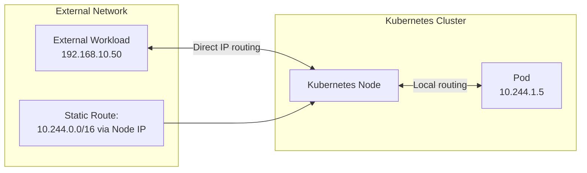

# How to Secure Workloads Outside the Cluster with Calico

Author: [nawazdhandala](https://github.com/nawazdhandala)

Tags: Calico, Kubernetes, BGP, External Workloads, Networking

Description: Secure connectivity between Kubernetes pods and external workloads using Calico network policies and encryption.

---

## Introduction

Many production environments have workloads running both inside Kubernetes and outside it — legacy applications, databases, monitoring agents, or infrastructure services that haven't been containerized. Calico enables seamless connectivity between Kubernetes pods and these external workloads by advertising pod routes via BGP or configuring static routes on external hosts.

The key challenge is ensuring that return traffic from external workloads can reach pod IPs. Because pod IPs are assigned from a private CIDR that is not natively routable on the external network, external hosts need either a BGP session with Calico or a static route pointing to a Kubernetes node as the gateway for the pod CIDR.

## Prerequisites

- Calico with BGP mode or static route configuration
- External workload hosts with network connectivity to Kubernetes nodes
- Ability to add routes or configure BGP on external hosts

## Configure External Host Routing

Option 1: Static routes on external hosts:

```bash
# On external host: add route to pod CIDR via a Kubernetes node
ip route add 10.244.0.0/16 via <kubernetes-node-ip>

# Make permanent
echo "10.244.0.0/16 via <kubernetes-node-ip>" >> /etc/network/routes
```

Option 2: BGP peering with external hosts running Bird:

```bash
# Install BIRD on external host
apt-get install -y bird2

# Configure BGP peering with Calico nodes
cat > /etc/bird/bird.conf << 'BIRDEOF'
router id <external-host-ip>;
protocol bgp calico_peer {
  local as 64514;
  neighbor <calico-node-ip> as 64512;
  ipv4 {
    import all;
    export none;
  };
}
BIRDEOF
```

## Test Pod-to-External Connectivity

```bash
# From pod, ping external workload
EXTERNAL_IP="192.168.10.50"
kubectl exec test-pod -- ping -c 3 ${EXTERNAL_IP}
kubectl exec test-pod -- curl http://${EXTERNAL_IP}:8080/health
```

## Test External-to-Pod Connectivity

```bash
# From external host, ping pod IP
POD_IP=$(kubectl get pod test-pod -o jsonpath='{.status.podIP}')
ping -c 3 ${POD_IP}
curl http://${POD_IP}:8080/
```

## Connectivity Architecture



## Conclusion

Enabling connectivity between Calico-managed pods and external workloads requires configuring routes on external hosts so they know how to reach pod IPs. Static routes work for simple setups, while BGP peering provides dynamic route distribution for more complex topologies. Combine with Calico network policies to control which external hosts can reach which pods.
