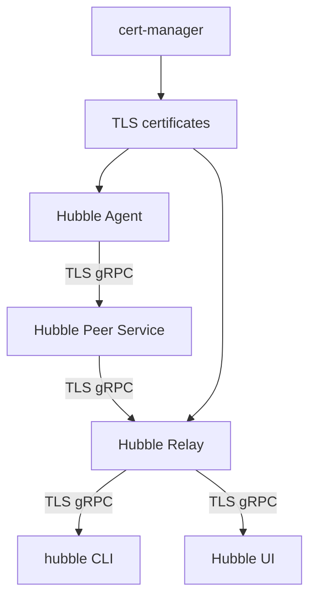

# How to Set Up TLS on the Hubble API in Cilium

Author: [nawazdhandala](https://github.com/nawazdhandala)

Tags: Cilium, Kubernetes, Hubble, TLS, Security, Observability

Description: Configure TLS encryption for the Hubble API to secure flow observability data in transit between Hubble agents, relay, and clients.

---

## Introduction

By default, the Hubble API (gRPC) communicates without TLS. In production environments, especially those with compliance requirements, encrypting Hubble's communication channels prevents flow data (which can contain sensitive metadata) from being observed in transit.

Cilium supports TLS for the Hubble peer service (agent-level API), the Hubble Relay aggregation service, and the Hubble UI backend. Certificates can be managed by cert-manager or provided manually.

## Prerequisites

- Cilium with Hubble enabled
- cert-manager (recommended) or manual certificate management

## Enable TLS for Hubble with Helm

Using cert-manager for automatic certificate management:

```bash
helm upgrade cilium cilium/cilium \
  --namespace kube-system \
  --reuse-values \
  --set hubble.tls.enabled=true \
  --set hubble.tls.auto.enabled=true \
  --set hubble.tls.auto.method=certmanager \
  --set hubble.tls.auto.certManagerIssuerRef.name=ca-issuer \
  --set hubble.tls.auto.certManagerIssuerRef.kind=ClusterIssuer
```

## Architecture



## Manual TLS Certificate Setup

Generate certificates manually:

```bash
# Generate CA
openssl req -x509 -newkey rsa:4096 -days 3650 \
  -keyout ca.key -out ca.crt -nodes -subj "/CN=Hubble CA"

# Generate Hubble server cert
openssl req -newkey rsa:2048 -nodes \
  -keyout hubble.key -out hubble.csr \
  -subj "/CN=*.hubble-grpc.cilium.io"

openssl x509 -req -in hubble.csr -CA ca.crt -CAkey ca.key \
  -CAcreateserial -out hubble.crt -days 365
```

Create secrets:

```bash
kubectl create secret generic hubble-ca-secret \
  --namespace kube-system \
  --from-file=ca.crt=ca.crt

kubectl create secret generic hubble-server-certs \
  --namespace kube-system \
  --from-file=tls.crt=hubble.crt \
  --from-file=tls.key=hubble.key
```

## Validate TLS is Active

```bash
kubectl get cm -n kube-system cilium-config \
  -o jsonpath='{.data.hubble-tls-cert-file}'
```

Test the Hubble API with TLS:

```bash
hubble --tls --tls-ca-cert ca.crt status
```

## Access Hubble UI with TLS

```bash
cilium hubble port-forward --tls &
hubble status
```

## Verify Certificate Rotation

With cert-manager, certificates are rotated automatically. Monitor expiry:

```bash
kubectl get certificate -n kube-system | grep hubble
```

## Conclusion

Enabling TLS for the Hubble API secures flow observability data in transit. Using cert-manager for automatic certificate management eliminates manual renewal work and ensures certificates are rotated before expiry. This is recommended for all production Cilium deployments where compliance or security audits require encryption of monitoring data.
