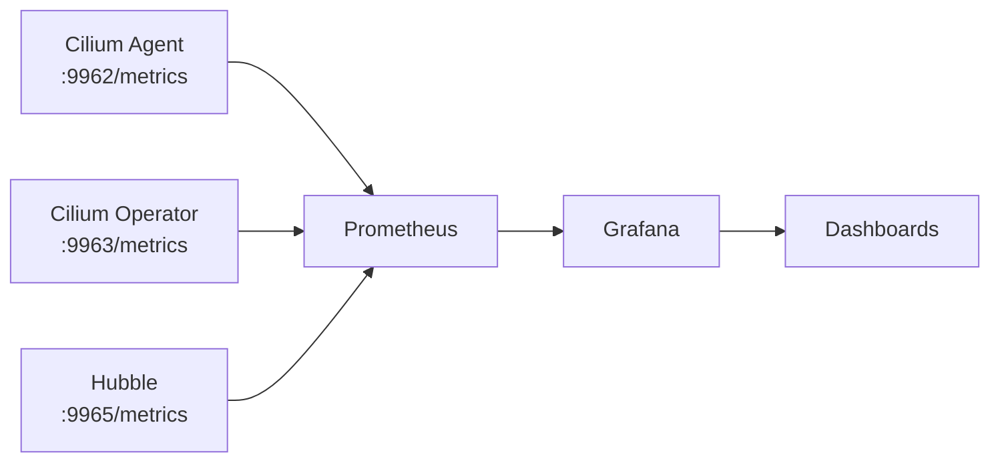

# How to Set Up Prometheus and Grafana for Cilium

Author: [nawazdhandala](https://github.com/nawazdhandala)

Tags: Cilium, Kubernetes, Prometheus, Grafana, Monitoring, Observability

Description: Set up Prometheus and Grafana to collect and visualize Cilium metrics including network policy decisions, connection tracking, and eBPF program health.

---

## Introduction

Cilium exposes hundreds of Prometheus metrics covering network policy decisions, connection tracking table utilization, eBPF program load times, Hubble flow rates, and operator health. Combining these with Grafana dashboards gives platform teams comprehensive visibility into their network infrastructure.

Cilium provides pre-built Grafana dashboards that can be imported directly, covering the most important operational metrics. This guide walks through the complete setup from Prometheus scrape configuration to dashboard import.

## Prerequisites

- Cilium with Prometheus enabled
- Prometheus Operator or standalone Prometheus
- Grafana

## Enable Prometheus in Cilium

```bash
helm upgrade cilium cilium/cilium \
  --namespace kube-system \
  --reuse-values \
  --set prometheus.enabled=true \
  --set operator.prometheus.enabled=true \
  --set hubble.metrics.enabled="{dns,drop,tcp,flow,icmp,http}"
```

## Architecture



## Configure Prometheus Scraping

If using Prometheus Operator, create ServiceMonitors:

```yaml
apiVersion: monitoring.coreos.com/v1
kind: ServiceMonitor
metadata:
  name: cilium-agent
  namespace: kube-system
spec:
  selector:
    matchLabels:
      k8s-app: cilium
  endpoints:
    - port: prometheus
      interval: 15s
      path: /metrics
```

```yaml
apiVersion: monitoring.coreos.com/v1
kind: ServiceMonitor
metadata:
  name: cilium-operator
  namespace: kube-system
spec:
  selector:
    matchLabels:
      io.cilium/app: operator
  endpoints:
    - port: prometheus
      interval: 15s
```

## Import Cilium Grafana Dashboards

Cilium provides official dashboards at:

- **Cilium Overview**: Dashboard ID `16611`
- **Hubble L7 HTTP**: Dashboard ID `16612`
- **Cilium Operator**: Dashboard ID `16613`

Import via Grafana UI: Dashboards → Import → Enter Dashboard ID.

## Key Metrics to Monitor

```promql
# Policy enforcement decisions per second
rate(cilium_policy_l7_total[5m])

# Active connections in CT table
cilium_bpf_map_ops_total{mapName="cilium_ct4_global"}

# Drop rate by reason
rate(cilium_drop_count_total[5m]) by (reason)

# Hubble flow processing rate
rate(hubble_flows_processed_total[5m])
```

## Verify Metrics are Being Scraped

```bash
kubectl port-forward -n kube-system ds/cilium 9962 &
curl -s http://localhost:9962/metrics | grep cilium_drop | head -5
```

## Conclusion

Setting up Prometheus and Grafana for Cilium provides the observability needed for production operations. The pre-built dashboards cover most use cases, and the rich metric set allows building custom panels for specific deployment requirements. Enable Hubble metrics alongside standard agent metrics for complete network observability.
