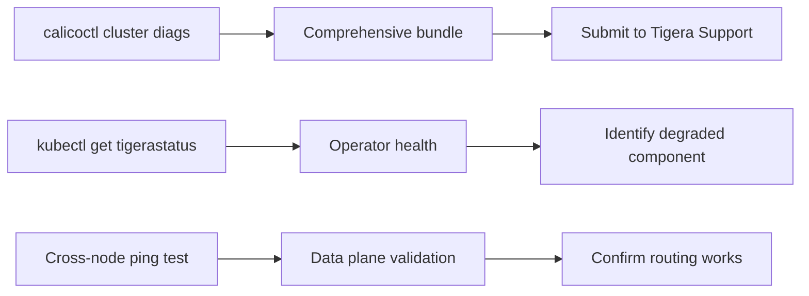

# How to Set Up Calico Cluster Diagnostics Step by Step

Author: [nawazdhandala](https://github.com/nawazdhandala)

Tags: Calico, Kubernetes, Networking, Diagnostics

Description: Set up a comprehensive Calico cluster diagnostics toolkit using calicoctl cluster diags, TigeraStatus, and cross-node connectivity tests to assess overall cluster networking health.

---

## Introduction

Calico cluster diagnostics assess the health of the entire Calico installation across all nodes, as opposed to single-node diagnostics. The primary tools are `calicoctl cluster diags` (comprehensive cluster-wide bundle), `kubectl get tigerastatus` (operator health), and cross-node connectivity tests (BGP route propagation). Setting up cluster diagnostics means preparing these tools and knowing when to use each one.

## Prerequisites

- `calicoctl` v3.x installed and configured
- kubectl with cluster-admin access
- Access to exec into calico-system namespace pods

## Step 1: Run calicoctl cluster diags

```bash
# Collect comprehensive cluster diagnostic bundle
# Must be run from within a calico-node pod
CALICO_POD=$(kubectl get pods -n calico-system -l app=calico-node \
  -o jsonpath='{.items[0].metadata.name}')

kubectl exec -n calico-system "${CALICO_POD}" -c calico-node -- \
  calicoctl cluster diags

# Copy the diagnostic archive out of the pod
kubectl cp calico-system/"${CALICO_POD}":/tmp/calico-diags.tar.gz \
  calico-cluster-diags-$(date +%Y%m%d).tar.gz
```

## Step 2: Check Cluster-Wide TigeraStatus

```bash
# All components should show Available=True
kubectl get tigerastatus

# Get detailed status for any degraded component
kubectl get tigerastatus -o yaml | \
  yq '.items[] | select(.status.conditions[].status == "False") | .metadata.name'

# Check operator logs for reconciliation errors
kubectl logs -n tigera-operator -l app=tigera-operator | \
  grep -i "error\|degraded" | tail -20
```

## Step 3: Test Cross-Node Pod Connectivity

```bash
# Deploy a test pod on node-A, test connectivity to pod on node-B
kubectl run test-client --image=nicolaka/netshoot \
  --node-name=<node-a> --restart=Never -- sleep 3600

TEST_POD_IP=$(kubectl get pod test-pod-on-node-b \
  -o jsonpath='{.status.podIP}')

kubectl exec test-client -- ping -c 3 "${TEST_POD_IP}"
# Success: cross-node routing is working
# Failure: BGP route propagation or IPAM issue
```

## Cluster Diagnostics Architecture



## Step 4: Check IPAM Cluster Health

```bash
# View IPAM allocation across all nodes
calicoctl ipam show --show-blocks

# Detect any IP allocation inconsistencies
calicoctl ipam check
# Exit code 0: IPAM is consistent
# Exit code non-zero: IPAM has leaked or orphaned allocations
```

## Conclusion

Cluster-wide Calico diagnostics start with TigeraStatus (operator health) and then drill down to calicoctl cluster diags for comprehensive state collection. The cross-node ping test validates that the data plane is actually forwarding packets, independent of the control plane state. Collect `calicoctl cluster diags` as the first step in any P1 incident before attempting fixes, since the bundle captures point-in-time state that may change after remediation.
