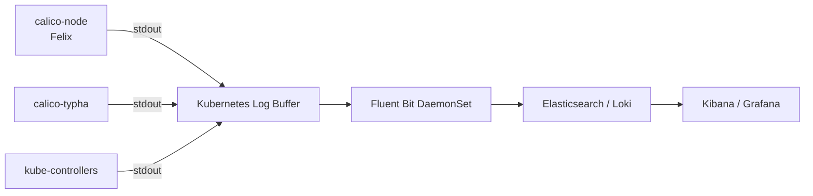

# How to Set Up Calico Component Log Collection Step by Step

Author: [nawazdhandala](https://github.com/nawazdhandala)

Tags: Calico, Kubernetes, Networking, Logging, Operations

Description: Set up centralized log collection for Calico components including calico-node, calico-typha, and calico-kube-controllers, with log level configuration and structured output for log aggregation systems.

---

## Introduction

Calico's three main components — calico-node (Felix), calico-typha, and calico-kube-controllers — each write logs to stdout, which Kubernetes captures. Setting up structured log collection means configuring appropriate log levels, enabling JSON log formatting for log aggregators, and ensuring your logging infrastructure can ingest the high-volume output from calico-node on busy clusters.

## Prerequisites

- Calico installed via Tigera Operator
- kubectl with cluster-admin access
- A log aggregation system (Elasticsearch/Loki/CloudWatch) or log shipper (Fluentd/Fluent Bit)

## Step 1: Configure Calico Log Levels

```bash
# Set Felix log level via FelixConfiguration
kubectl patch felixconfiguration default \
  --type=merge \
  -p '{"spec":{"logSeverityScreen":"Info"}}'

# Available log levels: Debug, Info, Warning, Error, Fatal
# For production: Info (default)
# For troubleshooting: Debug (high volume, temporary only)

# Verify the change
kubectl get felixconfiguration default -o jsonpath='{.spec.logSeverityScreen}'
```

## Step 2: Enable JSON Logging for Calico Components

```yaml
# FelixConfiguration with JSON log format
apiVersion: projectcalico.org/v3
kind: FelixConfiguration
metadata:
  name: default
spec:
  logSeverityScreen: Info
  logFilePath: none  # Log to stdout only (Kubernetes captures this)
```

## Step 3: Verify Component Logs Are Accessible

```bash
# calico-node (Felix) logs
kubectl logs -n calico-system -l k8s-app=calico-node -c calico-node | tail -20

# calico-typha logs
kubectl logs -n calico-system -l k8s-app=calico-typha | tail -20

# calico-kube-controllers logs
kubectl logs -n calico-system -l k8s-app=calico-kube-controllers | tail -20

# Follow logs from all calico-node pods simultaneously
kubectl logs -n calico-system -l k8s-app=calico-node -c calico-node --follow
```

## Log Collection Architecture



## Step 4: Configure Fluent Bit for Calico Logs

```yaml
# fluent-bit-configmap.yaml
apiVersion: v1
kind: ConfigMap
metadata:
  name: fluent-bit-calico-filter
  namespace: logging
data:
  calico-filter.conf: |
    [FILTER]
        Name    kubernetes
        Match   kube.calico-system.*
        Merge_Log On
        Labels  Off
        Annotations Off

    [FILTER]
        Name    grep
        Match   kube.calico-system.*
        Regex   kubernetes_container_name (calico-node|calico-typha|calico-kube-controllers)
```

## Step 5: Test Log Collection

```bash
# Generate test log entries by describing a node (triggers Felix reconcile)
kubectl describe node <any-node> | head -5

# Verify logs appear in aggregation system
# Search for: kubernetes.namespace_name:calico-system
```

## Conclusion

Setting up Calico log collection requires configuring the right log level (Info for production), ensuring logs are written to stdout where Kubernetes captures them, and configuring your log shipper to filter and forward calico-system namespace logs to your aggregation backend. The most important configuration is keeping Felix log level at Info during normal operations — Debug logging can generate hundreds of MB per hour per node and overwhelm log pipelines.
