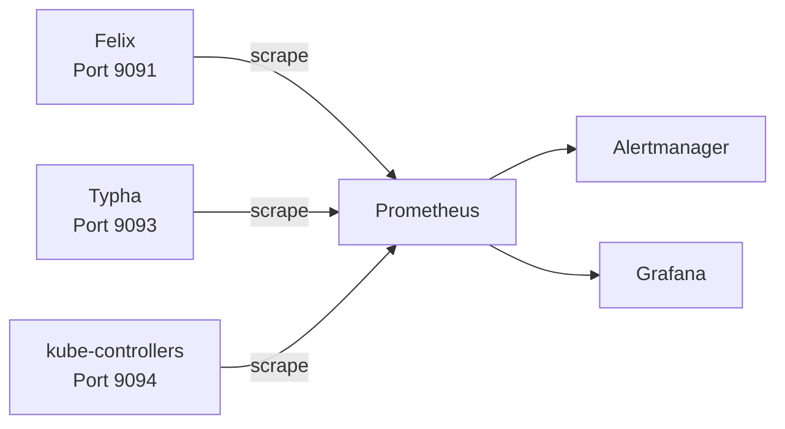

# How to Set Up Calico Component Metrics Monitoring Step by Step

Author: [nawazdhandala](https://github.com/nawazdhandala)

Tags: Calico, Kubernetes, Networking, Metrics, Prometheus, Monitoring

Description: A step-by-step guide to enabling Prometheus metrics for all Calico components including Felix, Typha, and kube-controllers for comprehensive networking observability.

---

## Introduction

Calico exposes Prometheus metrics from its three main components: Felix (the per-node network policy agent), Typha (the Kubernetes API cache for large clusters), and kube-controllers (the controller managing IPAM and policy sync). These metrics provide deep visibility into Calico's performance, health, and operational state - from policy programming latency to IPAM allocation counts.

Setting up Calico component metrics monitoring enables you to detect problems before they impact workloads, understand cluster-wide networking performance characteristics, and build dashboards that give platform teams visibility into the networking layer without requiring command-line access.

This guide walks through enabling metrics on each component, configuring Prometheus to scrape them, and setting up basic alerting.

## Prerequisites

- Calico installed via the Tigera Operator (v3.20+)
- Prometheus Operator installed (kube-prometheus-stack recommended)
- `kubectl` with cluster-admin access

## Architecture Overview



## Step 1: Enable Felix Metrics

```yaml
# felixconfiguration-metrics.yaml
apiVersion: projectcalico.org/v3
kind: FelixConfiguration
metadata:
  name: default
spec:
  prometheusMetricsEnabled: true
  prometheusMetricsPort: 9091
  prometheusGoMetricsEnabled: true
  prometheusProcessMetricsEnabled: true
```

```bash
kubectl apply -f felixconfiguration-metrics.yaml

# Verify Felix metrics are available
kubectl exec -n calico-system ds/calico-node -c calico-node -- \
  wget -qO- http://localhost:9091/metrics | head -20
```

## Step 2: Enable Typha Metrics

```yaml
# installation-typha-metrics.yaml
apiVersion: operator.tigera.io/v1
kind: Installation
metadata:
  name: default
spec:
  typhaMetricsPort: 9093
  # ... other settings
```

```bash
# Verify Typha metrics
TYPHA_POD=$(kubectl get pod -n calico-system -l k8s-app=calico-typha \
  -o jsonpath='{.items[0].metadata.name}')
kubectl exec -n calico-system "${TYPHA_POD}" -- \
  wget -qO- http://localhost:9093/metrics | head -20
```

## Step 3: Enable kube-controllers Metrics

```yaml
# kubecontrollersconfiguration-metrics.yaml
apiVersion: projectcalico.org/v3
kind: KubeControllersConfiguration
metadata:
  name: default
spec:
  prometheusMetricsPort: 9094
```

```bash
kubectl apply -f kubecontrollersconfiguration-metrics.yaml

# Verify kube-controllers metrics
kubectl exec -n calico-system deploy/calico-kube-controllers -- \
  wget -qO- http://localhost:9094/metrics | head -20
```

## Step 4: Create Prometheus ServiceMonitors

```yaml
# calico-servicemonitors.yaml
---
# Felix ServiceMonitor
apiVersion: monitoring.coreos.com/v1
kind: ServiceMonitor
metadata:
  name: calico-felix-metrics
  namespace: monitoring
  labels:
    app: kube-prometheus-stack
spec:
  namespaceSelector:
    matchNames: [calico-system]
  selector:
    matchLabels:
      k8s-app: calico-node
  endpoints:
    - port: http-metrics
      interval: 15s
      path: /metrics

---
# Typha ServiceMonitor
apiVersion: monitoring.coreos.com/v1
kind: ServiceMonitor
metadata:
  name: calico-typha-metrics
  namespace: monitoring
spec:
  namespaceSelector:
    matchNames: [calico-system]
  selector:
    matchLabels:
      k8s-app: calico-typha
  endpoints:
    - port: metrics
      interval: 15s

---
# kube-controllers ServiceMonitor
apiVersion: monitoring.coreos.com/v1
kind: ServiceMonitor
metadata:
  name: calico-kube-controllers-metrics
  namespace: monitoring
spec:
  namespaceSelector:
    matchNames: [calico-system]
  selector:
    matchLabels:
      k8s-app: calico-kube-controllers
  endpoints:
    - port: metrics
      interval: 30s
```

## Step 5: Create Services for Metrics Exposure

```yaml
# calico-metrics-services.yaml
---
apiVersion: v1
kind: Service
metadata:
  name: calico-felix-metrics
  namespace: calico-system
  labels:
    k8s-app: calico-node
spec:
  selector:
    k8s-app: calico-node
  ports:
    - name: http-metrics
      port: 9091
      targetPort: 9091
  type: ClusterIP

---
apiVersion: v1
kind: Service
metadata:
  name: calico-typha-metrics
  namespace: calico-system
  labels:
    k8s-app: calico-typha
spec:
  selector:
    k8s-app: calico-typha
  ports:
    - name: metrics
      port: 9093
      targetPort: 9093
  type: ClusterIP
```

## Step 6: Verify Metrics in Prometheus

```bash
# Port-forward Prometheus and query calico metrics
kubectl port-forward -n monitoring svc/prometheus-operated 9090 &

# Test queries
curl -s "http://localhost:9090/api/v1/query?query=felix_active_local_policies" | jq .
curl -s "http://localhost:9090/api/v1/query?query=typha_connections_accepted_total" | jq .
```

## Conclusion

Setting up Calico component metrics monitoring provides deep visibility into Felix, Typha, and kube-controllers performance. By enabling Prometheus metrics on each component, creating appropriate Services for exposure, and configuring ServiceMonitors for automatic Prometheus discovery, you establish the observability foundation needed to detect issues early and understand cluster networking performance trends. With metrics flowing into Prometheus, the next step is building dashboards and alert rules for each component.
