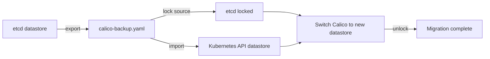

# How to Set Up Calico Datastore Export and Import Step by Step

Author: [nawazdhandala](https://github.com/nawazdhandala)

Tags: Calico, Kubernetes, Networking, Operations

Description: Set up Calico datastore export and import using calicoctl datastore migrate export and import to migrate from etcd to Kubernetes API datastore or back up Calico configuration for disaster recovery.

---

## Introduction

Calico's `calicoctl datastore migrate` commands enable migration between datastore backends (etcd to Kubernetes API datastore) and serve as a backup/restore mechanism for Calico configuration. The export command serializes all Calico resources to YAML, and the import command applies them to a new datastore. Setting up this workflow is essential for clusters migrating away from etcd or for maintaining configuration backups.

## Prerequisites

- `calicoctl` configured for the source datastore (etcd or Kubernetes)
- Access to the destination datastore
- kubectl with cluster-admin access (for Kubernetes datastore operations)

## Step 1: Export Calico Datastore

```bash
# Export from etcd-backed Calico to a backup file
DATASTORE_TYPE=etcdv3 \
  ETCD_ENDPOINTS=https://etcd:2379 \
  ETCD_KEY_FILE=/etc/etcd/ssl/client-key.pem \
  ETCD_CERT_FILE=/etc/etcd/ssl/client-cert.pem \
  ETCD_CA_CERT_FILE=/etc/etcd/ssl/ca.pem \
  calicoctl datastore migrate export > calico-datastore-backup.yaml

# Export from Kubernetes API datastore
DATASTORE_TYPE=kubernetes \
  KUBECONFIG=~/.kube/config \
  calicoctl datastore migrate export > calico-k8s-backup.yaml

# Verify export was successful
wc -l calico-datastore-backup.yaml
head -20 calico-datastore-backup.yaml
```

## Step 2: Lock the Source Datastore (Migration Only)

```bash
# Lock the etcd datastore before migration to prevent new writes
DATASTORE_TYPE=etcdv3 \
  ETCD_ENDPOINTS=https://etcd:2379 \
  calicoctl datastore migrate lock

# This prevents Felix from making changes during migration
# WARNING: This will cause Felix to stop making policy updates
# Complete the migration quickly and unlock or switch to new datastore
```

## Step 3: Import to New Datastore

```bash
# Import the exported data into Kubernetes API datastore
DATASTORE_TYPE=kubernetes \
  KUBECONFIG=~/.kube/config \
  calicoctl datastore migrate import < calico-datastore-backup.yaml

# Verify import
calicoctl get felixconfiguration
calicoctl get bgppeer
calicoctl get globalnetworkpolicy --all-namespaces
```

## Datastore Migration Architecture



## Step 4: Backup Use Case (Not Migration)

```bash
# Regular backup without migration (Kubernetes datastore)
BACKUP_FILE="calico-backup-$(date +%Y%m%d).yaml"
calicoctl datastore migrate export > "${BACKUP_FILE}"

echo "Backup complete: ${BACKUP_FILE}"
echo "Resources backed up: $(grep -c "^kind:" "${BACKUP_FILE}")"

# Store backup securely
aws s3 cp "${BACKUP_FILE}" s3://cluster-backups/calico/
```

## Conclusion

The Calico datastore export/import workflow serves two purposes: etcd-to-Kubernetes API datastore migration and regular configuration backup. For migration, the lock command prevents state drift during the transition window. For backup, regular exports provide a restore point for disaster recovery. Schedule weekly exports to S3 or similar storage as part of cluster backup procedures, and test the import procedure in a staging environment at least quarterly.
