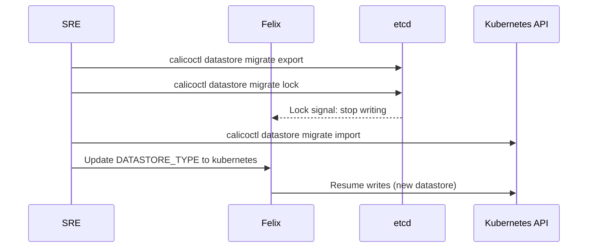

# How to Set Up Calico Datastore Locking Step by Step

Author: [nawazdhandala](https://github.com/nawazdhandala)

Tags: Calico, Kubernetes, Networking, Operations

Description: Set up and use Calico datastore locking during etcd-to-Kubernetes API datastore migrations to prevent Felix from making policy updates while the migration is in progress.

---

## Introduction

Calico datastore locking (`calicoctl datastore migrate lock`) prevents Felix from making any writes to the etcd datastore during a migration. This ensures that the exported configuration snapshot matches the actual state that Calico was enforcing at the time of cutover. Without locking, Felix could update iptables rules, IPAM allocations, or BGP state between the export snapshot and the import, causing drift that requires manual reconciliation.

## Prerequisites

- `calicoctl` configured for etcd datastore (locking is only applicable for etcd-to-Kubernetes migrations)
- etcd credentials with write access
- Understanding that locking will pause Felix policy updates

## Step 1: Understand the Impact of Locking

```markdown
## What Locking Does:
- Prevents Felix from writing updates to etcd
- Felix enters a "read-only" mode: existing rules are maintained
- New network policies will NOT be enforced during the lock period
- IPAM will not allocate new IPs during the lock period
- BGP updates will not be written to etcd

## When to Use Locking:
- During etcd-to-Kubernetes API datastore migration
- After exporting datastore state, before importing to new datastore
- Duration: should be < 5 minutes during a planned migration

## Do NOT use locking:
- In production without a migration in progress
- For longer than necessary (Felix can't update policies while locked)
```

## Step 2: Execute the Lock During Migration

```bash
# Step 1: Export current state
DATASTORE_TYPE=etcdv3 calicoctl datastore migrate export \
  > calico-migration-backup.yaml

# Step 2: Lock the etcd datastore
DATASTORE_TYPE=etcdv3 calicoctl datastore migrate lock
echo "Datastore locked at: $(date)"

# Step 3: Import to Kubernetes API datastore (quickly!)
DATASTORE_TYPE=kubernetes calicoctl datastore migrate import \
  < calico-migration-backup.yaml

# Step 4: Verify import succeeded
DATASTORE_TYPE=kubernetes calicoctl get felixconfiguration

# Step 5: Switch Calico components to use Kubernetes datastore
# (update DATASTORE_TYPE in calico-node DaemonSet)

# Step 6: The lock becomes irrelevant once Calico switches datastores
# Felix will now write to Kubernetes API, not etcd
```

## Datastore Locking Architecture



## Step 3: Verify Lock Status

```bash
# Check if datastore is locked
DATASTORE_TYPE=etcdv3 calicoctl datastore migrate lock
# If already locked, this returns an error indicating locked state

# To check lock from Felix perspective:
kubectl logs -n calico-system -l k8s-app=calico-node -c calico-node | \
  grep -i "locked\|migration"
```

## Conclusion

Calico datastore locking is a migration-specific tool that should only be active for the duration of the import phase of an etcd-to-Kubernetes datastore migration — typically 2-5 minutes. The lock window should be planned during a low-traffic period since no new network policies will be enforced during this time. Prepare the complete migration procedure in advance, test it in a staging environment, and execute it as a single continuous operation to minimize the lock duration.
